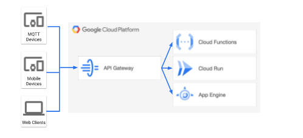
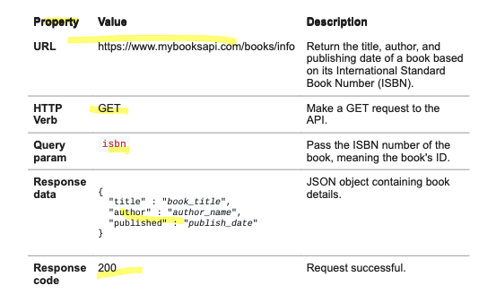
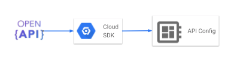
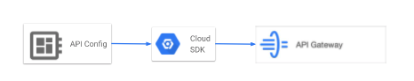

# https:§§cloud.google.com§api-gateway§docs§about-api-gateway
> https://cloud.google.com/api-gateway/docs/about-api-gateway


## About Google Cloud Platform services

diff backedn implementation are hiddent  we use api
each service is exposed as http endpoint
you can implment it as 
- CF
- Cloud Run 
- App Engine

gcp api gateway handle the complexity of exposing service over the web

## API gateway

consistent rest api to expose your service



you can change the back end 

## what is an api?

interface for an app to consume data + capability of another app



invoke using 

```
curl -X GET https://www.mybooksapi.com/books/info?isbn=0385504217
```

and dont care of the actual a backend impl

# defining an api

you use `openapi 2.0 spec`
- url
- data format of the data for the requ
- data format of the response
- the auth method

then upload the api config file



## deploying an api

deploy the api config file 



now you can rest call the published api

## Managing an API

Once deployed and running, you can monitor API activity, such as usage metrics and logs

## Controlling API access

configure the api auth method

 API Gateway supports the same authentication mechanism and syntax as used by Cloud Endpoints
 https://cloud.google.com/endpoints/docs

- API keys https://cloud.google.com/endpoints/docs/openapi/restricting-api-access-with-api-keys
- GCP service accounts https://cloud.google.com/docs/authentication/#service_accounts
- Google ID tokens https://cloud.google.com/endpoints/docs/openapi/glossary#google_id_token

or more information, see the GCP Auth guide.
https://cloud.google.com/docs/authentication


