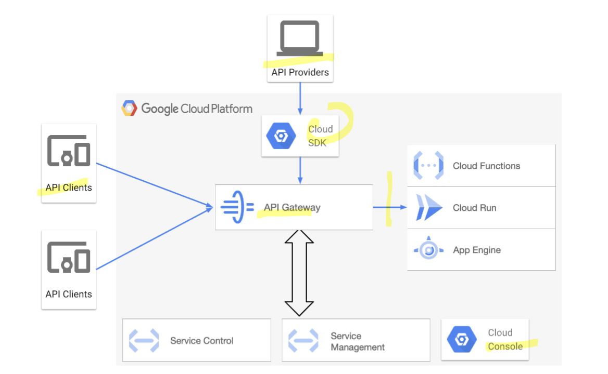

# https:§§cloud.google.com§api-gateway§docs§architecture-overview
> https://cloud.google.com/api-gateway/docs/architecture-overview

components
- api 
- service control
- service mng
- cloud sdk
- gconsole

## architecture

- api provider create and deploy an api on the api gateway
> api is written as openapi 2.0 spec

- api client makes rest request to an api on the api gateway
an api client needs to know 
- url 
- request verb // get put post delete
- auth req
- format of data sent and received

## API Gateway components

- API Gateway
fully managed to host your api

- Service Control API
check authentication 
report to logging

- cloud sdk
[https://cloud.google.com/sdk/ to use `gcloud` ](/https:§§cloud.google.com§sdk§ to use `gcloud` /readme.md)

- Cloud Console
monitoring and logging data recorded by service control

## Handling an API request

- 2 type of endpoints
    - api endpoint
    public to client to use so they can talk to the api
    - backend endpoint
    api uses to connect to the backend service

- Request routing

1 2 3 4 5 steps
TODO: check