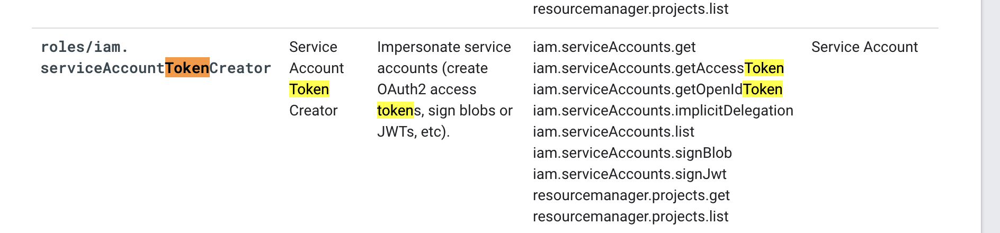
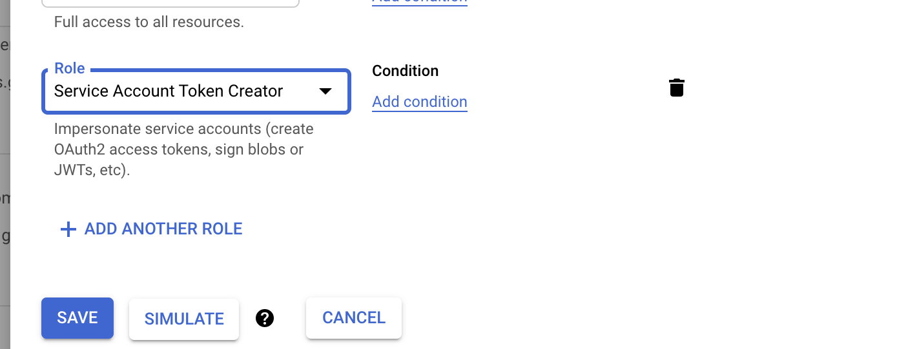
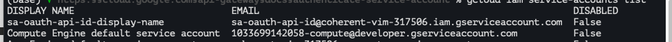
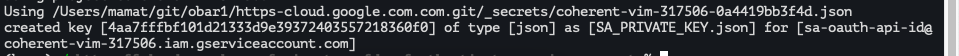
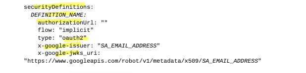
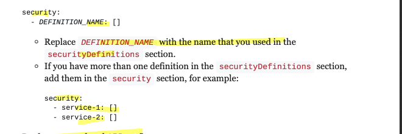
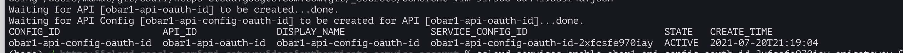
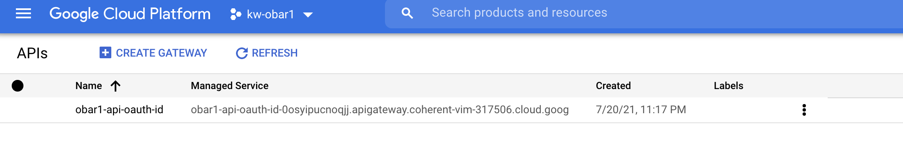
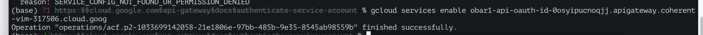

# https:§§cloud.google.com§api-gateway§docs§authenticate-service-account
> https://cloud.google.com/api-gateway/docs/authenticate-service-account

authenticate services - not only humans -  for api req

## Overview

to identify a service that sends req to  api use sa
the calling service uses sa private key to sign a secure json web token 
https://jwt.io/
> JSON Web Tokens are an open, industry standard RFC 7519 method for representing claims securely between two parties.
and sends signed req to the api

1. create sa and key for the calling service to use
2. add auth in api config gateway service
3. add code to  the calling service
    - creates a jwt and sings it with sa private key
    - send a signed jwt in api req (header)

api gateway validates the claim before fwd the req to the actual api
> api gateway does not check for cloud identity

## Prerequisites

[`here`](../https:§§cloud.google.com§api-gateway§docs§openapi-overview/readme.md)
[`here`](../https:§§cloud.google.com§api-gateway§docs§creating-api-config/readme.md)

## Creating a service account with a key

You need a service account with a private key file that the calling service uses to sign the JWT.

create service account adn private key file and assign to the sa the 


[`here`](../https:§§cloud.google.com§iam§docs§creating-managing-service-accounts/readme.md)

* create service account 
- Under All roles, select Service Accounts > Service Account Token Creator
- create new key (json)

```
gcloud iam service-accounts create SA_NAME \
  --display-name "SA_DISPLAY_NAME"
```



```
gcloud projects add-iam-policy-binding PROJECT_ID \
  --member serviceAccount:SA_EMAIL_ADDRESS \
  --role roles/iam.serviceAccountTokenCreator
```


```
gcloud iam service-accounts keys create FILE_NAME.json \
  --iam-account SA_EMAIL_ADDRESS
```


## Configuring your API to support authentication

https://github.com/OAI/OpenAPI-Specification/blob/main/versions/2.0.md#securityRequirementObject
https://github.com/OAI/OpenAPI-Specification/blob/main/versions/2.0.md#securityDefinitionsObject

we need to enable api gateway to validate the claims in the signed jwt used calling services

* add service account as issuer in the api config



* optionally add `x-google-audiences`

* add `security` section to apply the security



* update api config

[`here`](../https:§§cloud.google.com§api-gateway§docs§creating-api-config/readme.md)
updating-an-api-config

reuse
```
   API_ID=obar1-api-id
   CONFIG_ID=obar1-api-config-id
   API_DEFINITION='obar1-api.yaml'
```

checks on the jwt token 
before api gateway fwd req to  the actual api 
- signature of jwt using public key // locates in `x-google-jwks_uri`
- `iss` match `x-google-issuer`
- `aud` match one of the values in `x-google-audiences`
- token is not expired `exp`





For more information about x-google-issuer, x-google-jwks_uri, and x-google-audiences, see
https://cloud.google.com/endpoints/docs/openapi/openapi-extensions

## Making an authenticated request to an API Gateway API

1. create a jwt and sign it with the service account private key
2. send signed jwt in a req to the api

https://github.com/GoogleCloudPlatform/python-docs-samples/blob/HEAD/endpoints/getting-started/clients/google-jwt-client.py

params
- sakeyfile
- saemail
- audience
- expirylenght

ex
```
python call.py  https://a-test-d6vhs2p6.uc.gateway.dev/hello  https://a-test-d6vhs2p6.uc.gateway.dev          SA_PRIVATE_KEY.json   sa-oauth-api-id@coherent-vim-317506.iam.gserviceaccount.co


TOKEN='eyJ0eXAiOiAi....EUFgvw17pSIvrZmw'

curl --request GET \
  --header "Authorization: Bearer ${TOKEN}" \
  "https://a-test-d6vhs2p6.uc.gateway.dev/hello"
```

## Receiving authenticated results in your API
SKIP:
