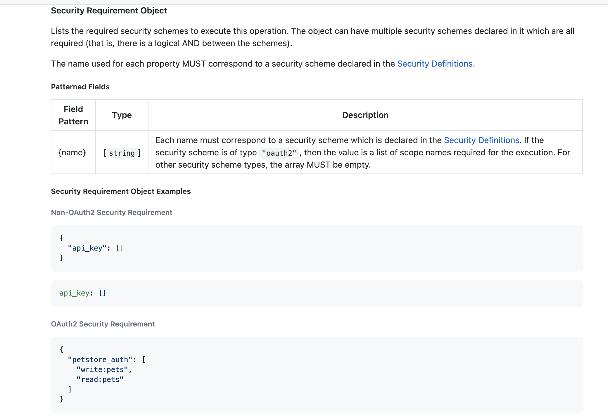
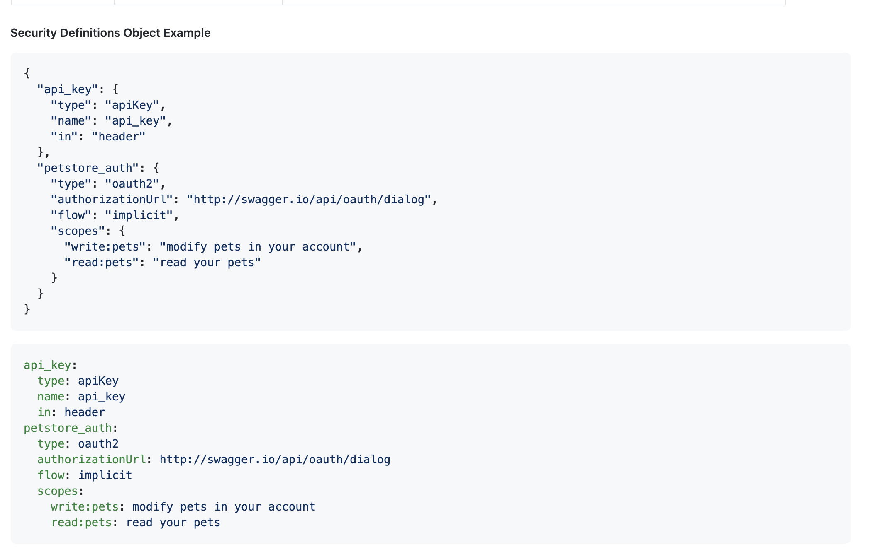

# https:§§cloud.google.com§api-gateway§docs§authenticating-users-auth0
> https://cloud.google.com/api-gateway/docs/authenticating-users-auth0

to auth user a client app must send token 
[https://jwt.io/](/https:§§jwt.io§/readme.md)
in th auth header of the http req to the api
api gateway validates the token
- no need to add code in the api 
- config api auth

api gateway uses `jkws` https://datatracker.ietf.org/doc/html/rfc7517
the location specified in `x-google-jwks_uri` in the gateway api config
they are cached and refresh every 5 min 

## Before you begin

add auth code to client app 
[https://auth0.com/docs/](/https:§§auth0.com§docs§/readme.md)

then client app sends http req, the auth header must contai
- iss
- sub
- aud
- iat
- exp

## Configuring API Gateway to support client authentication

in api config for api gateway to validate the claims
[https://github.com/OAI/OpenAPI-Specification/blob/main/versions/2.0.md#securityRequirementObject](/https:§§github.com§OAI§OpenAPI-Specification§blob§main§versions§2.0.md#securityRequirementObject/readme.md)


[https://github.com/OAI/OpenAPI-Specification/blob/main/versions/2.0.md#securityDefinitionsObject](/https:§§github.com§OAI§OpenAPI-Specification§blob§main§versions§2.0.md#securityDefinitionsObject/readme.md)


1.
add security def to  api config
```
 securityDefinitions:
    auth0_jwk:
      authorizationUrl: ""
      flow: "implicit"
      type: "oauth2"
      # Replace YOUR-ACCOUNT-NAME with your Auth0 account name.
      x-google-issuer: "https://YOUR-ACCOUNT-NAME.auth0.com/"
      x-google-jwks_uri: "https://YOUR-ACCOUNT-NAME.auth0.com/.well-known/jwks.json"
      # Optional. Replace YOUR-CLIENT-ID with your client ID
      x-google-audiences: "YOUR-CLIENT-ID"
```
2.
add a security section 
```
 security:
    - auth0_jwk: []
```

> The x-google-audiences field isn't required. API Gateway accepts all JWTs with the backend service name in the form of https://SERVICE_NAME in the aud claim.

## Making an authenticated call to an API Gateway API

send req using auth token put it on `Authorization:Bearer` header 

```
curl --request POST \
  --header "Authorization: Bearer ${TOKEN}" \
  "${GATEWAY_URL}/echo"
```
GATEWAY_URL and TOKEN are environment variables containing your deployed gateway URL and auth token
see
[https://cloud.google.com/api-gateway/docs/authenticate-service-account#making_an_authenticated_request](/https:§§cloud.google.com§api-gateway§docs§authenticate-service-account#making_an_authenticated_request/readme.md)

you cannot use the header when sending the request, you can put the authentication token in a query parameter called access_token. For example:

If you cannot use the header when sending the request, you can put the authentication token in a query parameter called access_token. 
```
curl "${GATEWAY_URL}/echo?access_token=${TOKEN}"
```

## Receiving authenticated results in your API

API Gateway usually forwards all headers it receives. However, it overrides the original Authorization header when the backend address is specified by x-google-backend in the API config.

API Gateway will send the authentication result in the X-Apigateway-Api-Userinfo to the backend API. It is recommended to use this header instead of the original Authorization header. This header is base64url encoded and contains the JWT payload
