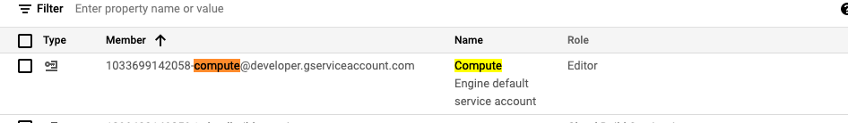
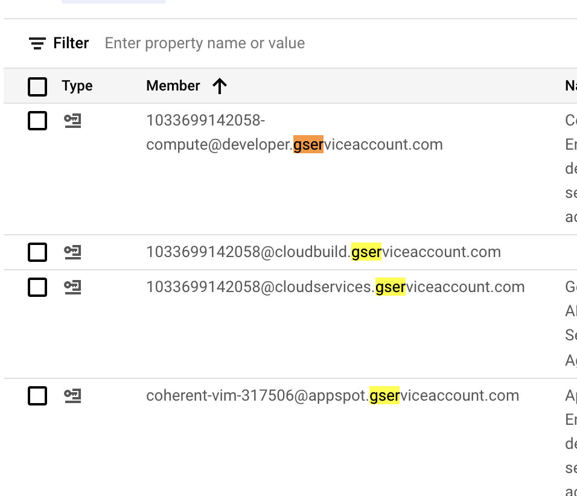

# https:§§cloud.google.com§api-gateway§docs§configure-dev-env
> https://cloud.google.com/api-gateway/docs/configure-dev-env

## Enabling required services

```
gcloud services enable apigateway.googleapis.com
gcloud services enable servicemanagement.googleapis.com
gcloud services enable servicecontrol.googleapis.com
```

## Configuring a service account

create a sa
[`here`](../https:§§cloud.google.com§iam§docs§creating-managing-service-accounts/readme.md)

need `iam.serviceAccounts.actAs` for create and update api config

FIXME: it looks to be roles/iam.serviceAccountUser

add role as
```
gcloud iam service-accounts SERVICE_ACCOUNT add-iam-policy-binding --member user:USER_EMAIL -role roles/iam.serviceAccountUser
```
need of  cloud function invoker or  cloud run invoker 
https://cloud.google.com/iam/docs

use `backend-auth-service-account` when creating api config
```
gcloud api-gateway api-configs create CONFIG_ID --api=API_ID --openapi-spec=API_DEFINITION --project=PROJECT_ID --backend-auth-service-account=SERVICE_ACCOUNT_EMAIL
```
[`here`](../https:§§cloud.google.com§api-gateway§docs§creating-api/readme.md)

## Using a default service account

some gcp products define `default` sa associated to  the service type

> The default service account is identifiable by its email address:
```
PROJECT_NUMBER-compute@developer.gserviceaccount.com
```
ex



