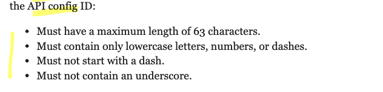
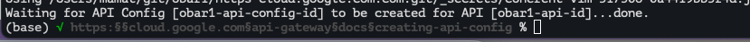
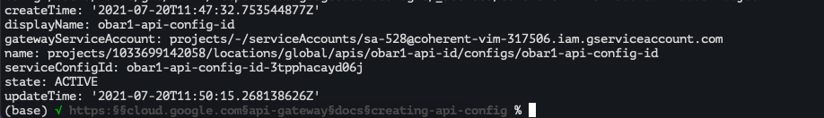
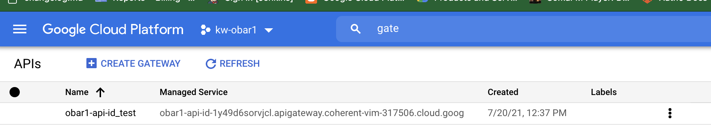
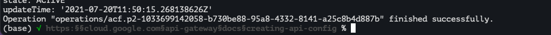
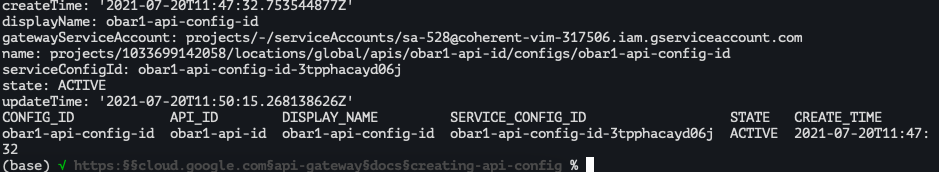

# https:§§cloud.google.com§api-gateway§docs§creating-api-config
> https://cloud.google.com/api-gateway/docs/creating-api-config


## Prerequisites
[`here`](../https:§§cloud.google.com§api-gateway§docs§openapi-overview/readme.md)
[`here`](../https:§§cloud.google.com§api-gateway§docs§creating-api/readme.md)

## API config ID requirements



* some help
```
gcloud api-gateway api-configs create --help
```

* create api config
```
gcloud api-gateway api-configs create CONFIG_ID --api=API_ID --openapi-spec=API_DEFINITION  --project=PROJECT_ID --backend-auth-service-account=SERVICE_ACCOUNT_EMAIL
```
> Creation of a complex API config could take up to ten minutes to complete successfully.

[`here`](../https:§§cloud.google.com§api-gateway§docs§configure-dev-env/readme.md)
> configuring_a_service_account



* describe api config
```
gcloud api-gateway api-configs describe CONFIG_ID  --api=API_ID --project=PROJECT_ID
```


* enable the API
```
gcloud services enable API_ID-HASH.apigateway.PROJECT_ID.cloud.goog
```



> You only have to run this command once when you create the API

* listing api
```
gcloud api-gateway api-configs list --project=
```


## Updating an API config

```
gcloud api-gateway api-configs update CONFIG_ID \
  --api=API_ID  --project=PROJECT_ID \
  --update-labels=a=1,b=2
```

## Deleting an API config

SKIP:

## What's next

[`here`](../https:§§cloud.google.com§api-gateway§docs§deploying-api/readme.md)
