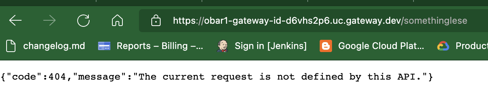

# https:§§cloud.google.com§api-gateway§docs§deploying-api
> https://cloud.google.com/api-gateway/docs/deploying-api


## Prerequisites

[`here`](../https:§§cloud.google.com§api-gateway§docs§creating-api/readme.md)
[`here`](../https:§§cloud.google.com§api-gateway§docs§openapi-overview/readme.md)
[`here`](../https:§§cloud.google.com§api-gateway§docs§creating-api-config/readme.md)

## Gateway ID requirements


## Defining the endpoint of the deployed API config

when deploying an api config to the gateway the api gateway creates uniq url on `gateway.dev`
```
[https://GATEWAY_ID-HASH.REGION_CODE.gateway.dev](/https:§§GATEWAY_ID-HASH.REGION_CODE.gateway.dev/readme.md)
# For example:
[https://my-gateway-a12bcd345e67f89g0h.uc.gateway.dev](/https:§§my-gateway-a12bcd345e67f89g0h.uc.gateway.dev/readme.md)
```

## Deploy an API config to a gateway

some help
```
gcloud api-gateway gateways create --help
```

*  deploy api config to a gateway
```
gcloud api-gateway gateways create GATEWAY_ID  --api=API_ID --api-config=CONFIG_ID  --location=GCP_REGION --project=PROJECT_ID
```


* gateway a details 
```
gcloud api-gateway gateways describe GATEWAY_ID  --location=GCP_REGION --project=PROJECT_ID
```


defaultHostname: `obar1-gateway-id-d6vhs2p6.uc.gateway.dev`

invocation


note


## Listing gateways

```bash
gcloud api-gateway gateways list \
    --project=PROJECT_ID
# specific api
gcloud api-gateway gateways list \
    --filter="apiConfig:projects/PROJECT_ID/locations/global/apis/API_ID/*" \
    --project=PROJECT_ID
# specific api config
gcloud api-gateway gateways list \
    --filter="apiConfig:projects/PROJECT_ID/locations/global/apis/API_ID/configs/CONFIG_ID" \
    --project=PROJECT_ID
```

## Updating a gateway

SKIP:

## Deleting a gateway

```bash
gcloud api-gateway gateways delete GATEWAY_ID  --location=GCP_REGION --project=PROJECT_ID
```