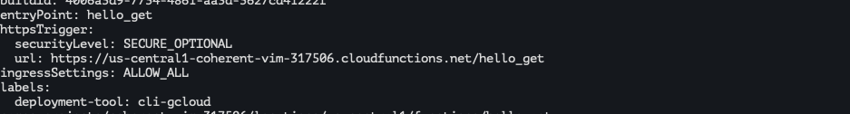
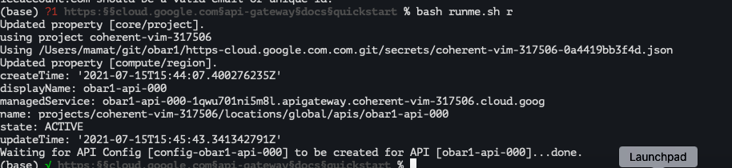
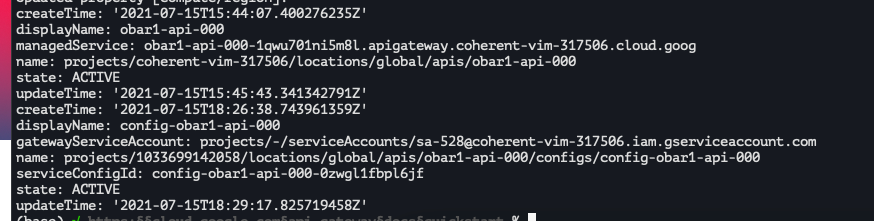
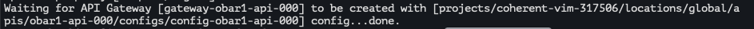
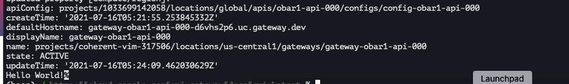
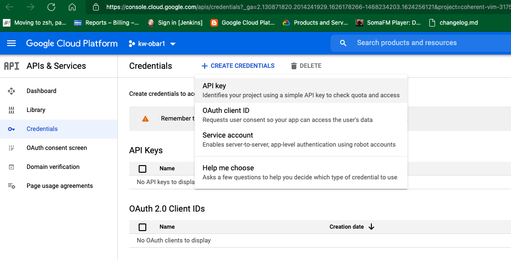
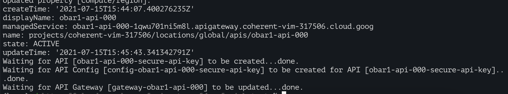
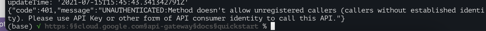

# https:§§cloud.google.com§api-gateway§docs§quickstart
> https://cloud.google.com/api-gateway/docs/quickstart

## Before you begin

```
gcloud components update
gcloud config set project PROJECT_ID
```

## Enabling required services

all of them

gcloud services list


```
gcloud services enable apigateway.googleapis.com 
gcloud services enable servicemanagement.googleapis.com 
gcloud services enable servicecontrol.googleapis.com
```
check https://cloud.google.com/sdk/gcloud/reference/services

## Deploying an API backend

API Gateway sits in front of a deployed backend service and handles all incoming requests. In this quickstart, API Gateway routes incoming calls to a Cloud Function backend named helloGET that contains the function shown below:

https://cloud.google.com/functions/docs/quickstart




## Creating an API

Now you are ready to create your API on API Gateway.

1. Enter the following command, where:

API_ID specifies the name of your API. 

API ID requirements
- Must have a maximum length of 63 characters.
- Must contain only lowercase letters, numbers, or dashes.
- Must not start with a dash.
- Must not contain an underscore.

```
gcloud api-gateway apis create API_ID --project=PROJECT_ID
# ex
gcloud api-gateway apis create my-api --project=my-project
```

2. On successful completion, you can use the following command to view details about the new API:

```
gcloud api-gateway apis describe API_ID --project=PROJECT_ID
# For example:
gcloud api-gateway apis describe my-api --project=my-project
```

## Creating an API config

Before API Gateway can be used to manage traffic to your deployed API backend, it needs an API config.

 OpenAPI spec that contains specialized annotations to define the desired API Gateway  
 
[here](./my-api.yaml.template)
 

3. Edit the file 
4. Enter the following command, where:
CONFIG_ID specifies the name of your API config. API_ID specifies the name of your API. PROJECT_ID specifies the name of your Google Cloud project. SERVICE_ACCOUNT_EMAIL specifies the service account created explicitly for creating API configs. 
For more information, see Configuring a service account. https://cloud.google.com/api-gateway/docs/configure-dev-env#configuring_a_service_account

```
gcloud api-gateway api-configs create CONFIG_ID \ --api=API_ID --openapi-spec=API_DEFINITION \ --project=PROJECT_ID --backend-auth-service-account=SERVICE_ACCOUNT_EMAIL
# For example:
gcloud api-gateway api-configs create my-config \ --api=my-api --openapi-spec=openapi2-functions.yaml \ --project=my-project --backend-auth-service-account=0000000000000-
compute@developer.gserviceaccount.com
```

This operation may take several minutes to complete as the API config is propagated to downstream systems. Creation of a complex API config could take up to ten minutes to complete successfully.



5. After the API config is created, you can view its details

```
gcloud api-gateway api-configs describe CONFIG_ID \ --api=API_ID --project=PROJECT_ID
# For example:
gcloud api-gateway api-configs describe my-config \ --api=my-api --project=my-project
```



## Creating a gateway

Now deploy the API config on a gateway. Deploying an API config on a gateway defines an external URL that API clients can use to access your API. 

```
gcloud api-gateway gateways create GATEWAY_ID \ --api=API_ID --api-config=CONFIG_ID \ --location=GCP_REGION --project=PROJECT_ID
# For example:
gcloud api-gateway gateways create my-gateway \ --api=my-api --api-config=my-config \ --location=us-central1 --project=my-project

```
where: GATEWAY_ID specifies the name of the gateway. API_ID specifies the name of the API Gateway API associated with this gateway. CONFIG_ID specifies the name of the API config deployed to the gateway.
GCP_REGION is the Google Cloud region for the deployed gateway.
>Note: Allowed values are:
asia-east1 asia-northeast1 australia-southeast1 europe-west1 europe-west2 us-east1 us-east4 us-central1 us-west2 us-west3 us-west4
 


On successful completion, use the following command to view details about the gateway:

```
gcloud api-gateway gateways describe GATEWAY_ID \ --location=GCP_REGION --project=PROJECT_ID
# For example:
gcloud api-gateway gateways describe my-gateway \ --location=us-central1 --project=my-project
```


> Note the value of the defaultHostname property. This is the hostname portion of the gateway URL you use to test your deployment in the next step.


## Testing your API deployment

Now you can send requests to your API using the URL generated upon deployment of your gateway.


Enter the following curl command, where: DEFAULT_HOSTNAME specifies the hostname portion of your deployed gateway URL. hello is the path specified in your API config.

```
curl https://DEFAULT_HOSTNAME/hello
# For example:
curl https://my-gateway-a12bcd345e67f89g0h.uc.gateway.dev/hello
```
The output is:
Hello World!



You have successfully created and deployed an API Gateway!

## Securing access by using an API key

To secure access to your API backend, generate an API key associated with your project and grant that key access to call your API
https://cloud.google.com/endpoints/docs/openapi/restricting-api-access-with-api-keys
If you do not already have an API key associated with the Google Cloud project you are using in this quickstart, you can add one by following the steps at Creating an API Key. 
https://cloud.google.com/docs/authentication/api-keys#creating_an_api_key



To secure access to your gateway using an API key:
1. Enable API key support for your service. 
NOTE: look for managedservice hash value


```
gcloud services enable API_ID-HASH.apigateway.PROJECT_ID.cloud.goog
#For example:
gcloud services enable my-api-123abc456def1.apigateway.my-project.cloud.goog
```

2. Modify the OpenAPI spec used to create your API config to include instructions to enforce an API key validation security policy on all traffic. Add the security type and securityDefinitions as shown below:
[here](./obar1-api-000-secure-api-key.yaml)

3. Create a new API config with the modified OpenAPI spec using the following command:
```
gcloud api-gateway api-configs create NEW_CONFIG_ID \ --api=API_ID --openapi-spec=NEW_API_DEFINITION \ --project=PROJECT_ID --backend-auth-service-account=SERVICE_ACCOUNT_EMAIL
#For example:
gcloud api-gateway api-configs create my-config-key \ --api=my-api --openapi-spec=openapi2-functions.yaml \ --project=my-project --backend-auth-service-
account=0000000000000compute@developer.gserviceaccount.com
```

4. Run the following command to update your existing gateway with the new API config:
```
gcloud api-gateway gateways update GATEWAY_ID \ --api=API_ID --api-config=NEW_CONFIG_ID \ --location=GCP_REGION --project=PROJECT_ID
#For example:
gcloud api-gateway gateways update my-gateway \ --api=my-api --api-config=my-config-key \ --location=us-central1 --project=my-project
```


## Testing your API key

Once you have created and deployed the modified API, try making a request to it. Enter the following curl command, where:
DEFAULT_HOSTNAME specifies the hostname portion of your deployed gateway URL. hello is the path specified in your API config.

```
curl https://DEFAULT_HOSTNAME/hello
For example:
curl https://my-gateway-a12bcd345e67f89g0h.uc.gateway.dev/hello
```
This should result in the following error:
> UNAUTHENTICATED:Method doesn't allow unregistered callers (callers without established identity). Please use API Key or other form of API consumer identity to call this API.



Now, enter the following curl command where:

```
curl https://DEFAULT_HOSTNAME/hello?key=API_KEY
```

Now you should see Hello World! in the response from your API.
Congratulations! You have successfully protected your API backend with an API Gateway. Now you can start onboarding new API clients by generating additional API keys.


## Clean up

To avoid incurring charges to your Google Cloud account for the resources used in this quickstart, you can delete your API and delete your gateways. You can also delete the Google Cloud project used for this tutorial.

