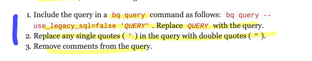

# `https:§§cloud.google.com§bigquery§docs§bq-command-line-tool`

> <https://cloud.google.com/bigquery/docs/bq-command-line-tool>

complete ref 
[https://cloud.google.com/bigquery/docs/reference/bq-cli-reference](/https:§§cloud.google.com§bigquery§docs§reference§bq-cli-reference/readme.md)

## Before you begin

Enable the BigQuery API

## Entering bq commands in Cloud Shell

use `bq`

## Positioning flags and arguments

The bq command-line tool supports two kinds of flags:

- Global flags can be used in all commands.
- Command-specific flags apply to a specific command.


use ' or "  with spacec etc
prefer using FLAG=ARGUMET

## Running queries from the bq command-line tool

To take a query that you've developed in the Google Cloud Console and run it from the bq command-line tool, do the following:



```bash
bq query --use_legacy_sql=false\
'
SELECT word, SUM(word_count) AS count
FROM `bigquery-public-data.samples.shakespeare`
WHERE word LIKE "%raisin%"
GROUP BY word
'
```

For more information, see Running interactive and batch query jobs.
[https://cloud.google.com/bigquery/docs/running-queries](/https:§§cloud.google.com§bigquery§docs§running-queries/readme.md)

## Getting help

bq version
bq help
be --help
bq help CMD

## Setting default values for command-line flags

SKIP:

## Running the bq command-line tool in an interactive shell

bq shell

You can run the bq command-line tool in an interactive shell where you don't need to prefix the commands with bq

## Running the bq command-line tool in a script

You can run the bq command-line tool in a script

example

```bash
#!/bin/bash 
gcloud config set project myProject 
bq query --use_legacy_sql=false --destination_table=myDataset.myTable \ 
'SELECT
word, SUM(word_count) AS count FROM `bigquery-public-data`.samples.shakespeare WHERE word LIKE "%raisin%" GROUP BY word'
```

## Running bq commands from a service account

To run bq commands using a service account, you must authorize access to Google Cloud from the service account.

## Examples

You can find command-line examples
[https://cloud.google.com/bigquery/docs/how-to](/https:§§cloud.google.com§bigquery§docs§how-to/readme.md)

## Creating resources

[https://cloud.google.com/bigquery/docs/datasets#bigquery-create-dataset-cli](/https:§§cloud.google.com§bigquery§docs§datasets#bigquery-create-dataset-cli/readme.md)
[https://cloud.google.com/bigquery/docs/tables#bigquery-create-table-cli](/https:§§cloud.google.com§bigquery§docs§tables#bigquery-create-table-cli/readme.md)
[https://cloud.google.com/bigquery/docs/tables#creating_a_table_from_a_query_result](/https:§§cloud.google.com§bigquery§docs§tables#creating_a_table_from_a_query_result/readme.md)
[https://cloud.google.com/bigquery/docs/creating-partitioned-tables#creating_an_empty_ingestion-time_partitioned_table_with_a_schema_definition](/https:§§cloud.google.com§bigquery§docs§creating-partitioned-tables#creating_an_empty_ingestion-time_partitioned_table_with_a_schema_definition/readme.md)
[https://cloud.google.com/bigquery/docs/views#creating_a_view](/https:§§cloud.google.com§bigquery§docs§views#creating_a_view/readme.md)

## Listing resources

[https://cloud.google.com/bigquery/docs/listing-datasets](/https:§§cloud.google.com§bigquery§docs§listing-datasets/readme.md)
[https://cloud.google.com/bigquery/docs/tables#listing_tables_in_a_dataset](/https:§§cloud.google.com§bigquery§docs§tables#listing_tables_in_a_dataset/readme.md)
[https://cloud.google.com/bigquery/docs/listing-datasets#listing_datasets_in_a_project](/https:§§cloud.google.com§bigquery§docs§listing-datasets#listing_datasets_in_a_project/readme.md)

## Updating resources

[https://cloud.google.com/bigquery/docs/updating-datasets](/https:§§cloud.google.com§bigquery§docs§updating-datasets/readme.md)
[https://cloud.google.com/bigquery/docs/managing-tables#updating_table_properties](/https:§§cloud.google.com§bigquery§docs§managing-tables#updating_table_properties/readme.md)
[https://cloud.google.com/bigquery/docs/updating-views](/https:§§cloud.google.com§bigquery§docs§updating-views/readme.md)

## Loading data

[https://cloud.google.com/bigquery/docs/loading-data-cloud-storage-avro#bigquery-import-gcs-file-cli](/https:§§cloud.google.com§bigquery§docs§loading-data-cloud-storage-avro#bigquery-import-gcs-file-cli/readme.md)
[https://cloud.google.com/bigquery/docs/loading-data-cloud-storage-json#loading_json_data_into_a_new_table](/https:§§cloud.google.com§bigquery§docs§loading-data-cloud-storage-json#loading_json_data_into_a_new_table/readme.md)
[https://cloud.google.com/bigquery/docs/loading-data-cloud-storage-csv#loading_csv_data_into_a_new_table](/https:§§cloud.google.com§bigquery§docs§loading-data-cloud-storage-csv#loading_csv_data_into_a_new_table/readme.md)
[https://cloud.google.com/bigquery/docs/loading-data-local#loading_data_from_a_local_data_source](/https:§§cloud.google.com§bigquery§docs§loading-data-local#loading_data_from_a_local_data_source/readme.md)

## Querying data

[https://cloud.google.com/bigquery/docs/running-queries#bigquery-query-cli](/https:§§cloud.google.com§bigquery§docs§running-queries#bigquery-query-cli/readme.md)
[https://cloud.google.com/bigquery/docs/writing-results#writing_query_results](/https:§§cloud.google.com§bigquery§docs§writing-results#writing_query_results/readme.md)
[https://cloud.google.com/bigquery/docs/parameterized-queries#running_parameterized_queries](/https:§§cloud.google.com§bigquery§docs§parameterized-queries#running_parameterized_queries/readme.md)

## Using external data sources

[https://cloud.google.com/bigquery/external-table-definition#creating_a_table_definition_using_a_json_schema_file](/https:§§cloud.google.com§bigquery§external-table-definition#creating_a_table_definition_using_a_json_schema_file/readme.md)

## Exporting data

[https://cloud.google.com/bigquery/docs/exporting-data#exporting_data_stored_in_bigquery](/https:§§cloud.google.com§bigquery§docs§exporting-data#exporting_data_stored_in_bigquery/readme.md)

## Using the BigQuery Data Transfer Service

SKIP:

## Debugging

- see req sent 
```
--apilog=PATH_TO_FILE
```
- error 
```
--format=prettyjeson
```
look reason
[https://cloud.google.com/bigquery/docs/error-messages](/https:§§cloud.google.com§bigquery§docs§error-messages/readme.md)
