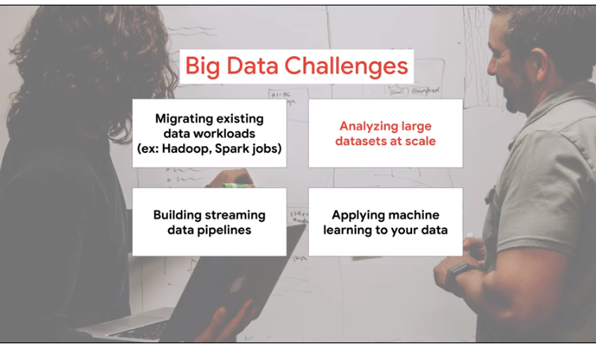

# 01CourseOverview


real world ml challenge using gcp

6 modules


1) data driven decision making 
about data and ml tools from 1000 feet

next 4 about each of thema 
you have hands on module

last) summary and resource


each module
- lectures with scenario and challenges and how to address
- demo solution/action to do in labs
- practice with quicklab 
- check use case from customer to think your solution

> get insight from the approach taken to solve the use case


there ll be a lot of job opp in data 
1% of data is analyzed all the rest is lost


roles 

this course is for `data eng`

challenges for the role:



```
- migrating your existing big data workloads to an environment where you can effectively analyze all of your data 
- analyzing large data sets of historical
data third 
- building scalable pipelines that can handle streaming data so that your business can make data-driven decisions more quickly 
- building machine learning models so that you're not just reacting to data you're able to make predictive forward-looking actions using your data
```