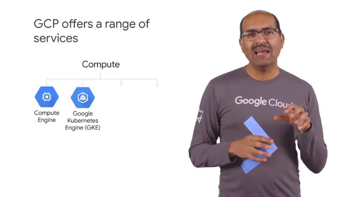
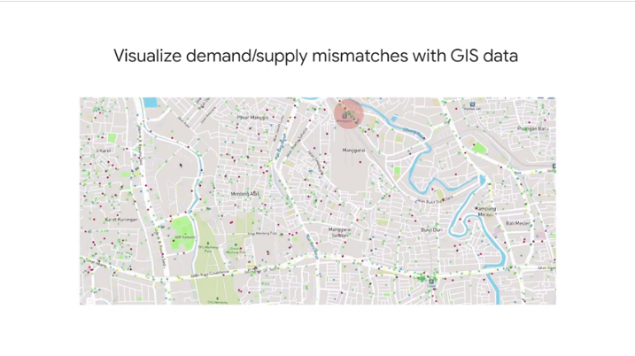

# 02IntroductiontoGoogleCloudPlatform

## Introduction to Google Cloud Platform

infrastructure of GCP
>initially created to support google products 

big data ml products built on top of GCP

learnng from use case by customers

building the right team // structure and roles 


base layer is `security` 

on top `compute store networking`

the top layer to abstract the infrastructure under it


## Compute Power for Analytic and ML Workloads

you need compute power and scale

ex


video is a lot of frames
time series data of the gyroscope


a lot of data just for an image

```
1.2 billion  photops uploaded every day
430 min of video uploaded every minute
> to be processed and text extracted etc
60 pb every hour
```

the ml is trained on million of pictures to make the stabilitation happen

the training happens on the datacenter and the `trained modules` are deployed ont the mobiles


```
build movie raccomenadtion use `clod video`
```

you can use these building blocks


in the past few year the compute power has hit its plato


google created `asic` for ml specific tasks than traditionsl gpu
you can use tpu in the gcp for challenges 

ex


ex 


to boost google dc efficiency 
streaming sensor data
to train ml to cool in more efficiency 


## Demo - Creating a VM on Compute Engine

1. sping up compute
2. copy file from cloude storage
3. public the files


start with https://cloud.google.com/


```
computer engine -> vm instance -> create vm
peek region
peek zone
check n virtual cpu
// curr 64 vcpu
search by n core and mem

small is 1vcpu 10gb space
allow full access to clud api 
// you can +w to cloud storage

// you can ssh the machine 

> create

// install what you need
sudo apt-get install git

git clone https://github.com/GoogleCloudPlatform/training-data-analyst

```

we can now process earth quake data from ugs


https://github.com/GoogleCloudPlatform/training-data-analyst/blob/master/courses/bdml_fundamentals/demos/earthquakevm/ingest.sh
to copy/get all the data you need

https://github.com/GoogleCloudPlatform/training-data-analyst/blob/master/courses/bdml_fundamentals/demos/earthquakevm/install_missing.sh
missing software to install int he bare boen vm

check the `earthquake.csv`


use `transform.py` to create an img from the data


as we are done with the compute part we can get ride off the vm after publishing the data


create a cloud storage bucket


```
storage -> browser -> create bucket

// uniq name for it

multi-region

set permission 

go back to vm 

gsutils ls gs://__bucket_name

gsutils cp earth*. gs://__bucket_name

```


the files are there but not yet public


stop the vm // pay for space but not for compute

delete vm

edit the privacy 

```
add memebers 
all users
+ storage object viewew

```


use the `public link`


## Elastic Storage with Google Cloud Storage


we still need a place where to store data generated
it's separated from the computer model
computer and storage are indipendent
you need `data pipeline` before ml models


`google file storage` is a global entity wher to store the data

`gsutil` is a cmd line utility


you have
standard storage is fastest
arhcive is the least exp

ex
nearline for montlhy
stage data in std storage 

you need data available in the region to be used by vpc

reduce network charges

`cloud stroage buckets` sample of cloud resource

from the most granular 

bucket names must be gloablly unique


! use prj id for the bucket

`prj` is a base level organizsing enitty to create reosurces and services foir mng billing and permission api


prj is a local org
zone more physicial

you can use `folders` to org projects


and on top we have `org` the root node of your gcp hierarchy


to define policies to apply to all the undeneath elments

`cloud identinty and access mng` helps to fine tune access controel of gcp resources

> if you want to use folders you must have an org

how to use th bucker?


int he demo use gsutil 
// already there in the vcp

you can download the google skd so you cna use it there 
// similar to unix


https://cloud.google.com/storage/docs/gsutil_install

## Build on Google's Global Network


private network

1000s of cable to cross oceans
40% of internet traffic everyday

1pb/sec network


full duplex bandwith

every machine can talk to very machine at 10gb => racks location does not matter that much anymore


`edge point of presence` to connect to public internet

more than 90 ww

the lowewst delayt edge is used to connect to the end user request

a `edge caching mechanism` is in place too

## Security - On-premise vs Cloud-native


on premise you need to take care of all:
- content
- access policies
- usage
- deployment
- web app security
- identity
- operations
- acces and auth
- network security
- os udaptes
- audit logging
- network 
- storage and encryption
- hw

with gcp


communciation are encypted in transit to protectt from ddos


`bigquery` is petascale analytics dwh

data in table is encrypted with data encyption key
they are then encypted with other keys to have `envelope encription`
you can add your custom keys

you can monitor the running queries

you can limit the access on table/views af fine level

## Evolution of Google Cloud Big Data Tools

until now low level infrastructure

you tytically work with hight level products

check the history/evolution to undertand the problems


google invented new data prcessing method

- 2002
`gfs` foundation for cloud storage

- 2004 
  how to process the data of the web 
  use` map reduce` to parlallelize on large cluster of commodity machiens

  > dough cutting and caffarella created `hadoop` to handle 3V for structured and unstructed data 

- 2006
cloud big table
move focus on developing app logic to move away from m/r

- 2008
  `dremel`
  bremel breaks data in shards and compress them in columnar storage and use a columnar optz to fire parallel queries on shrades 
  service mng autoscale and balance 

> query engine behind bigquery

- 2009
  `colossus` next gen distributed query eng
  `spanner` planet scale relationale db
  `flume and millwheel` for data pipeline
  `pub/sub` for msg
  `tensorflow` for ml
  `tpu` for specialize hw


you can practice in the labs witha  lot of them

use quicklabs sandbox
https://youtu.be/yF7EDXKTmoQ


## Exploring a BigQuery Public Dataset

 [Exploring a BigQuery Public Dataset .pdf](Exploring a BigQuery Public Dataset .pdf) 


https://cloud.google.com/solutions/bigquery-data-warehouse
https://cloud.google.com/bigquery/docs/bq-command-line-tool
https://cloud.google.com/bigquery/docs/reference/rest

## Choosing the Right Approach

we have a few options for computer and storage
`compute engine` to run vm in the cloud
iaas solution
you manage the instance

`gke` about clusters of machien running containers with code and dependencies 
containarize apps in the cloud under your admin
you can pkg code in containers
to orchestarte the contiander you need kubernetes



`app engine` to run code in the cloud
google provides the reosurces
paas solution
`cloud functions` 
serveless 
fucntion as service
based events it runs code


use app engine who live for a while
cloude function is triggered by events

you need to use some db to store data

you can do in the vm as in the past
or use google fully amanged db solutions


big data and ml services


in a data processing data flow

left from right:
raw data as collected >>> serve the users needs


## What you can do with GCP

ex of usage


train ml to recognize common model and contents


email pipeline

## Activity - Explore a Customer Use Case

check https://cloud.google.com/customers#/products=Big_Data_Analytics

ex
https://cloud.google.com/customers/aclima/
https://cloud.google.com/customers/affable/

how challenges were solved
biz imapact

**gojek**


data ingested in pub/sub
data is brought in cloud data flow to process
and other data soruces are used to enrich the data
and big query is used to store the data




red are areas are the problem


## The Different Data Roles in an Organization

you need 
data eng  to build pipleine
decision maker about how far to go
analys to check the status
ml ppl to inject know about the core math
mng to help


use few personas in the corse

data eng  : brittany and theo //hadoop job
data anlyst : jacob //reports
rebecca : data eng //streaming i/o
vishal : ml eng //ml in karas and tensorflow
