# **03RecommendingProductsusingCloudSQLandSpark**

 ## How Businesses Use Recommendation Systems

migrate reccomendation system from on premise to gcp
challenges on tuning on premise cluster
move to google storage

reccomendation system are everywhere
ex
in ecommerce suggest similar problems, you can upvote and help the model to learn from your preference
they get info from your behaviour and cluster 

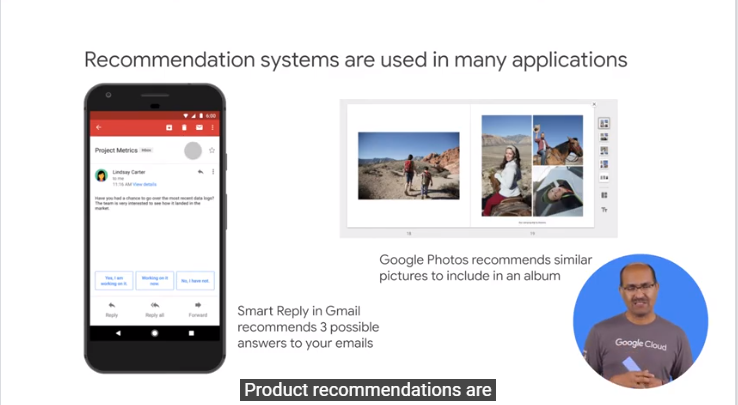

recommendation system work when they are trained on scale

## Introduction to Machine Learning

check scenario on house rentals to reccomend to users based their preferences

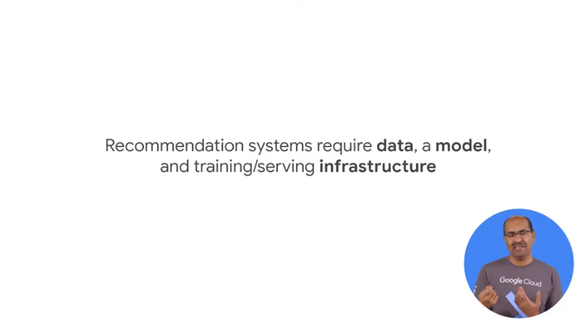

models are trainied on data not on rules
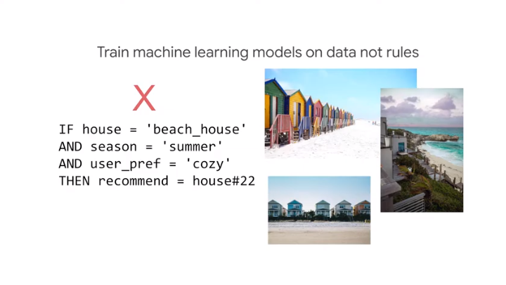

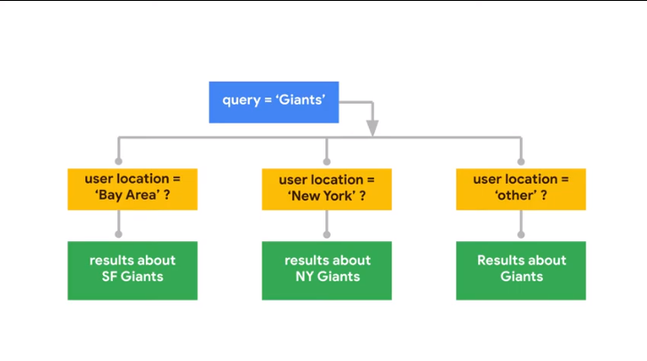
you cannot do this with `if then` approach 
hand coded rules are very hard to maintian
`ml` scales and learn from data, examples are recorded from real cases 
> we need good lable examples

ex
show result of query
record what ppl link
`rankbrain`

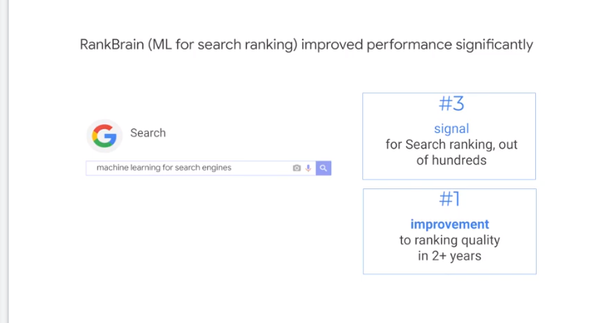


## ML for Recommending Housing Rentals

ingest rating of all the houses // done by users

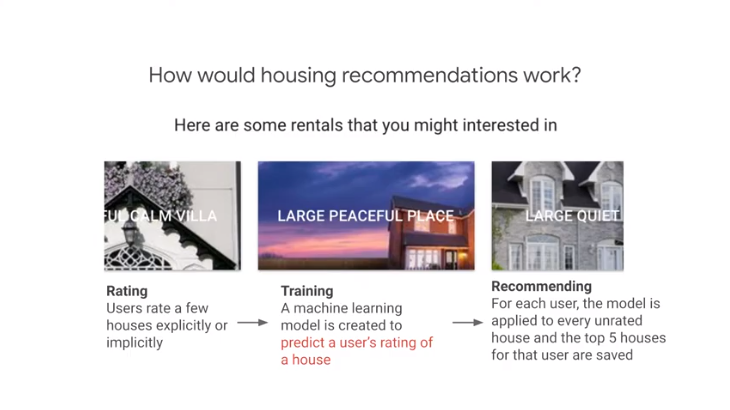
alg get people similar to you and uses their data to reccomend you things you never rate in the past

the model has to find the users who are like you and weight 

the matrix can be sparse so we need to cluster too 

now think how often to compute the ratings and where to store them

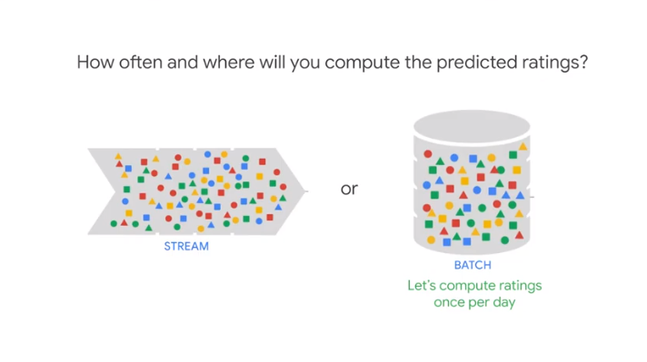

no need to be streaming, so you can do batch in a scalable way and store in sql in precomputed way

## Move From On-Premise to Google Cloud Platform

use hadoop + mysql for the house recoomendation problem

you have on premises where the system runs and we want to  move to gcp


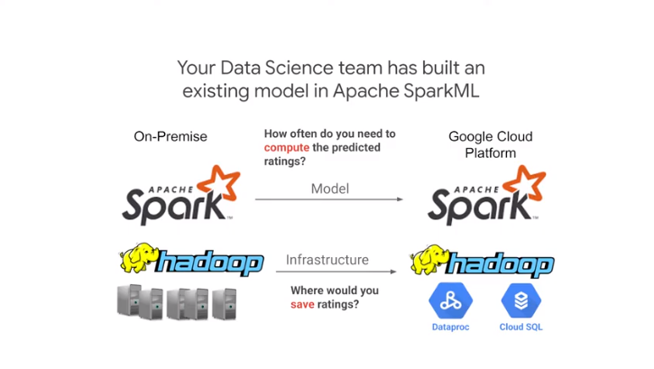

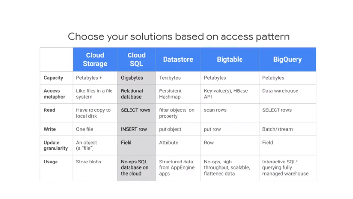

use cloud storage as global fs
use cloud sql as rdbms for trans data
use datastore as trans no sql obj db
use big data for no sql append only table //ex sensor data
use bigquery as sql dwh for analytical needs on PB scale

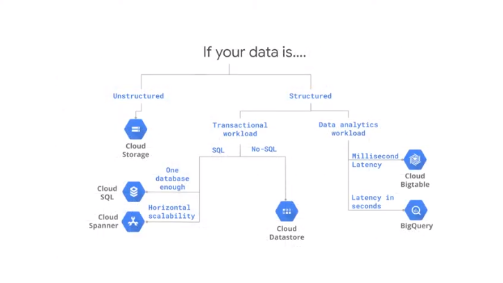
unstrcutured // video and obj
struct and trans

if you need trans db for more than a few db or global trans use cloud spanner


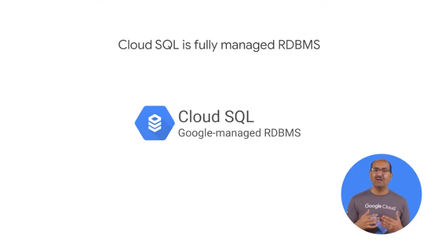
google hosted 
- mysql and postgres supported

+ are
- familiar
- mng bks by gcp
- connect in the same region where the app runs
- secure in google dc

we need to decide where to  do the compute part 

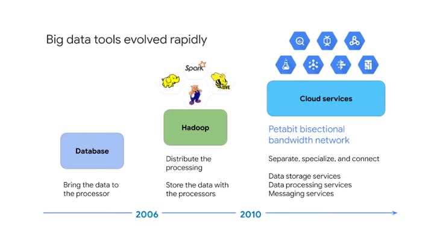
google lunched `cloud proc`

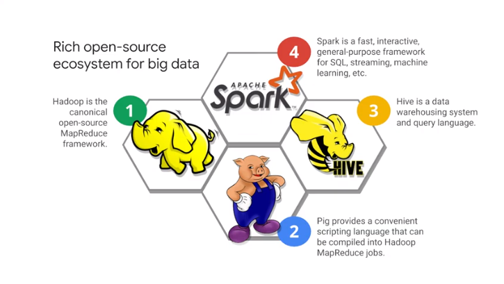
tools usable
spark offers ml 

> we use spark for the housing rental but we ll do the computation on cloud proc

## Demo - From Zero to an Apache Spark Job in 10 Minutes or Less

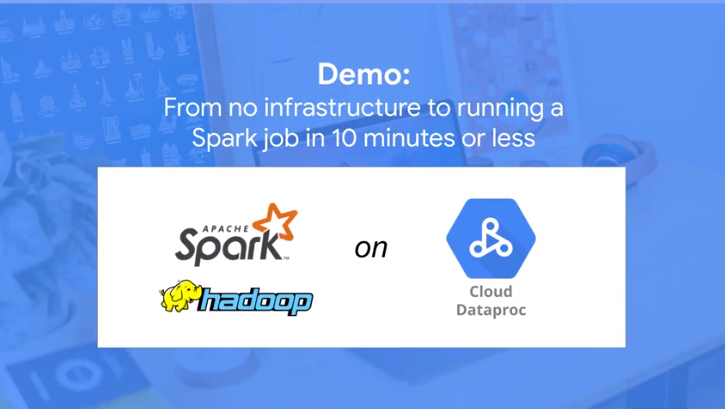

producst -> big data -> dataproc

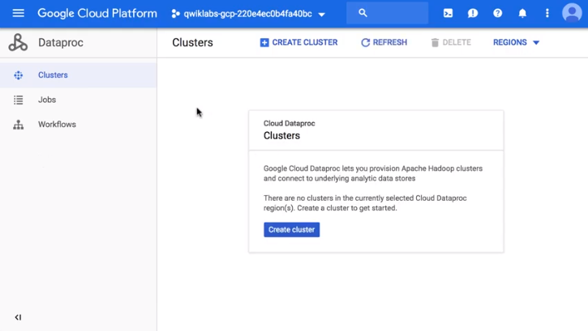

creta and provision a cluster


job ->submit job
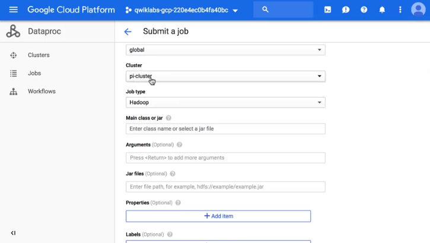
type 
def jar and java class

cluster are ephemoral // fungable resource

## Utilizing and Tuning On-Premise Clusters

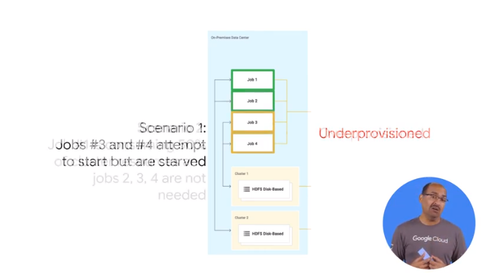

the static nature is a problem
- resource are there not used
- resource are not enough

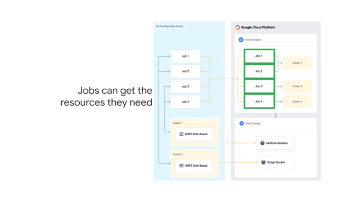

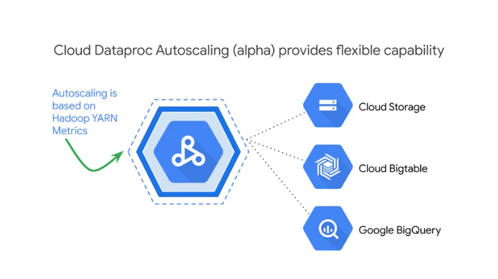
check hadoop metrics and derive info about the scale you need fot the future

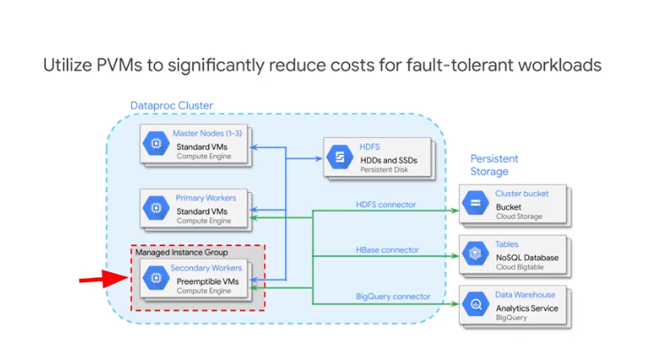
preemptive vm are 80% discount 
store the data outside the cluster

## Move Storage Off-Cluster with Google Cloud Storage

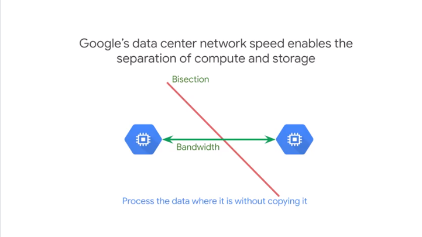
you can use bucket as google has this so any server can communicate with any other server at hight speed

no need to move data in the cluster 

cluster go down and data is there 

change the path in the on-premise code as

```
hdfs:// -> gs://
```

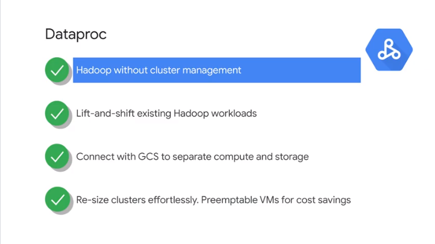
lift and shift the workload
connect dataproc with storage
autoscale and preemetive vm to save money

## Lab - Recommend Products Using Cloud SQL and SparkML

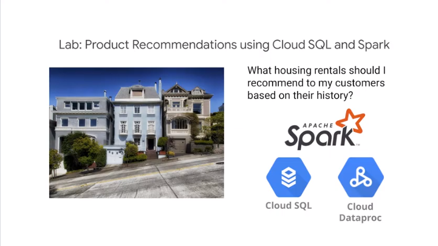

cto ask to move on-remise hadoop cluster to gcp

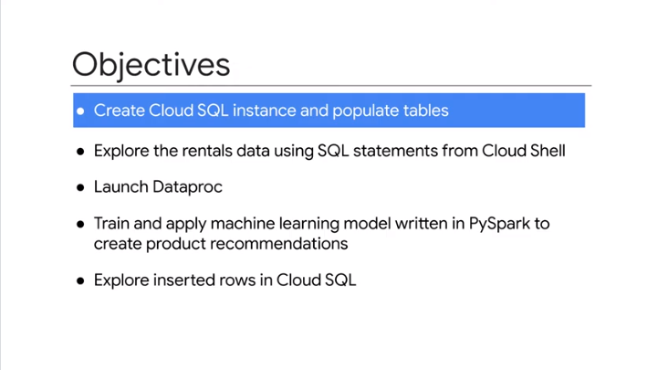

# Recommending Products Using Cloud SQL and Spark

  [Recommending Products Using Cloud SQL and Spark | Qwiklabs .pdf](Recommending Products Using Cloud SQL and Spark | Qwiklabs .pdf) 

copy csv

```
echo "Creating bucket: gs://$DEVSHELL_PROJECT_ID"
gsutil mb gs://$DEVSHELL_PROJECT_ID

echo "Copying data to our storage from public dataset"
gsutil cp gs://cloud-training/bdml/v2.0/data/accommodation.csv gs://$DEVSHELL_PROJECT_ID
gsutil cp gs://cloud-training/bdml/v2.0/data/rating.csv gs://$DEVSHELL_PROJECT_ID

echo "Show the files in our bucket"
gsutil ls gs://$DEVSHELL_PROJECT_ID

echo "View some sample data"
gsutil cat gs://$DEVSHELL_PROJECT_ID/accommodation.csv
```

auth ips for dataproc
```
echo "Authorizing Cloud Dataproc to connect with Cloud SQL"
CLUSTER=rentals
CLOUDSQL=rentals
ZONE=us-central1-a
NWORKERS=2

machines="$CLUSTER-m"
for w in `seq 0 $(($NWORKERS - 1))`; do
   machines="$machines $CLUSTER-w-$w"
done

echo "Machines to authorize: $machines in $ZONE ... finding their IP addresses"
ips=""
for machine in $machines; do
    IP_ADDRESS=$(gcloud compute instances describe $machine --zone=$ZONE --format='value(networkInterfaces.accessConfigs[].natIP)' | sed "s/\['//g" | sed "s/'\]//g" )/32
    echo "IP address of $machine is $IP_ADDRESS"
    if [ -z  $ips ]; then
       ips=$IP_ADDRESS
    else
       ips="$ips,$IP_ADDRESS"
    fi
done

echo "Authorizing [$ips] to access cloudsql=$CLOUDSQL"
gcloud sql instances patch $CLOUDSQL --authorized-networks $ips
```

get taining model code

```

$ gsutil --help
Usage: gsutil [-D] [-DD] [-h header]... [-i service_account] [-m] [-o] [-q] [-u user_project] [command [opts...] args...]
Available commands:
  acl              Get, set, or change bucket and/or object ACLs
  bucketpolicyonly Configure uniform bucket-level access
  cat              Concatenate object content to stdout
  compose          Concatenate a sequence of objects into a new composite object.
  config           Obtain credentials and create configuration file
  cors             Get or set a CORS JSON document for one or more buckets
  cp               Copy files and objects
  defacl           Get, set, or change default ACL on buckets
  defstorageclass  Get or set the default storage class on buckets
  du               Display object size usage
  hash             Calculate file hashes
  help             Get help about commands and topics
  hmac             CRUD operations on service account HMAC keys.
  iam              Get, set, or change bucket and/or object IAM permissions.
  kms              Configure Cloud KMS encryption
  label            Get, set, or change the label configuration of a bucket.
  lifecycle        Get or set lifecycle configuration for a bucket
  logging          Configure or retrieve logging on buckets
  ls               List providers, buckets, or objects
  mb               Make buckets
  mv               Move/rename objects
  notification     Configure object change notification
  perfdiag         Run performance diagnostic
  rb               Remove buckets
  requesterpays    Enable or disable requester pays for one or more buckets
  retention        Provides utilities to interact with Retention Policy feature.
  rewrite          Rewrite objects
  rm               Remove objects
  rsync            Synchronize content of two buckets/directories
  setmeta          Set metadata on already uploaded objects
  signurl          Create a signed url
  stat             Display object status
  test             Run gsutil unit/integration tests (for developers)
  ubla             Configure Uniform bucket-level access
  update           Update to the latest gsutil release
  version          Print version info about gsutil
  versioning       Enable or suspend versioning for one or more buckets
  web              Set a main page and/or error page for one or more buckets

Additional help topics:
  acls             Working With Access Control Lists
  anon             Accessing Public Data Without Credentials
  apis             Cloud Storage APIs
  crc32c           CRC32C and Installing crcmod
  creds            Credential Types Supporting Various Use Cases
  dev              Contributing Code to gsutil
  encoding         Filename encoding and interoperability problems
  encryption       Using Encryption Keys
  metadata         Working With Object Metadata
  naming           Object and Bucket Naming
  options          Top-Level Command-Line Options
  prod             Scripting Production Transfers
  retries          Retry Handling Strategy
  security         Security and Privacy Considerations
  subdirs          How Subdirectories Work
  support          Google Cloud Storage Support
  versions         Object Versioning and Concurrency Control
  wildcards        Wildcard Names

Use gsutil help <command or topic> for detailed help.
```


```
gsutil cp gs://cloud-training/bdml/v2.0/model/train_and_apply.py train_and_apply.py
cloudshell edit train_and_apply.py
```


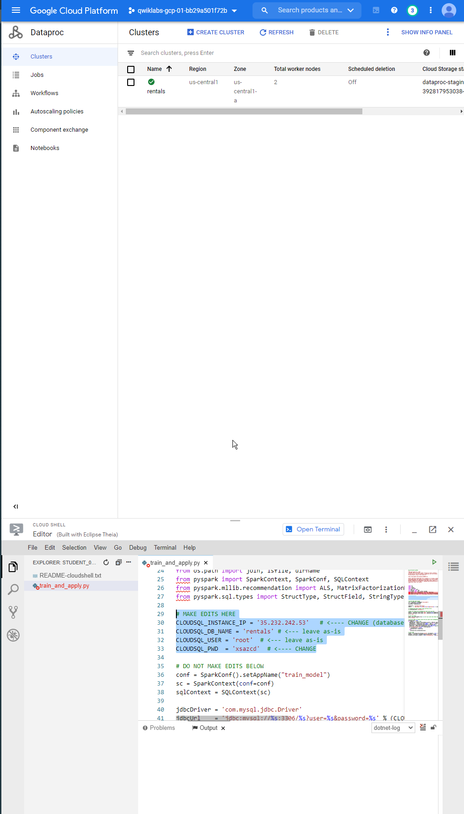

edit
```
# MAKE EDITS HERE
CLOUDSQL_INSTANCE_IP = '35.232.242.53'   # <---- CHANGE (database server IP)
CLOUDSQL_DB_NAME = 'rentals' # <--- leave as-is
CLOUDSQL_USER = 'root'  # <--- leave as-is
CLOUDSQL_PWD  = 'xsazcd'  # <---- CHANGE
```


```
gs://qwiklabs-gcp-01-bb29a501f72b/train_and_apply.py

```

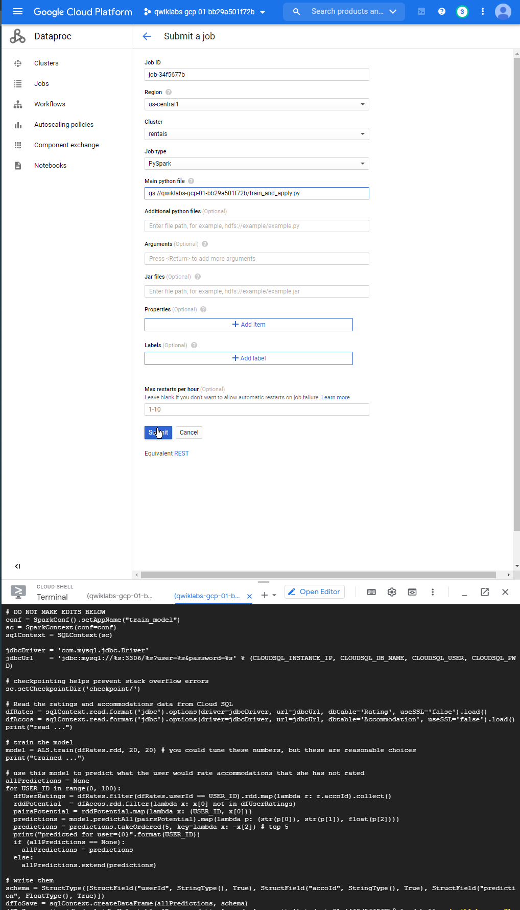


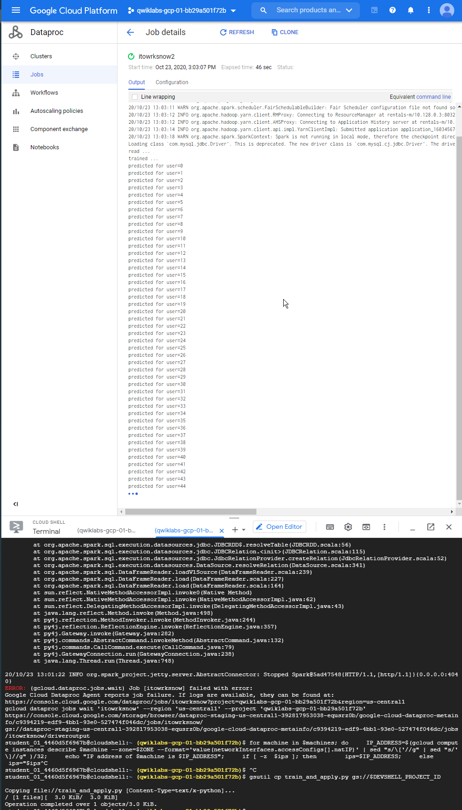

:P

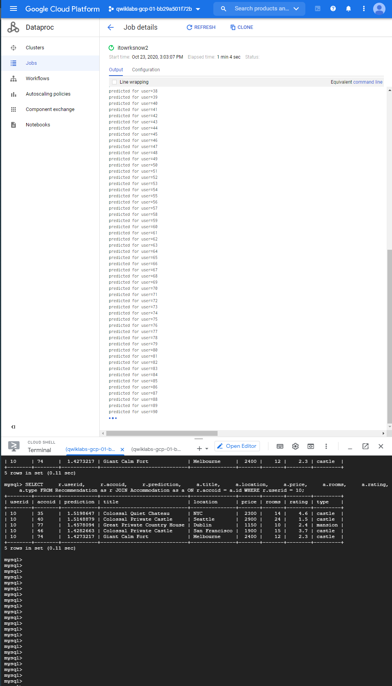


```sql

mysql> select count(*) from Recommendation;
+----------+
| count(*) |
+----------+
|      125 |
+----------+
1 row in set (0.10 sec)

mysql>
```


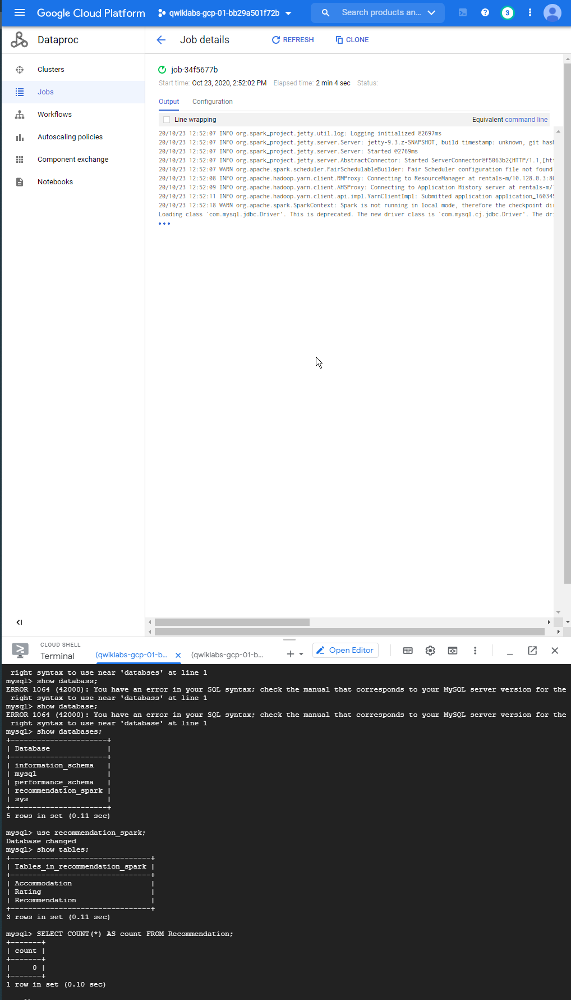
check job execution

