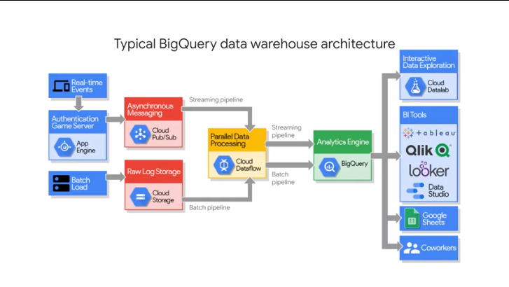
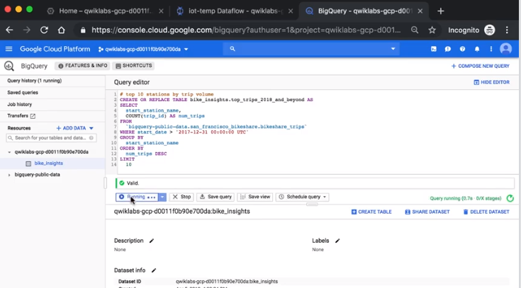
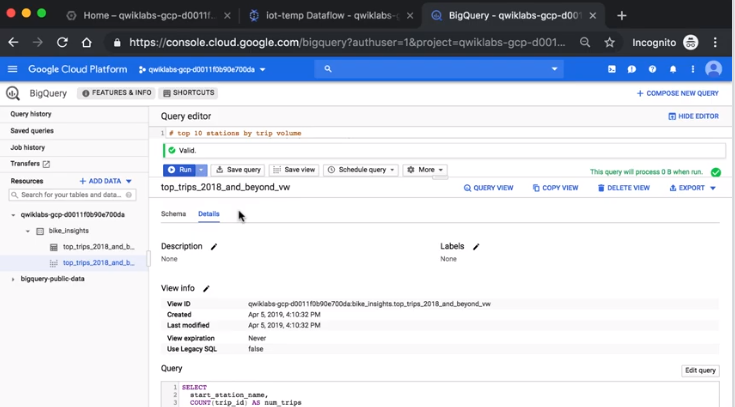
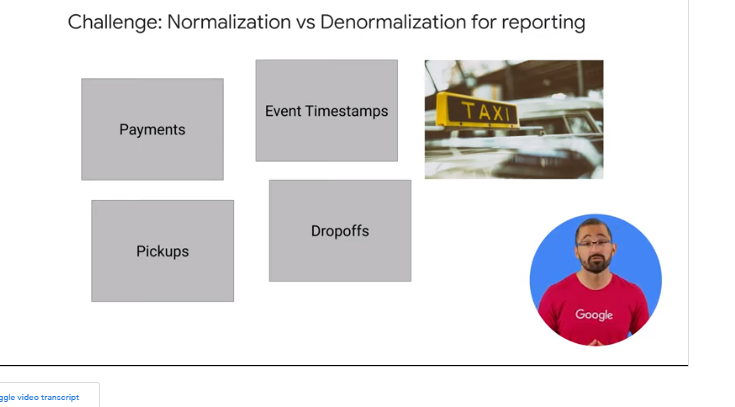
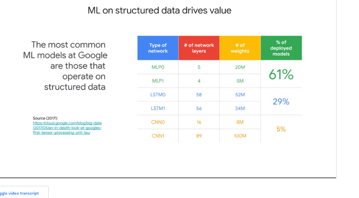
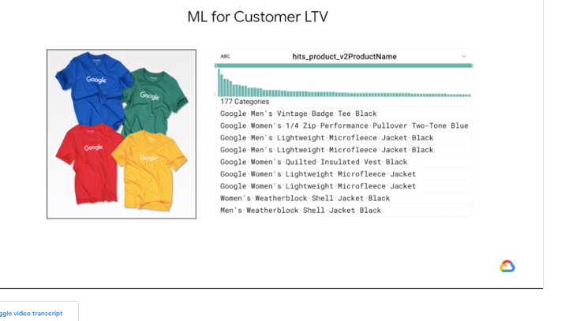
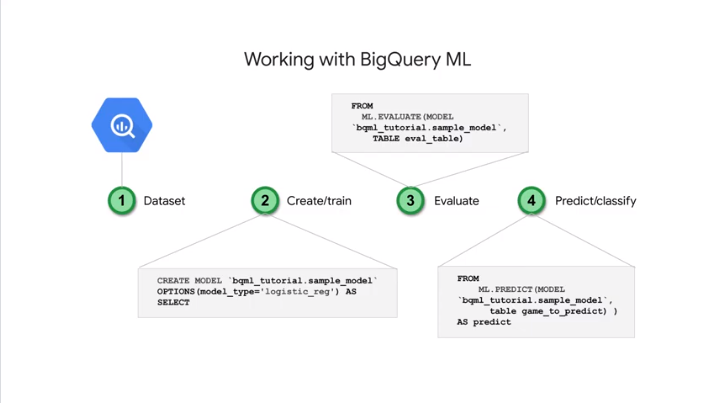

# 04PredictVisitorPurchasesUsingBigQueryML

bigquery is a pertabyte scale dwh
- fast sql query engine
- managed storage for dataset

ml  on structued data
// choose the model

build custom model  with sql


- serverlsee
pay for the bytes and data stored
// flat tier option

-data is encrypted at rest

- gis data 
// use cloud iam 

- foundantion ai and ml
// store transform and feed ml model



big query is staging area for the data
//ppl can get access to it and build what they need

## Demo - Query 2 Billion Lines of Code in Less Than 30 Seconds


challnge

bigdata->bigquery


create dataset from `github activity data`

// table are names as `prj-id.dataset-id.tbl-name`

at beginning you have a lot of raw data

break-up the problem in logical pieces

it supports `array` as datatypes so you can use in the sql directly 


`split(contentm, "\n")`

it supports `'regexp_contains` for the reg ex manipuilation


check 

`execution details`
across all the workers what it took to run the computation

## BigQuery - Fast SQL Engine
2 services in one  
- fast sql engine
- managed storage for dataset


the fast network enable that 

data is contained 
```
- in a project
-- in a dataset
--- in a table
```
data in tables is saved in `colossus` filesytem that provides durability and distribution


- bq storage service
- bq query service

you can submit a query using
- web ui
- bq
- rest api //7 lang
// there are some connectors to other services to simplify the data exchange
cloud dat proc and cloud data flow

you can run query on csv file too  // external to the storage service like in cl storage

sql statement is opt to match the actual data in the storage service and how they are stored

## Demo - Exploring Bike Share Data with SQL

you use sql to get insights from dataset


add new `public dataset` to your env

always start checking to get familiar with the data 
`schema - details - preview`
for a new tabl/dataset as 1st thing

// if you click on the fields it will copied in the query editor for you


use `#` to add comments



you can see in the left part

save the tmp insight as
`create or replace table/view dataset.tbl as  ...`

or create a view


in the view you don't have preview tab, you need to query it

## Data Quality
you can run some query to check the data quality 
// look for null etc

use **cloud dataprep** for ui checks

ex


data skewed 

expected data as mapped given the type


you can define a `daterecipe` for data preparation
data prep job it farms out the work tour cloud data flow which hand the actual processing of your data

to do the same in bigquery you can use
- `runtime` param
- schedule a query

data security and bq intro


bigquery uses iam regarding access
for example  

- if you're an overall project viewer and  cloud  you can start bigquery jobs but you cannot create new data sets yourself 
- if you're an editor you can  create data sets and 
- if you're an owner  you can also delete data sets 

// you can override security settings at dataset level 
you can also set  up very granular controls over your  columns and rows of data and bigquery  using the new `data catalogs` service `authorized views`

## BigQuery Managed Storage

bq manage the storage and the metadat, not only the actual data


data is replicated or set autoscale automatically


to bypass the storage 
//in google sheet like small datasource that changes quickly

consider using cloud dataflow to stream this external small data to put in the storage too

you can stream records using the api inside the storage
```
max row size fro msg is 1024B
max 100k rows at sec per project
```
if you need more performance consider cl big table


for windowed data etc


**normalization** is the process to break up relations in  db tables

ex


one row of data with `struct` and `array`
so you can avoid the joins on N tables
check the metadata looking for `RECORD` type

col family `event.`


## Insights from Geographic Data

bigquery supports natively **gis** (latitude longitude)

`st_geopint` `st_geogfromtext`
geoviz uses google maps to visualise data


host dataset in googlebigquery


## Demo - Analyzing Lightning Strikes with BigQuery GIS


imported and free for all


`data studio`


zoom in


query viz plugin


add zip codes polygon to see data in a more geo located way

https://console.cloud.google.com/marketplace/browse?q=freebqcovid&_ga=2.130297039.1307074111.1603708630-362898221.1603275285&pli=1

## Choosing a ML Model Type for Structured Data


built on rows and columns of structured dataset in bw 

no need to use sparkml


define a **model type** to be used:

- 1a is there any historical answer you want to model and predict => supervised ML
- 1b exploring the data for unknown relationship => unsupervised ML // try clustering

we are focusing only on supervised:

- 2a forecasting 
  ex
  sales figures - demand of product
  //usually the label are numbers
- 2b classifying
  ex
  high/medium/low label applied //multi-class classification
  row is thisd class to or that
  //usually the label are strings 
- 2c recommending something 
  ex
  a product for a given user //matrix factorization


we have models for each of these model types and we have `performance threshold` they have to achieve to be accepted


## Predicting Customer Lifetime Value

we need to feed in training data // of good quality ;)


ltv = revenues from a customer given his customer/class of customer


target high value customers with promotions
find the fields to find the valuable customers


you can feed the models and see what happens

`instances` are row of the dataset
`labels` are the values in a column for historical data for which we have answer
// in the future data thw value for the future instances are of course unknown


features are input to the model
//like cooking ingredient that might need to  be used
the quality of the data is important
you can combine them


new data comes in and you have reach history of the model and we can train the model with the top data and then to tun the model on the data on the bottom to predict the label

## BigQueryML - Create Models with SQL

how to create the model 


export data in the notebook //pandas 
transform the data and perform feature eng
then after using that in the local laptop you have to go back 

now you can do `bigquery ml`

1. create the model with sql 
1. invoke `ml.predict`
1. check the model results

> of you know sql you can run some ml in bigquery


it does automatically even the splitting of the data between training and validation 
learning rate etc


use `udf` subqueries etc to create the data


## Phases in ML Model Lifecycle


1.  bring data in bigquery // use connectors to get data from external
1. feature selection and data processing
1. use syntax to create the model
1. check new obj `ml.evaluate` 
1. use the model `ml.predict` to get predictions given the model confidence // `_predicted`

## BigQuery ML - Key Features Walkthrough

use `create or replace model`
add `model_type` to choose which one to use
def the `input+lable_cols` 
and all the param specific to  the model used

ex


use `ml.evaluate` ro evaluate the model


you need a fields called label // `input_label_cols`
use `feature_info`

model is what you used // check the model obj info to check 

model types is about what you choose

view training progress `ml.training_info`

inspect withghts to check 

evaluate eht model `ml.evaluate`

prediction `ml.predict` to get the label foe unknown data


4 steps


1. get data using sql
1. create model
1. evaluate model and verify how much it's good
1. predict using that model


you can list them as:


## Predicting Visitor Purchases with a Classification Model with BigQuery ML

### task1

https://cloud.google.com/bigquery/docs/quickstarts/quickstart-web-ui?_ga=2.180377313.-751698529.1603715447

dataset
https://console.cloud.google.com/bigquery?p=data-to-insights&d=ecommerce&t=web_analytics&page=table
schema def
https://support.google.com/analytics/answer/3437719?hl=en

### task2
Browse the complete list of fields here and then preview the demo dataset to ...

https://support.google.com/analytics/answer/3437719?hl=en

https://bigquery.cloud.google.com/table/data-to-insights:ecommerce.web_analytics?tab=preview

FIXME: the link

```
SELECT * FROM `data-to-insights.ecommerce.web_analytics` LIMIT 1000
```
json sample
[here](./ecomm-web-analytics-1row.json)

The features are bounces and time_on_site. The label is will_buy_on_return_visit

```
Which fields are known after a visitor's first session? (Check all that apply)
check
bounces
check
visitId
check
time_on_site

Which field isn't known until later in the future after their first session?
will_buy_on_return_visit

```

### task3


### task4

```
There are the two model types to choose from:

Model	Model Type	Label Data type	Example
Forecasting	linear_reg	Numeric value (typically an integer or floating point)	Forecast sales figures for next year given historical sales data.
Classification	logistic_reg	0 or 1 for binary classification	Classify an email as spam or not spam given the context.
```
https://www.tensorflow.org/tutorials/

Which model type should you choose for will buy or wont buy?
check
Classification model (like logistic_reg etc.)

```sql
CREATE OR REPLACE MODEL `ecommerce.classification_model`
OPTIONS
(
model_type='logistic_reg',
labels = ['will_buy_on_return_visit']
)
AS

#standardSQL
SELECT
  * EXCEPT(fullVisitorId)
FROM

  # features
  (SELECT
    fullVisitorId,
    IFNULL(totals.bounces, 0) AS bounces,
    IFNULL(totals.timeOnSite, 0) AS time_on_site
  FROM
    `data-to-insights.ecommerce.web_analytics`
  WHERE
    totals.newVisits = 1
    AND date BETWEEN '20160801' AND '20170430') # train on first 9 months
  JOIN
  (SELECT
    fullvisitorid,
    IF(COUNTIF(totals.transactions > 0 AND totals.newVisits IS NULL) > 0, 1, 0) AS will_buy_on_return_visit
  FROM
      `data-to-insights.ecommerce.web_analytics`
  GROUP BY fullvisitorid)
  USING (fullVisitorId)
;
```

After your model is trained, you will see the message "This statement created a new model named qwiklabs-gcp-xxxxxxxxx:ecommerce.classification_model".


### task5

use `ml.evaluate`


### task6

Add some new features and create a second machine learning model called classification_model_2:

How far the visitor got in the checkout process on their first visit
Where the visitor came from (traffic source: organic search, referring site etc.)
Device category (mobile, tablet, desktop)
Geographic information (country)

```sql
CREATE OR REPLACE MODEL `ecommerce.classification_model_2`
OPTIONS
  (model_type='logistic_reg', labels = ['will_buy_on_return_visit']) AS

WITH all_visitor_stats AS (
SELECT
  fullvisitorid,
  IF(COUNTIF(totals.transactions > 0 AND totals.newVisits IS NULL) > 0, 1, 0) AS will_buy_on_return_visit
  FROM `data-to-insights.ecommerce.web_analytics`
  GROUP BY fullvisitorid
)

# add in new features
SELECT * EXCEPT(unique_session_id) FROM (

  SELECT
      CONCAT(fullvisitorid, CAST(visitId AS STRING)) AS unique_session_id,

      # labels
      will_buy_on_return_visit,

      MAX(CAST(h.eCommerceAction.action_type AS INT64)) AS latest_ecommerce_progress,

      # behavior on the site
      IFNULL(totals.bounces, 0) AS bounces,
      IFNULL(totals.timeOnSite, 0) AS time_on_site,
      totals.pageviews,

      # where the visitor came from
      trafficSource.source,
      trafficSource.medium,
      channelGrouping,

      # mobile or desktop
      device.deviceCategory,

      # geographic
      IFNULL(geoNetwork.country, "") AS country

  FROM `data-to-insights.ecommerce.web_analytics`,
     UNNEST(hits) AS h

    JOIN all_visitor_stats USING(fullvisitorid)

  WHERE 1=1
    # only predict for new visits
    AND totals.newVisits = 1
    AND date BETWEEN '20160801' AND '20170430' # train 9 months

  GROUP BY
  unique_session_id,
  will_buy_on_return_visit,
  bounces,
  time_on_site,
  totals.pageviews,
  trafficSource.source,
  trafficSource.medium,
  channelGrouping,
  device.deviceCategory,
  country
);
```

A key new feature that was added to the training dataset query is the maximum checkout progress each visitor reached in their session, which is recorded in the field hits.eCommerceAction.action_type. If you search for that field in the field definitions you will see the field mapping of 6 = Completed Purchase.

As an aside, the web analytics dataset has nested and repeated fields like ARRAYS which need to broken apart into separate rows in your dataset. This is accomplished by using the UNNEST() function, which you can see in the above query

https://cloud.google.com/bigquery/docs/reference/standard-sql/arrays
TODO: check the other types


```sql
#standardSQL
SELECT
  roc_auc,
  CASE
    WHEN roc_auc > .9 THEN 'good'
    WHEN roc_auc > .8 THEN 'fair'
    WHEN roc_auc > .7 THEN 'not great'
  ELSE 'poor' END AS model_quality
FROM
  ML.EVALUATE(MODEL ecommerce.classification_model_2,  (

WITH all_visitor_stats AS (
SELECT
  fullvisitorid,
  IF(COUNTIF(totals.transactions > 0 AND totals.newVisits IS NULL) > 0, 1, 0) AS will_buy_on_return_visit
  FROM `data-to-insights.ecommerce.web_analytics`
  GROUP BY fullvisitorid
)

# add in new features
SELECT * EXCEPT(unique_session_id) FROM (

  SELECT
      CONCAT(fullvisitorid, CAST(visitId AS STRING)) AS unique_session_id,

      # labels
      will_buy_on_return_visit,

      MAX(CAST(h.eCommerceAction.action_type AS INT64)) AS latest_ecommerce_progress,

      # behavior on the site
      IFNULL(totals.bounces, 0) AS bounces,
      IFNULL(totals.timeOnSite, 0) AS time_on_site,
      totals.pageviews,

      # where the visitor came from
      trafficSource.source,
      trafficSource.medium,
      channelGrouping,

      # mobile or desktop
      device.deviceCategory,

      # geographic
      IFNULL(geoNetwork.country, "") AS country

  FROM `data-to-insights.ecommerce.web_analytics`,
     UNNEST(hits) AS h

    JOIN all_visitor_stats USING(fullvisitorid)

  WHERE 1=1
    # only predict for new visits
    AND totals.newVisits = 1
    AND date BETWEEN '20170501' AND '20170630' # eval 2 months

  GROUP BY
  unique_session_id,
  will_buy_on_return_visit,
  bounces,
  time_on_site,
  totals.pageviews,
  trafficSource.source,
  trafficSource.medium,
  channelGrouping,
  device.deviceCategory,
  country
)
));
```

### task7

next you will write a query to predict which new visitors will come back and make a purchase.

```sql
SELECT
*
FROM
  ml.PREDICT(MODEL `ecommerce.classification_model_2`,
   (

WITH all_visitor_stats AS (
SELECT
  fullvisitorid,
  IF(COUNTIF(totals.transactions > 0 AND totals.newVisits IS NULL) > 0, 1, 0) AS will_buy_on_return_visit
  FROM `data-to-insights.ecommerce.web_analytics`
  GROUP BY fullvisitorid
)

  SELECT
      CONCAT(fullvisitorid, '-',CAST(visitId AS STRING)) AS unique_session_id,

      # labels
      will_buy_on_return_visit,

      MAX(CAST(h.eCommerceAction.action_type AS INT64)) AS latest_ecommerce_progress,

      # behavior on the site
      IFNULL(totals.bounces, 0) AS bounces,
      IFNULL(totals.timeOnSite, 0) AS time_on_site,
      totals.pageviews,

      # where the visitor came from
      trafficSource.source,
      trafficSource.medium,
      channelGrouping,

      # mobile or desktop
      device.deviceCategory,

      # geographic
      IFNULL(geoNetwork.country, "") AS country

  FROM `data-to-insights.ecommerce.web_analytics`,
     UNNEST(hits) AS h

    JOIN all_visitor_stats USING(fullvisitorid)

  WHERE
    # only predict for new visits
    totals.newVisits = 1
    AND date BETWEEN '20170701' AND '20170801' # test 1 month

  GROUP BY
  unique_session_id,
  will_buy_on_return_visit,
  bounces,
  time_on_site,
  totals.pageviews,
  trafficSource.source,
  trafficSource.medium,
  channelGrouping,
  device.deviceCategory,
  country
)

)

ORDER BY
  predicted_will_buy_on_return_visit DESC;
```

The predictions are made on the last 1 month (out of 12 months) of the dataset.

Your model will now output the predictions it has for those July 2017 ecommerce sessions. 

You can see three newly added fields:
```
predicted_will_buy_on_return_visit: whether the model thinks the visitor will buy later (1 = yes)
predicted_will_buy_on_return_visit_probs.label: the binary classifier for yes / no
predicted_will_buy_on_return_visit.prob: the confidence the model has in it's prediction (1 = 100%)

```