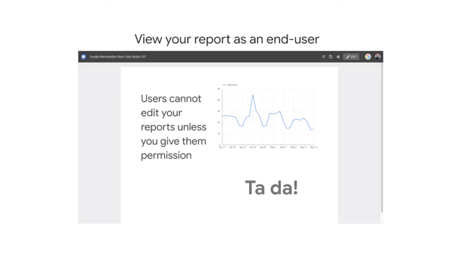

# 05CreateStreamingDataPipelineswithCloudPubsubandCloudDataflow

## Modern Data Pipeline Challenges

until now batch ingestion, let's view what to do with msg streaming


msg
apache beam
visualize with dashboard


variety
game events
i/o
pos sales from storefront

volume
from gb to pb

velocity
near realtime when data arrives
transform and handle the late arrive


## Message-oriented Architectures with Cloud Pub/Sub

handling large volume of streaming data not from a db but from events and msg happening async


temperature sensors

we have to handle
- device who sent delayed, bad data
- allow in buffer
- subscribe to msg collected
- able to scale
- reliable, we need all the msg and possibly no dups


pub/sub = publisher and subscriber model

distributed msg service that receives msgs and ensure `at least once` delivery to subscribers
api is open
end to end encryption of the msg
global service


```
data ingest from devices
inegested in pub/sub  that stores mgs in topics
cloud dataflow as subscriber get the msg and it will output these in
bigquery for processing
data studio for visualization 
```


antenna is always there to capture the radio signal even no one is listening
listener are listening even when there in only  white noise

ex

diff source to send the same type of msgs
`decoupled sources`


all these systems subscriber independently get and process the same msg 
`decoupled workers`

pub/sub buffers the changes and reliable transfer msgs to the subscribers when they req

## Designing Streaming Pipelines with Apache Beam


- design 
? code is compatible with batch and streaming
? does sdk code have transformation (aggreg , windowing) and can handle late date in the pipeline
? is there any template to use

// ex apache beam


- implement
see later


is portable data processing programming model
unified = single model it can work for batch or streaming
portable = not locked in a vendor


runners pass the model to executors // dataflow is a runner


ex
filter - group - compare -join
// in parallel use od `ProcessContext`


you can deploy on appengine to execute the pipeline

## Implementing Streaming Pipelines on Cloud Dataflow


questions are solved with cloduflow as
- little
- built on google 
- autoscale workers
- integrated with stackdriver
- use spark/cloudflow etc


you can run all the hadoop dataflow with cloud flow

data flow is serverless 
// resource managed 
// pipeline is reliable


```
let's see what happens when a job is submitted
cloud dataflow service optimize the execution graph 
schedules the work allocating the executors
oit will auto-heal if workers died
rebalance to optimize the load 
put dat in the sinks

```


these are templates you canstart with 

https://github.com/GoogleCloudPlatform/DataflowTemplates


recap
// query per second


## Visualizing Insights with Data Studio

stakeholders want to interact with the data to explore the data or present the result


use `explore in datastudio`


ex 
of the tv ad on the olympics
tell a good story about the data

the fact someone can access your dashboard does not mean can see the data automatically 

https://datastudio.google.com/

you can use template
tell where the data is from
`data source picker`


## Creating Charts with Data Studio
`click and draw` to place the chart
click view to see what viewers can see


live data so the graph changes

- dimension are green //categories
- metrics are blue // count 
- calculated fields can be both from dim or metrics


underlying data must be granted // not sone automatically when you share the report

## Demo - Data Studio Walkthrough


visualize as bar


add a filter // like a where condition

## Lab - Real-time IoT Dashboards with Pub/Sub, Dataflow, and Data Studio

end to end on sensor data and report in ral time
- def a topic 
- def a dataflow job and subscribe to the topic
- run the job and monitor the output in the sink // bigquery
- use views to visualize the data
- build dashboard to render the data in realtime 


## Creating a Streaming Data Pipeline for a Real-Time Dashboard with Dataflow


### Note your project name; confirm that needed APIs are enabled


and dataflow

Pub/Sub is an asynchronous global messaging service. By decoupling senders and receivers, it allows for secure and highly available communication between independently written applications. Pub/Sub delivers low-latency, durable messaging.

In Pub/Sub, publisher applications and subscriber applications connect with one another through the use of a shared string called a topic. A publisher application creates and sends messages to a topic. Subscriber applications create a subscription to a topic to receive messages from it.

### Task 1. Create a Pub/Sub topic and BigQuery dataset


https://cloud.google.com/pubsub/
https://opendata.cityofnewyork.us/
https://cloud.google.com/bigquery/

```
bq mk taxirides

Dataset 'qwiklabs-gcp-01-6dce59947e80:taxirides' successfully created
```


```
bq mk \
--time_partitioning_field timestamp \
--schema ride_id:string,point_idx:integer,latitude:float,longitude:float,\
timestamp:timestamp,meter_reading:float,meter_increment:float,ride_status:string,\
passenger_count:integer -t taxirides.realtime

Table 'qwiklabs-gcp-01-6dce59947e80:taxirides.realtime' successfully created.
```

### Option 2: The BigQuery Console UI

BigQuery is a serverless data warehouse. Tables in BigQuery are organized into datasets. In this lab, messages published into Pub/Sub will be aggregated and stored in BigQuery.


https://cloud.google.com/bigquery/docs/partitioned-tables?_ga=2.232838296.-723080937.1603787946


### Task 2. Create a Cloud Storage bucket

https://cloud.google.com/storage/

Cloud Storage allows world-wide storage and retrieval of any amount of data at any time


## Task 3. Set up a Dataflow Pipeline

https://cloud.google.com/dataflow/

Dataflow is a serverless way to carry out data analysis


### Task 4. Analyze the taxi data using BigQuery

```
SELECT * FROM taxirides.realtime LIMIT 10
```


### Task 5. Perform aggregations on the stream for reporting

```sql
WITH streaming_data AS (

SELECT
  timestamp,
  TIMESTAMP_TRUNC(timestamp, HOUR, 'UTC') AS hour,
  TIMESTAMP_TRUNC(timestamp, MINUTE, 'UTC') AS minute,
  TIMESTAMP_TRUNC(timestamp, SECOND, 'UTC') AS second,
  ride_id,
  latitude,
  longitude,
  meter_reading,
  ride_status,
  passenger_count
FROM
  taxirides.realtime
WHERE ride_status = 'dropoff'
ORDER BY timestamp DESC
LIMIT 100000

)

# calculate aggregations on stream for reporting:
SELECT
 ROW_NUMBER() OVER() AS dashboard_sort,
 minute,
 COUNT(DISTINCT ride_id) AS total_rides,
 SUM(meter_reading) AS total_revenue,
 SUM(passenger_count) AS total_passengers
FROM streaming_data
GROUP BY minute, timestamp
```


### Task 6. Create a real-time dashboard

Click Explore Data > Explore with Data Studio in BigQuery page.

https://datastudio.google.com/navigation/reporting


ex

### Task 7. Create a time series dashboard


From the list of Google Connectors, select the BigQuery tile

custom query 

```sql
SELECT
  *
FROM
  taxirides.realtime
WHERE
  ride_status='dropoff'
```


view


### my version ;)


[here](./Untitled_Report.pdf)


