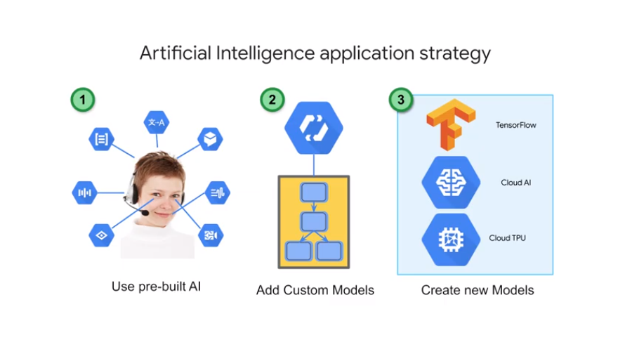
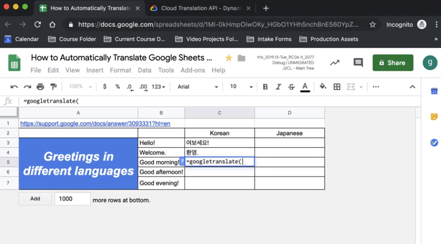
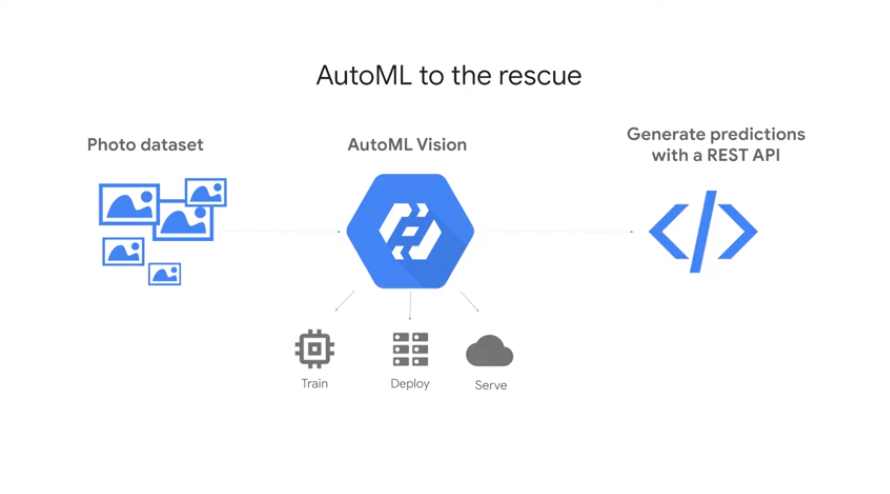

# 06ClassifyImageswithPreBuiltModelsusingVisionAPIandCloudAutoML

## Where is Unstructured ML used in business?

create model 

add label to image

def caption on what is in the img

## How Does ML on Unstructured Data Work?

how ml learn from unstructured data

ex no rule can describe this
how do we know that is a cat?

rules fail here

you need to give to the NN a loads of images of cats to train it

NN/Deep learning inspired by out brain
it builds internal recipe to categorize

use deeplearning when we cannot label ourself the example and looking for answer/categorization

## Demo - ML built into Google Photos

google photo uses internally to categorize what is in a photo
uses `vision api`

## Comparing Approaches to ML

we have 3 approaches:

when you have 100+ to millions of example use `create custom model` but if they are less use `prebuilt ai`
chatbot uses dialogflow
if the building block does not work well use `automl` 

as service
less complex to use as they are prebuilt
- cloud speech-to-text convert audio to text for data processing 
- cloud natural language api recognizes parts of speech called entities and sentiment
- cloud translation converts text in one language to another 
- dialogue flow to build chat BOTS to conduct conversations 
- cloud text-to-speech converts text into high-quality voice audio 
- cloud vision API is for working with and recognizing content in still images 
- cloud video intelligence API is for recognizing emotions and action in video

you need 100k samples to train a forecast model

## Demo - Using ML Building Blocks

// cloud translation 

the api

use api in google sheets

// vision api
label detection
detect face in img and emotional 
ocr and extract text
explicit contents  like violent and adult
landmark detection
logo in a img

ex of `json` result and attributes for each result

harry potter car 

try it https://cloud.google.com/vision an upload imgs

use ocr and translate https://cloud.google.com/translate
https://www.wootric.com/
prioritize customer feedback

magnitude

video intelligence api to label and when they occurred and confidence level

https://cloud.google.com/video-intelligence

# Using Pre-built AI to Create a Chatbot

use chatbot on top  existing solution

talk with someone 
automation to scale

platform to  built rich conversational exp
powerful natural language engine to process text

https://cloud.google.com/dialogflow

it recognizes entities
it has sentiment analysis for a block of text
classify documents about theta they are

agent learn from interaction with users

use out of the box or import in your custom agent

how users are using their time with the agent

## Customizing Pre-built Models with AutoML

build ml-model with aut-ml // no code required

train model with classes and examples

1 compute hour for free for training

mdeol trained

evaluate the model

prevision = measure about quality
recall = measure of the quantity 

use `confusion matrix` to evaluate the model

one has some issues as percentual is low

all these steps are gone with automl

multiple models are created and compared

y is accuracy 

recap
auto ml is good for classification on img you provide

## Demo - Text Classification Done Three Ways

we can solve a problem using 3 approach
big query ml
aut ml
custom model ml

> given some text can you say where it was copied from

### use big query

`hacker new stories` from public data set

TODO: check the dataset

5 words

train ml model giving it as input

model is `logistic regression` and label is `source`

we have then a new model that is trained in big query

check accuracy from the result

let's test on some input with `ml.predict`

### use auto ml

load dataset 100k articles with label

train the model // few hours

check the confusion matrix

test with predict

### write custom model

> use notebook

https://github.com/GoogleCloudPlatform/training-data-analyst

change bucket using your project id

jupiter magic to run bigquery // as done before

traindf and evaldf // 75% and 25%

use tensorflow or keras for ml models

submit to ml engine

