# 07Summary

## Course Summary

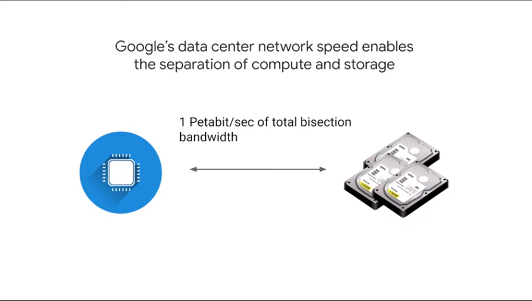
petabit/sec network speed
every machine can talk to each one to 10gb machine 

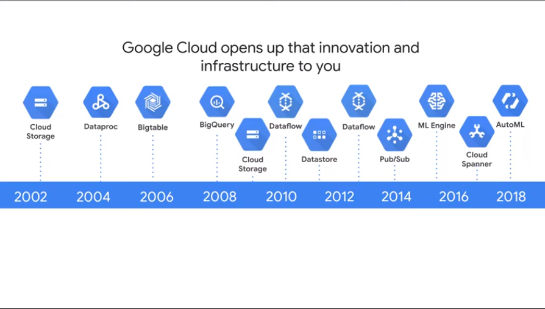
all on gcp

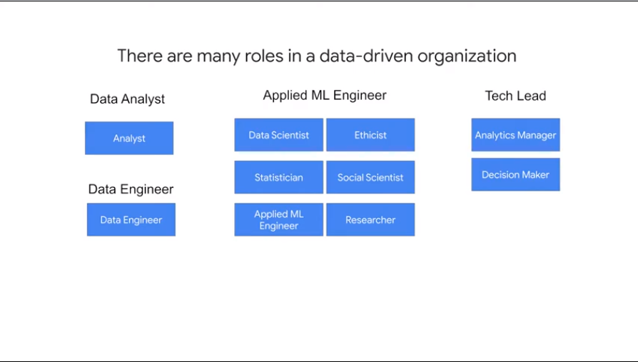
data roles and wehat they use

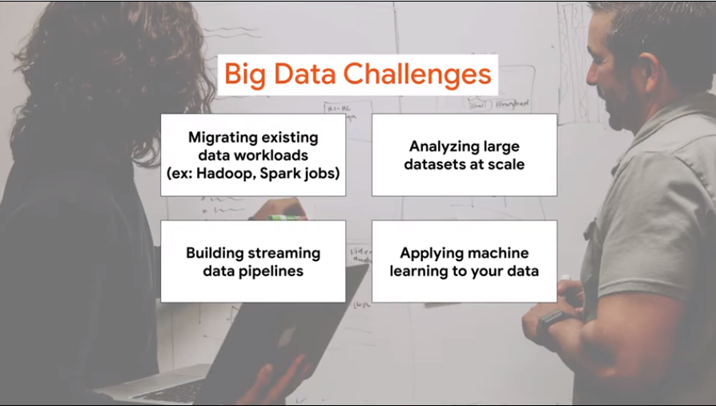
role and challenge
lab

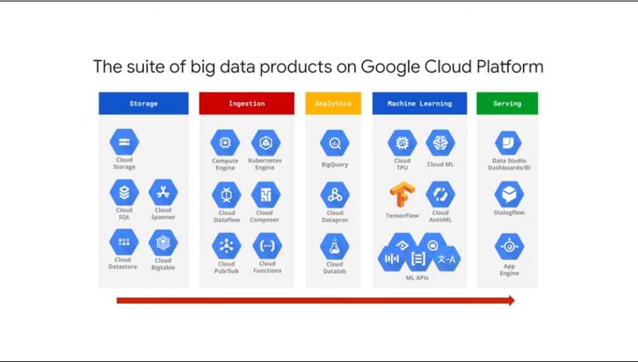
where and when use streaming pipeline

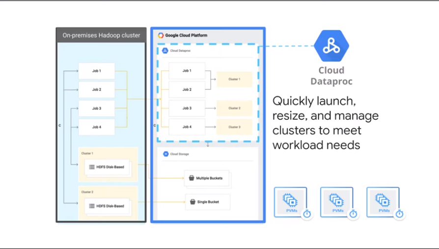
data proc and no cluster mng
cluster 

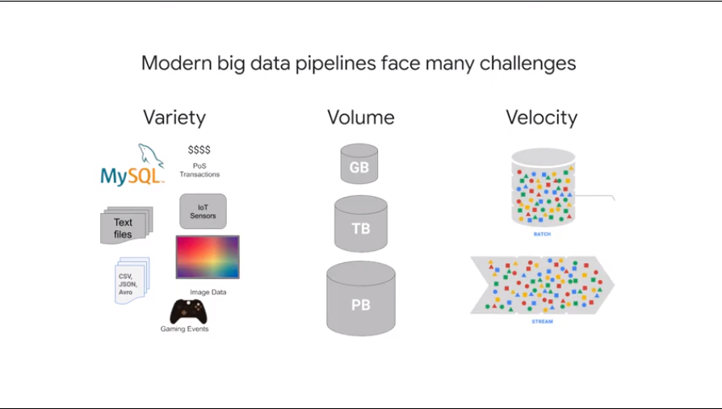
challenges of 3v
streaming pipeline

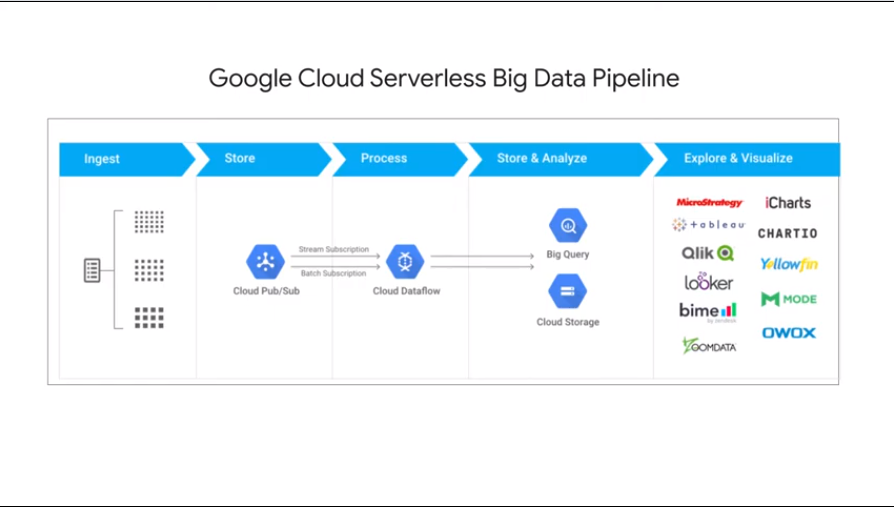
arch with pub/sub 

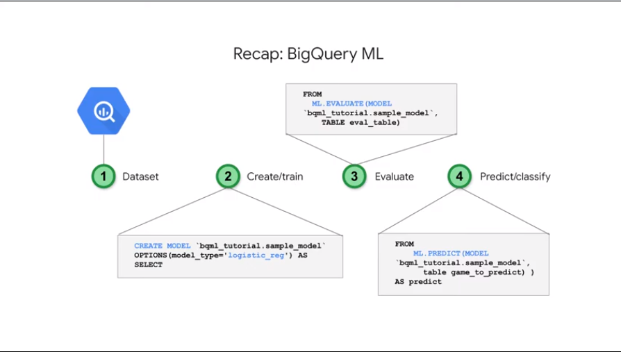
use bigqueryml
4 steps

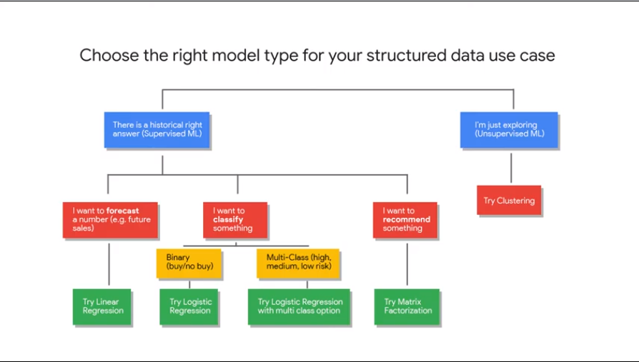
appropriate choosing model

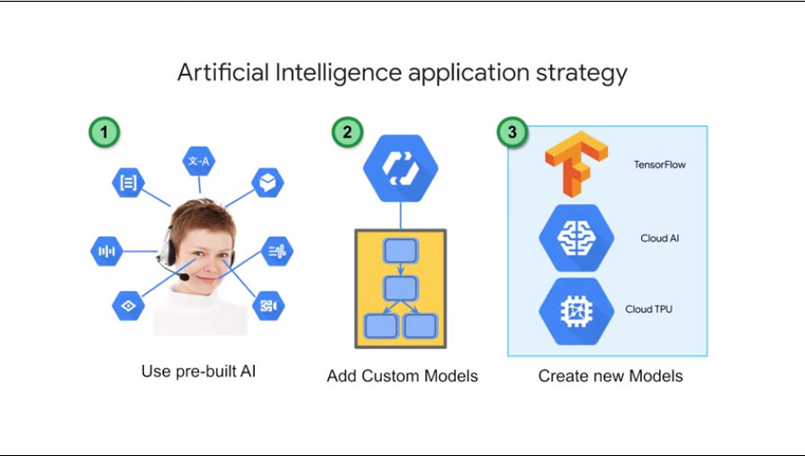
ai strategy options

> next

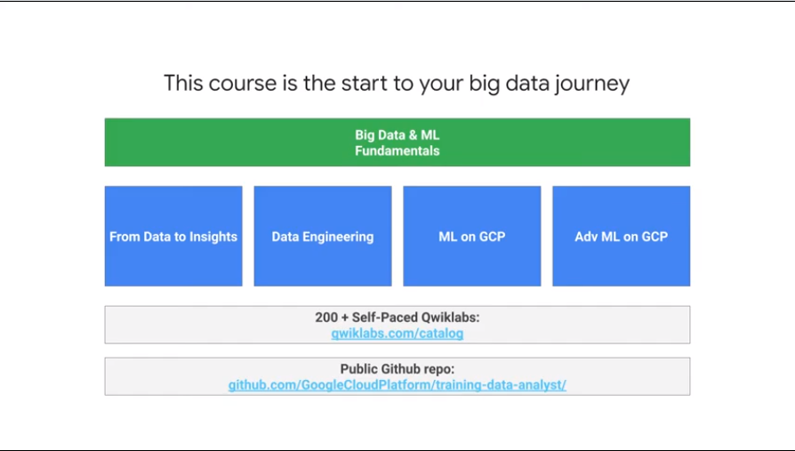

