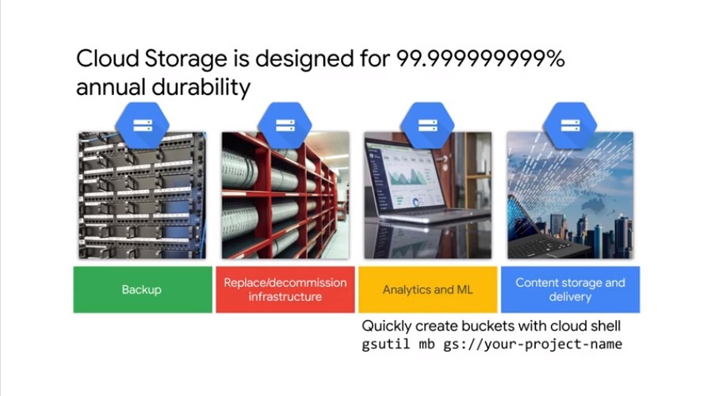
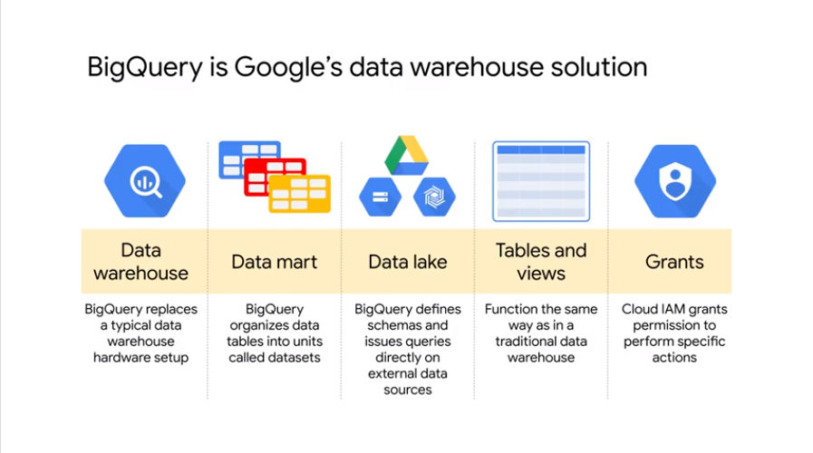
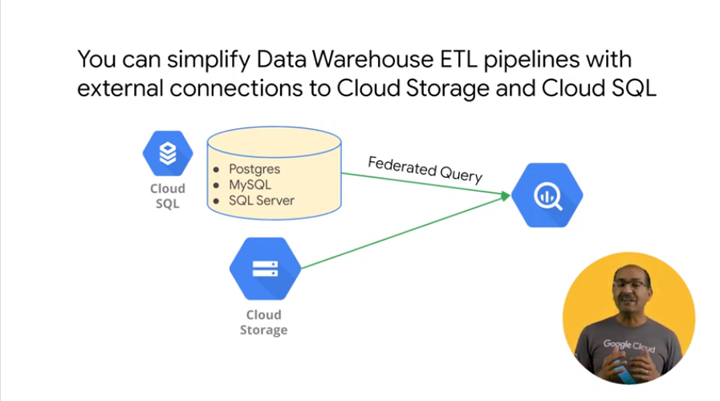

# 02IntroductiontoDataEngineering

## Explore the role of a data engineer


what a data eng does and his task
- build data pipelines
- build stuff on the cloud

look the challenges on building data pipelines in the cloud
what a `data pipeline` can do for the organization
look to *reference architecture* 
// you can adapt to your case scenario

let's start with high level view and then check more details on the products


data pipeline are necessary to bring data where the biz can take data driver decisions
the data needs to be in ` usable condition`
> raw data is not very useful

`data lake` brings data from the enterprise in a specific location

ex
```
sql dump / xls / csv as raw into the datalake
```


we need to  consider

- data lake handle all the types of data 
//can it fit in a cloud storage bucket ?
- can elastically scale
// as data collect increase more space etc
- high speed ingestion? 
// the network bandwidth
- is fine grained access control to objects
// think about it when choosing where to store
- how the tool for analytics can access the data



good option to stage raw data in one space before building the actual pipelines

```bash
# create a bucket as
gsutil mb gs://prj-id
```


for additional processing 
extract data transform it and then load it // etl
use of `dataproc` and `dataflow`


if you need realtime analytics on data that 
- keeps arriving - continuously - async
to build the *streaming pipeline*

## Analyze data engineering challenges


challenges: 
- access the data // data does not have the quality required
- computational resource to transform
- query performance with the resource you have


1) challenge
consolidate diff dataset and dataformat
ex
```
how much does it cost in marketing / discount to acquire a customer?
data can be in a lot of crm and marketing etc from different tools and schemas
to find something of value
you need to bring data out from these silos
```


data silos between departments and dep
ex
```
you have an operational sys for inventory
you have a marketing dep manages the promotions
and you need to run analytical query combining them promotions and inventory
you need to combine the data from the 3 dataset  
```

2) challenge
etl ensures data quality 
a dwh usually handles this
data in dwh is joinable and queryable in efficient way
raw data has to been cleaned and transformed 
in a format that is efficient to query 
elt the data and store in dwh
ex
```
retail need data from promotions and stores in dwh
some missing transactions need to  be included
convert ts in utc
promotions could be just txt with codes
do a query to get best perf promotions can be in this case challenging 
you need to get raw data and transform and put in a dwh
```
3) challenge
where do I carry out the compute for all the above


on premise the etl resource is not constant and it depends on the market flow

4) challenge


on premise you need to choose query engine and manage all the service 

>let's look to alternatives to on premises to spend more time to solve biz questions 


## Intro to BigQuery




serverless dwh solution `bigquery`
petabyte scale
no cluster to mng focus on insights
it serves for all the analytical set in the company
you can divide in `dataset` // collection of tables
analytical domain
a dataset is bound to  gcp prj
`data lake` files in storage / cloud big table // cloud sql
define schema on external data and run query on it as federated
`table and views` to use `ansi sql`
cloud iam to grant permission 
like `grant/revoke` in traditional sql


biz want to pay for insights
with cloud 100% on insight


no need to provision resources
`bigquery` allocates resource dynamically
`storage are allocated/deall` as you add/remove tables
query type and complexity uses `slots`
slot = cpu + ram resource 

## Data Lakes and Data Warehouses
look more in details to: dwf and dlk


raw data usually is not very useful


use etl pipelines to transforma dn make data more usable

questions:
- dwh will be serving batch jobs or realtime job //this impact how often data must be updates in the dwh
- dwh will scale when query will be run 
- how data is organized // data catalogue // access control 
- is dwh designed for concurrency // ned of idx adn tuning
- what level of support 


bigquery
- modern dwh
- automate data transfer 
- make readonly shared resource used by google sheets / tableau 
- foundation for AI // direct model with bigquery ml with simple sql 
- realtime insights // thousands of rows can be ingested at /sex  // petabyte scale query in sec
- use iam define resources and groups


use bigq to query data in cloud sql or in cloud storage
leave the data in place and join them with other data in the dwh


## Demo:Federated Queries with BigQuery

query data in big query from gsheets
https://github.com/GoogleCloudPlatform/training-data-analyst/blob/master/courses/data-engineering/demos/simple_external_data_query.md


create a new `dataset` to holds tbl and mle ect


source is google drive and external


data is not cached when it's external and it's slower as it cna use the native bigq storage and it needs to authenticate when accessing the data each time

useful to keep reference data and get the latest when needed


## Transactional Databases vs Data Warehouses

transactional db are for ops
dwh for analytics


you can migrate any rdbms to `cloud sql` 
> you cannot use it for report purpose directly 
it's opt for transaction / for write / record based storage
built on top of `relational integrity`


bigquery is `column` oriented storage
> you have very wide schema and read the column you need for analytic tasks


2 types 2 purposes


complete picture
raw data on the left 
data is gathered in the datalake // durability and HA
data is processed through ETL to put in dhw // here is read for downstream analytics
ex 
ml team to write pipeline to get feature for training
bi team to  build dashboards

## Partner effectively with other data teams

provide access to dwh while keeping data governance practice


data team rely on our provided data
ml eng / data analyst / data eng

ex

- get time in time to train the model
- ml team needs a rich history  of relations in the data


you can create ml model in bigquery-ml
ex
```
create model
train and use
```


bi teams need good clean data to query and build dashboard
clear schema def
scale to support many concurrent user
look `bi engine` // in mem
https://cloud.google.com/bi-engine/docs/introduction
no need of olap cubes 
serve as fast in mem cache serve 


oth data eng can rely too for their tasks


monitor with `cloud audit log`
you can setup alert and metric // stackdriver
ex
```
query count
byte used
```
https://cloud.google.com/stackdriver/docs


## Manage data access and governance


we need data gov model who can access
how PII are handled // phone email name


`data catalog` works on dataset
- flag column with sensitive data
- add tags
- simplify mng
- single unified to discover dataset

`dlp` data loss prevention // credit card , phone number gcp credentials
sensitive data
fast scalable classification 


## Demo:Finding PII in your dataset with DLP API


https://github.com/GoogleCloudPlatform/training-data-analyst/blob/master/courses/data-engineering/demos/cloud_dlp.md


output is likelihood for  PII


## Build production-ready pipelines

productionize and monitor the  data process end to end


4 questions...


`airflow` in gcp is called `cloud composer`
https://cloud.google.com/composer/docs

ex
```
new csv dropped in a bucket you can kick a data flow to ingest and place the data in the dwh ect
```
using api endpoints

## Review GCP customer case study

key studies of gcp customer


loads of msg and customer service has to figure out the high priority


ml model to find to priority and put in a queue the ones more time sensitive


sales did not have access to the tweets 
replicated data from the hadoop clusters and loaded into bigquery

## recap


on the left upstream systesm from biz


datalake is durable and HA for consolidated  raw data // gloud storage


dwh end result of preprocessing from datalake ready for analytics etc


https://github.com/gregsramblings/google-cloud-4-words


## Using BigQuery to do Analysis


```sql
SELECT
  MIN(start_station_name) AS start_station_name,
  MIN(end_station_name) AS end_station_name,
  APPROX_QUANTILES(tripduration, 10)[OFFSET (5)] AS typical_duration,
  COUNT(tripduration) AS num_trips
FROM
  `bigquery-public-data.new_york_citibike.citibike_trips`
WHERE
  start_station_id != end_station_id
GROUP BY
  start_station_id,
  end_station_id
ORDER BY
  num_trips DESC
LIMIT
  10

```

```sql
WITH
  trip_distance AS (
SELECT
  bikeid,
  ST_Distance(ST_GeogPoint(s.longitude,
      s.latitude),
    ST_GeogPoint(e.longitude,
      e.latitude)) AS distance
FROM
  `bigquery-public-data.new_york_citibike.citibike_trips`,
  `bigquery-public-data.new_york_citibike.citibike_stations` as s,
  `bigquery-public-data.new_york_citibike.citibike_stations` as e
WHERE
  start_station_id = s.station_id
  AND end_station_id = e.station_id )
SELECT
  bikeid,
  SUM(distance)/1000 AS total_distance
FROM
  trip_distance
GROUP BY
  bikeid
ORDER BY
  total_distance DESC
LIMIT
  5

```

```sql
SELECT
  wx.date,
  wx.value/10.0 AS prcp
FROM
  `bigquery-public-data.ghcn_d.ghcnd_2015` AS wx
WHERE
  id = 'USW00094728'
  AND qflag IS NULL
  AND element = 'PRCP'
ORDER BY
  wx.date
  ```

### Find correlation between rain and bicycle rentals


```sql
WITH bicycle_rentals AS (
  SELECT
    COUNT(starttime) as num_trips,
    EXTRACT(DATE from starttime) as trip_date
  FROM `bigquery-public-data.new_york_citibike.citibike_trips`
  GROUP BY trip_date
),

rainy_days AS
(
SELECT
  date,
  (MAX(prcp) > 5) AS rainy
FROM (
  SELECT
    wx.date AS date,
    IF (wx.element = 'PRCP', wx.value/10, NULL) AS prcp
  FROM
    `bigquery-public-data.ghcn_d.ghcnd_2015` AS wx
  WHERE
    wx.id = 'USW00094728'
)
GROUP BY
  date
)

SELECT
  ROUND(AVG(bk.num_trips)) AS num_trips,
  wx.rainy
FROM bicycle_rentals AS bk
JOIN rainy_days AS wx
ON wx.date = bk.trip_date
GROUP BY wx.rainy

```

> use left join ;)

### xtra

```sql
WITH
  bicycle_rentals AS (
  SELECT
    COUNT(starttime) AS num_trips,
    EXTRACT(DATE
    FROM
      starttime) AS trip_date
  FROM
    `bigquery-public-data.new_york_citibike.citibike_trips`
  GROUP BY
    trip_date ),
  rainy_days AS (
  SELECT
    element,
    MAX(date) date
  FROM
    `bigquery-public-data.ghcn_d.ghcnd_2015`
  WHERE
    element IS NOT NULL
  GROUP BY
    element )
SELECT
  bk.*,
  wx.element e
FROM
  bicycle_rentals AS bk
LEFT JOIN
  rainy_days AS wx
ON
  wx.date = bk.trip_date
ORDER BY
  date DESC
  ```

  

