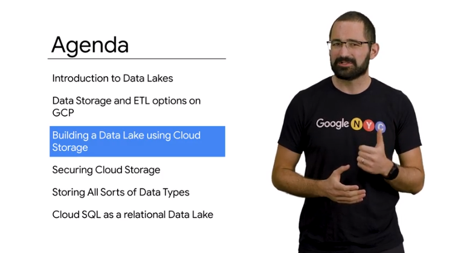
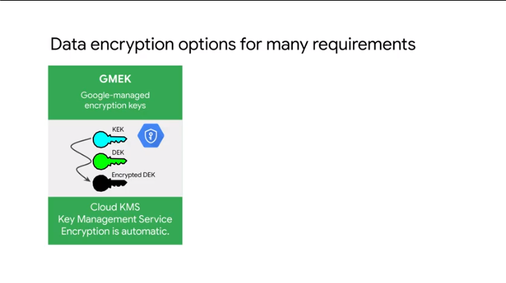

# 03BuildingaDataLake

## Introduction to Data Lakes


securely store various type of data for 
- processing
- analytics


start with data sources, then you retrieve that data and put in data sinks 
after that the data is off the source system

analogy

task:  build a skyscraper
0) on the construction site bring all the raw material // datalake
1) we need to cut the wood - put the steel //formatted data is ready to use // dwh
2) transform the raw material in useful pieces // ml and model to transform data in insights
4) orchestration layer by manager/supervise to mng the teams // workflow orchestration to automate the pipeline  (airflow)


use `cloud storage`


in this model 
`cloud data storage` and `cloud sql`
> bigquery is not there


store obj blobs or file in dlk
do something useful with the dwh layer
- schema identified and structured /semi structured
- use case defined

## Data Storage and ETL options on GCP


the path depends where the data is now + where it has to go
and amount of transf to do 


do etl or elt


just EL
ex
```
import avro directly into bigquery
```
> with federated you can leave the data where it is

ELT
the data needs to be cleaned + transformed
amount of T is not very high in the target
the size of the transformed data is ~ amount of init data

```
use sql to write the data to a new table

```

ETL
extract data + apply a lot of transformation and the size drops so you can save in network bandwidth
```
proprietary legacy format to be transfomed
cloud dataflow pipeline and loaded in bigquery
```

## Data Storage and ETL options on GCP


- cloud sql and cloud spanner for relational data
- file store and cloud bigtable for nosql


to decide:
data sink from and where
3vs and amount of transformations needed

options are:

el - import as is // from db where schema is the same 
// use federated query for orc avro in bigquery

elt - to clean and correct // amount of the data to move is not that big 
// sql to sql into  a new table

etl - apply a bunch of process to  the data // make data to tranfer much smalled
// binary format and legacy using dataflow to load into bigquery

## Building a Data Lake using Cloud Storage




compute is exp and caching results in cloud storage can be less exp and better than having re-done again
save the state an app when not need and kill the vm 
cloud storage is a binary obj storage, strong consistent, encrypted, global availability
can keep in specific geographic location 


`buckets` are containers 
`object` are blob of data inside a bucket 

- uniq filename until it's released
- associated with a region to save network charges
- replicas are created and when one is lost it will be replaces // 9s
- for multi region bucket they are replicated among region
- in the region the obj is replicated in zones in that region
- high throughput is because we hev multiple replica
- some metadata are added // you can def autodelete it on schedule


ask:
- location cannot be changed // copy and delete to mv
- a single region 
ex asia south1 or eu ge west
- multiple region // ok for natural disaster
ex eu or asia
- location can be dual-region 
ex
north america 4 

a single zone can go down in the same region to provide isolation for physical issues
https://cloud.google.com/storage/docs/locations#considerations

storage classes:
access and mutability can affect a lot the cost //backup and archive

https://cloud.google.com/storage/docs/storage-classes


`bucket-name/obj-name` similar a file path system

you cans use `gs` util
you can use web ui https://storage.cloud.google.com/ use tls to protect the data in transit 


def retention policy on ob 
versioning on obj
lifecycle mng to move nearline aor coldline

## Demo:Optimizing cost with Google Cloud Storage classes and Cloud Functions


from standard to nearline if accessed less often 


check the bucket usage with stackdriver monitor


## Securing Cloud Storage


cloud storage 2 methods to handle access: 
- cloud iamm
- acls
iamm set at bucket level // rules applied to  obj in the bucket
acls applied to  bucket or individual obj // more fine grain control

bucket reader bucker writer bucket owner

acls is aiaam bucket role 
set iaam policies is a prj level role

when you create a bucket you can disable acls

ex
```
name@email.com +r to bucket using iam 
and +w to a file in that bucket using acls
```


google uses encryption keys or gmac
2 levels of encryption 
kek rotated on schedule
stored in cms (cloud mng system)

you can control it 

kmek

or 


csek
you give the keys and decide the rotation 
// check with legal councilor


encryption on the obj
audit log are created
you can place an object hold so obj cannot be changed // you can do it to bucket level too

encryption is about contents
locking is about immutability

you can tag an obj properly 
```
tag zip file to be uncompressed when served
```

you can  set up a bucket to be requester pays  normally if data is accessed from a  different region you have to pay network  `egress` charges that's traffic going out  of the network you can make the  requester pay so that you pay only for  data storage 
you can create a signed URL  to anonymously share an object in cloud  storage and even have the URL expire  after a period of time it's possible to  upload a single object in pieces and  create a composite object without having  to concatenate the pieces after upload  

## Storing All Sorts of Data Types


don't use cloud storage for transactional (high frequency +w) // use cloud sql or fire store 9sql or nosql)
don't use cloud storage for analytic on cloud storage // a lot of compute resource on parsing the data
use big table or bigquery on structured data


transactional = fast insert // simple query and small amount of data affected each time
```
bank uses oltp
```
analytical workload reads entire dataset and used for decision
// data comes from oltp but it's consolidated
```
bank create reports for account
```


```
+w all the time in op sys
+r periodically populated to generate reports on ALL the items
```
put data in cloud storage and use parall to ingest that into  bigquery 


## Demo:Running federated queries on Parquet and ORC files in BigQuery


orc data is partitioned 


partition values are encoded in the dir structure


gzip compressed files

let's query the data from bigquery


tbl ded file is to def the structure
we can define an external table


query a specific partition 


import hive partitioned in a mng table


## Storing Relational Data in the Cloud
for rdbms use `cloud sql` instance  // if you data is in sql 
for global rdms use `cloud spanner` or too big // a lot gb
cloud sql is cheaper 

use big table for millisecond answer or millions of rows for sec
otherwise cheaper is bigquery 

## Cloud SQL as a relational Data Lake

db task // bkp // patch done by google
a compute instance with your sql installed for you and kept sound //ssas


you can use from other gcp resource


- data in encrypted // network firewall
- mng bkp and store them // up to 7 bkp for each instance
- scale vertically 
- read replicas // 3 replicas in the sam relocation of master or external (outside gcp)

use cloud spanner for horizontal +r and +w


TODO:


for failover cloud sql can be setup with a replica in diff zone in the same region
data is replicated among zone in the same region
in outage case all the changes made in the master are replicated
failover to the replica
you can init a manual failover 
- failover is charged as separate instance
- in failover connection to the master in outage are closed // app can reconnect with same connection string

after failover the replica becomes the master and a new failover replica is created automatically // for safety 
you can use the replica to offload and save bottleneck on the master


all is serverless apart dataproc

## Lab:Loading Taxi Data into Cloud SQL


## Loading Taxi Data into Google Cloud SQL

https://www1.nyc.gov/site/tlc/about/tlc-trip-record-data.page

qwiklabs-gcp-04-09f2073dc7e8

```
# activate
$ gcloud auth login
```
to obtain new credentials.

If you have already logged in with a different account:
```
    $ gcloud config set account ACCOUNT
```
to select an already authenticated account to use.
student_04_3dc74a1d1933@cloudshell:~ (qwiklabs-gcp-04-09f2073dc7e8)$ gcloud auth login
Go to the following link in your browser:
    https://accounts.google.com/o/oauth2/auth?client_id=32555940559.apps.googleusercontent.com&redirect_uri=urn%3Aietf%3Awg%3Aoauth%3A2.0%3Aoob&scope=openid+https%3A%2F%2Fwww.googleapis.com%2Fauth%2Fuserinfo.email+https%3A%2F%2Fwww.googleapis.com%2Fauth%2Fcloud-platform+https%3A%2F%2Fwww.googleapis.com%2Fauth%2Fappengine.admin+https%3A%2F%2Fwww.googleapis.com%2Fauth%2Fcompute+https%3A%2F%2Fwww.googleapis.com%2Fauth%2Faccounts.reauth&code_challenge=Ntf0pVf6dFr9HrvQBs2u4RXiGaKxQ7wvj8jq1f2VJvs&code_challenge_method=S256&access_type=offline&response_type=code&prompt=select_account

```
Enter verification code: 4/5wHbTonD9YMmXhuAfRT-cR0nj7s3-aULoNslGVzUL5DkCJLkTihgk3w

You are now logged in as [student-04-3dc74a1d1933@qwiklabs.net].
Your current project is [qwiklabs-gcp-04-09f2073dc7e8].  You can change this setting by running:
  $ gcloud config set project PROJECT_ID
student_04_3dc74a1d1933@cloudshell:~ (qwiklabs-gcp-04-09f2073dc7e8)$

## info 
gcloud config list project
[core]
project = qwiklabs-gcp-04-09f2073dc7e8

Your active configuration is: [cloudshell-24872]
student_04_3dc74a1d1933@cloudshell:~ (qwiklabs-gcp-04-09f2073dc7e8)$

# vars 
export PROJECT_ID=$(gcloud info --format='value(config.project)')
export BUCKET=${PROJECT_ID}-ml

```

### Create a Cloud SQL instance

```
student_04_3dc74a1d1933@cloudshell:~ (qwiklabs-gcp-04-09f2073dc7e8)$ gcloud sql instances create taxi \
>     --tier=db-n1-standard-1 --activation-policy=ALWAYS
WARNING: Starting with release 233.0.0, you will need to specify either a region or a zone to create an instance.
Creating Cloud SQL instance...done.
Created [https://sqladmin.googleapis.com/sql/v1beta4/projects/qwiklabs-gcp-04-09f2073dc7e8/instances/taxi].
NAME  DATABASE_VERSION  LOCATION       TIER              PRIMARY_ADDRESS  PRIVATE_ADDRESS  STATUS
taxi  MYSQL_5_7         us-central1-b  db-n1-standard-1  34.123.204.222   -                RUNNABLE
student_04_3dc74a1d1933@cloudshell:~ (qwiklabs-gcp-04-09f2073dc7e8)$
```


```
export ADDRESS=$(wget -qO - http://ipecho.net/plain)/32
gcloud sql instances patch taxi --authorized-networks $ADDRESS


MYSQLIP=$(gcloud sql instances describe taxi --format="value(ipAddresses.ipAddress)")


```


```sql
create database if not exists bts;
use bts;

drop table if exists trips;

create table trips (
  vendor_id VARCHAR(16),		
  pickup_datetime DATETIME,
  dropoff_datetime DATETIME,
  passenger_count INT,
  trip_distance FLOAT,
  rate_code VARCHAR(16),
  store_and_fwd_flag VARCHAR(16),
  payment_type VARCHAR(16),
  fare_amount FLOAT,
  extra FLOAT,
  mta_tax FLOAT,
  tip_amount FLOAT,
  tolls_amount FLOAT,
  imp_surcharge FLOAT,
  total_amount FLOAT,
  pickup_location_id VARCHAR(16),
  dropoff_location_id VARCHAR(16)
);
```

### Add data to Cloud SQL instance

```
gsutil cp gs://cloud-training/OCBL013/nyc_tlc_yellow_trips_2018_subset_1.csv trips.csv-1
gsutil cp gs://cloud-training/OCBL013/nyc_tlc_yellow_trips_2018_subset_2.csv trips.csv-2
```
example
```
vendor_id,pickup_datetime,dropoff_datetime,passenger_count,trip_distance,rate_code,store_and_fwd_flag,payment_type,fare_amount,extra,mta_tax,tip_amount,tolls_amount,imp_surcharge,total_amount,pickup_location_id,dropoff_location_id
1,2018-03-27T12:47:16,2018-03-27T13:39:54,1,2.7,1,N,1,29,0,0.5,5.95,0,0.3,35.75,68,162
```

import in mysql
```
Operation completed over 1 objects/849.8 KiB.
student_04_3dc74a1d1933@cloudshell:~ (qwiklabs-gcp-04-09f2073dc7e8)$ mysqlimport --local --host=$MYSQLIP --user=root --password \
> --ignore-lines=1 --fields-terminated-by=',' bts trips.csv-*
Enter password:
bts.trips: Records: 10018  Deleted: 0  Skipped: 0  Warnings: 0
bts.trips: Records: 10006  Deleted: 0  Skipped: 0  Warnings: 0
```


### Checking for data integrity

```
mysql> describe trips;
--------------
describe trips
--------------

+---------------------+-------------+------+-----+---------+-------+
| Field               | Type        | Null | Key | Default | Extra |
+---------------------+-------------+------+-----+---------+-------+
| vendor_id           | varchar(16) | YES  |     | NULL    |       |
| pickup_datetime     | datetime    | YES  |     | NULL    |       |
| dropoff_datetime    | datetime    | YES  |     | NULL    |       |
| passenger_count     | int(11)     | YES  |     | NULL    |       |
| trip_distance       | float       | YES  |     | NULL    |       |
| rate_code           | varchar(16) | YES  |     | NULL    |       |
| store_and_fwd_flag  | varchar(16) | YES  |     | NULL    |       |
| payment_type        | varchar(16) | YES  |     | NULL    |       |
| fare_amount         | float       | YES  |     | NULL    |       |
| extra               | float       | YES  |     | NULL    |       |
| mta_tax             | float       | YES  |     | NULL    |       |
| tip_amount          | float       | YES  |     | NULL    |       |
| tolls_amount        | float       | YES  |     | NULL    |       |
| imp_surcharge       | float       | YES  |     | NULL    |       |
| total_amount        | float       | YES  |     | NULL    |       |
| pickup_location_id  | varchar(16) | YES  |     | NULL    |       |
| dropoff_location_id | varchar(16) | YES  |     | NULL    |       |
+---------------------+-------------+------+-----+---------+-------+
17 rows in set (0.10 sec)
```


