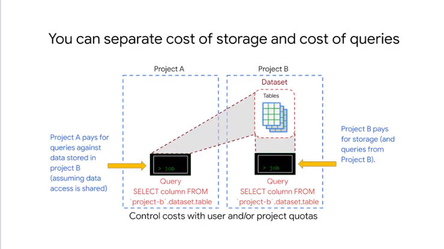
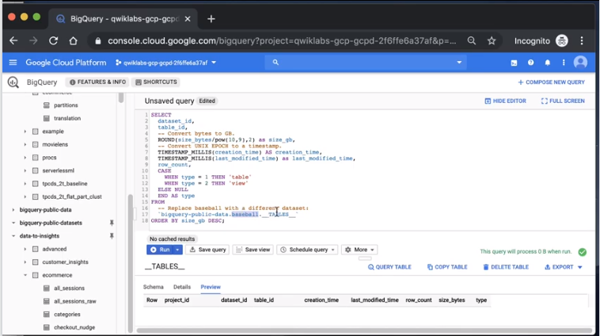

# 04Buildingadatawarehouse

## The Modern Data Warehouse

describe a modern dwh and diff with dlk
consolidate data from nay sources
in dwh we have always a schema in dlk we have raw data
make sure query result are meaningful 
data
-clean 
-accurate 
-consistent

store data is about dlk not of dwh

all data in dwh should be queryable

modern dwh: 
- holds gb to pb // not fitting in mem
- single warehouse for diff dataset that can scale
- sass and no-pos // no idx creation responsibilities
- rich visualization and reporting // support of them natively
- build data pipeline to bring data in the dwh // integrate with process to built pipeline 
- able to stream data too // not only batch updates
- ml and predictive analytics // no need to move data outside the dwh to do that
- security and collaboration//share data ana queries

## Intro to BigQuery

it does 

stores data with no problem where to keep 
stream data in in realtime data
gcp  security based

## Demo:Querying TB of Data in seconds


how it scales automatically on 10B rows

https://github.com/GoogleCloudPlatform/training-data-analyst/blob/master/courses/data-to-insights/demos/wikipedia-10-billion.sql


check in details pan to see the amount of rows


check the `execution details`

## Getting Started
how data is organized in bigquery 
data set are scoped to gcp project
when you reference a table use as `prj.dataset.table`


to help structure the data logically
use multiple domain to isolate dataset from each others
you can use for access control and billing


prj and billing are associated
```
run query vs bigquery-public-data prj the billing goes vs that prj
```
to run a query on a specific prj you need cloud iam 


access control is a dataset level NOT a table
to query data in a table in a ds you need `read permission` on that ds // at least


region => multiple zone in that region replicas
multi region => across multiple region replicas


each table has a schema 
`json file`


data encrypted at rest and on the wire 
use of cloud iam roles // so you can use gmail or G's accounts
+r/+w on ds => all tables in that ds
all events are logged
you can make expire a table after n days
you have immutable logs of the access to ds under the prj


you can create cloud iam roles 
assign to users or groups


achieve role level auth
define `authorized views` and `row-level permission`


share access to ds is easy 
use `gcp` to onborad analyst:
grant access to the prj
use the console and bigquery ui
show query how to get some data
they can collaborate on file using storage buckets

https://cloud.google.com/bigquery/docs/access-control


use auth views to have more fine control on data access
data in the same region if multiregion
view is a sql like a table
views are persisted // materialized and in sync with the contents of source table


when you submit query to bigquery service 
bigquery query service is separated from the bigquery storage service
data can be in bigq storage or in external storage // `federated queries`
results are stored in tmp tables to display the results  // kept for 24h and cached and charge free


pricing can be estimated with on demand plan and pay for data amount in the query
for flat rate worry about the `slots` used


separate costs using separate prj
auth users have access to the other ds and pay in their pej even if the data in another ds
```
you can separate the cost of storage andthe cost of queries by separating projects a and B it's possible to share the data without giving access to runjobs in this diagram users 1 & 2 have access to run jobs and access the datasets and their respective projects if they run a query that job is built to their own projects what if user 2 needs the ability to access the data in project a this person who owns project A can allow a user to to query the project A data set and the charges will go to project B the public dataset project owner granted all authenticated users access to use their data the special setting all authenticated users makes a data set public authenticated users must use bigquery within their own project and have access to run big cray jobs so that they can query the public data set the billing for the query goes to their project even though the queries using public or shared data bigquery offers one terabyte of querying for free every month so public datasets are an easy way to try out
```


bigq data transfer service to copy large amount of data 

## Loading Data


it depends how much T needed


el data usable in org form
batch load
you can use

gzip too is supported but slow
load jobs are 
- async
- do create a dest table if not there already

determine the schema
- avro // auth
- json // auth but verify
- pass schema as parama

to skip csv headers: use 
https://cloud.google.com/bigquery/docs/reference/bq-cli-reference


bigq set limits on the amount you can load by prj by table
and size of individual loads
ex
```
use `cloud functions` that listen to `cloud storage events` to fire a job when a new file arrives in a bucket
```


you can directly import fire store and data store export files 

you can call api to insert data  // usually by cloud data proc or cloud data flow

*data transfer service - dts`


schedule or events


you can query point in time
you can recreate the deleted table


use dts with no code
you need to stage and T and process in the final schema
issues might happen with `late arrival` // data backfills


repeated data load
use of template in dts


eff move data between regions
no need of data buckets


diff connectors ready
```
several connectors including campaign  manager cloud storage Amazon s3 Google  ad manager Google Ads  Google Play transfers YouTube channel  YouTube content owner  Tara data migration
```


simple T can be done with SQL
- insert/update


you can use replace 
https://cloud.google.com/bigquery/docs/reference/standard-sql/query-syntax#select_replace


use federated query with external tbl syntax


you can write your own UDF using sql or javascript for new function


shared 

## Lab Intro:Loading Data into BigQuery


load data using console and cmd line and the DDL


## Loading data in bigquery


https://storage.googleapis.com/cloud-training/OCBL013/nyc_tlc_yellow_trips_2018_subset_1.csv


create table


```bash
bq load \
--source_format=CSV \
--autodetect \
--noreplace  \
nyctaxi.2018trips \
gs://cloud-training/OCBL013/nyc_tlc_yellow_trips_2018_subset_2.csv
```

import more rows


https://cloud.google.com/bigquery/docs/reference/standard-sql/timestamp_functions


```sql
#standardSQL
CREATE TABLE
  nyctaxi.january_trips AS
SELECT
  *
FROM
  nyctaxi.2018trips
WHERE
  EXTRACT(Month
  FROM
    pickup_datetime)=1;
```

extra


## Exploring Schemas


100+ ds and schema on public ds


##  Demo:Exploring Schemas


https://cloud.google.com/bigquery/docs/information-schema-tables

use sql to query metadata on ds/tbls


`__TABLES__`
creation time
rows count 
size in bytes 
is it view or table


`__INFORMATION_SCHEMA.COLUMNS__`


all the metadata of public ds


useful 

https://cloud.google.com/bigquery/docs/information-schema-tables#advanced_example

to track schema def over time checking it in git 


## Schema Design


orig data and normalized data in tables
if tables has < 1m of rows 

denormalize is 

data is repeated
flatten data
flatten takes more space
more fast parallel processing
before loading into bigquery

sometimes if you do `group by` column in 1 to many relation denormalize is bad

shuffle is slow 


schema uses `nested and repeated fields`
> more eff
```
 in this example a  denormalized flattened table is compared  with one that has been den but the schema takes advantage of  nested and repeated fields order idea is  a repeated field because this is  declared in advance bigquery can sort  and process the data respecting some of  the original organization of the data  for this reason nested and repeated  fields is useful for working with data  that originates in relational databases  nested columns can be understood as a  form of repeated field it preserves the  relational ism of the original data and  the schema while enabling columnar and  parallel processing of the repeated  nested fields it's the best alternative  for data that already has a relational  pattern to it turning our relation into  a nested or repeated field improves  bigquery performance  nested and repeated fields help B query  work with data sources in relational  databases look for nested and repeated  fields wherever bigquery is used in a  hybrid solution in conjunction with  traditional databases
 ```

## Nested and Repeated Fields


for single order  1 to N events
we need to store all that for pb of data


norm and fully normalized

drawbacks

rdbsm are record based and in a join they need to open the record
one massive data makes query faster
be careful of data at diff level of granularity 
```
you have orderid repeated for each eventid related to it,  if you want to  roll up  orderid cannot be counted simply
```
then 

use nested data
```
1 order and array of events 
```

4 rows for 4 orders
all the events are in array for the order id
use of `struct` for events for pickups for destination //like prejoined pieces


>bigquery is `columnar storage` based not record based
both of best worlds


structs
you can add more dims adding more struct to the table


array of the status and ts

cheat sheet

- structs  are of type record when looking at a  schema 
- arrays are `mode repeated`  
// arrays can be of any single type like 
ex an  array of floats or an array of strings  
arrays can be part of a regular field or  be part of a nested field nested inside  of a struct 

a single table can have zero too many struts

a struct can  have other structs nested inside of it 

big query works well  with star-schema etc

use structs when data comes in that form


https://static.googleusercontent.com/media/research.google.com/en//pubs/archive/36632.pdf


## Demo:Nested and Repeated Fields


https://github.com/GoogleCloudPlatform/training-data-analyst/blob/master/courses/data-engineering/demos/nested.md

bitcoin 
blocks and transactions


diff granularity in nested tables


stats of the query


transactions has struct


>small shuffle and lees resources used
// cross join ~ `,`


for a give transactionid there a N values of output_satoshi

so  we have to `unset` in individual rows


## Lab Intro:Working with JSON and Array Data in BigQuery


use of json structure nature and query them with array and structs


json results


```
Select file from GCS bucket: gs://data-insights-course/labs/optimizing-for-performance/shopping_cart.json File format: JSONL (Newline delimited JSON)

```

schema is
```
Field name	Type	Mode	Policy tags 	Description
total_cost	FLOAT	NULLABLE	
fruit_array	STRING	REPEATED	
person	STRING	NULLABLE	
```

### Creating your own arrays with ARRAY_AGG()

```sql
SELECT
  fullVisitorId,
  date,
  v2ProductName,
  pageTitle
  FROM `data-to-insights.ecommerce.all_sessions`
WHERE visitId = 1501570398
ORDER BY date
```


```
Field name	Type	Mode	Policy tags 	Description
fullVisitorId	STRING	NULLABLE	
channelGrouping	STRING	NULLABLE	
time	INTEGER	NULLABLE	
country	STRING	NULLABLE	
city	STRING	NULLABLE	
totalTransactionRevenue	INTEGER	NULLABLE	
transactions	INTEGER	NULLABLE	
timeOnSite	INTEGER	NULLABLE	
pageviews	INTEGER	NULLABLE	
sessionQualityDim	INTEGER	NULLABLE	
date	STRING	NULLABLE	
visitId	INTEGER	NULLABLE	
type	STRING	NULLABLE	
productRefundAmount	INTEGER	NULLABLE	
productQuantity	INTEGER	NULLABLE	
productPrice	INTEGER	NULLABLE	
productRevenue	INTEGER	NULLABLE	
productSKU	STRING	NULLABLE	
v2ProductName	STRING	NULLABLE	
v2ProductCategory	STRING	NULLABLE	
productVariant	STRING	NULLABLE	
currencyCode	STRING	NULLABLE	
itemQuantity	INTEGER	NULLABLE	
itemRevenue	INTEGER	NULLABLE	
transactionRevenue	INTEGER	NULLABLE	
transactionId	STRING	NULLABLE	
pageTitle	STRING	NULLABLE	
searchKeyword	STRING	NULLABLE	
pagePathLevel1	STRING	NULLABLE	
eCommerceAction_type	STRING	NULLABLE	
eCommerceAction_step	INTEGER	NULLABLE	
eCommerceAction_option	STRING	NULLABLE	
 
```

and as json


```sql
SELECT
  fullVisitorId,
  date,
  ARRAY_AGG(v2ProductName) AS products_viewed,
  ARRAY_AGG(pageTitle) AS pages_viewed
  FROM `data-to-insights.ecommerce.all_sessions`
WHERE visitId = 1501570398
GROUP BY fullVisitorId, date
ORDER BY date
```


array_agg


compare


> You can do some pretty useful things with arrays like:

- finding the number of elements with ARRAY_LENGTH(<array>)
- deduplicating elements with ARRAY_AGG(DISTINCT <field>)
- ordering elements with ARRAY_AGG(<field> ORDER BY <field>)
- limiting ARRAY_AGG(<field> LIMIT 5)

### Querying datasets that already have ARRAYs

The BigQuery Public Dataset for Google Analytics bigquery-public-data.google_analytics_sample has many more fields and rows than our course dataset data-to-insights.ecommerce.all_sessions.

```
SELECT
  visitId,
  hits.page.pageTitle
FROM `bigquery-public-data.google_analytics_sample.ga_sessions_20170801`
WHERE visitId = 1501570398
You will get an error: Cannot access field product on a value with type ARRAY> at [5:8]
```

Before we can query REPEATED fields (arrays) normally, you must first break the arrays back into rows.

For example, the array for hits.page.pageTitle is stored currently as a single row like:

['homepage','product page','checkout']
and we need it to be

['homepage',
'product page',
'checkout']
How do we do that with SQL? Answer: Use the UNNEST() function on your array field:

```sql
SELECT DISTINCT
  visitId,
  h.page.pageTitle
FROM `bigquery-public-data.google_analytics_sample.ga_sessions_20170801`,
UNNEST(hits) AS h
WHERE visitId = 1501570398
LIMIT 10

```


### Introduction to STRUCTs

https://cloud.google.com/bigquery/docs/reference/standard-sql/data-types#struct-type

```
A STRUCT can have:

one or many fields in it
the same or different data types for each field
it's own alias
Sounds just like a table 
```

```
select  * from
`bigquery-public-data.google_analytics_sample.ga_sessions_20170801`
limit 1
```
[here](./results-20201105-115429.json)

```
select  * from
`bigquery-public-data.google_analytics_sample.ga_sessions_20170801`
where  v
```
[here](/results-20201105-115723.json)

As you can imagine, there is an incredible amount of website session data stored for a modern ecommerce website. The main advantage of having 32 STRUCTs in a single table is it allows you to run queries like this one without having to do any JOINs:

```SQL
SELECT
  visitId,
  totals.*,
  device.*
FROM `bigquery-public-data.google_analytics_sample.ga_sessions_20170801`
WHERE visitId = 1501570398
LIMIT 10
```

```json

  {
    "visitId": "1501570398",
    "visits": "1",
    "hits": "11",
    "pageviews": "11",
    "timeOnSite": "731",
    "bounces": null,
    "transactions": null,
    "transactionRevenue": null,
    "newVisits": "1",
    "screenviews": null,
    "uniqueScreenviews": null,
    "timeOnScreen": null,
    "totalTransactionRevenue": null,
    "sessionQualityDim": "8",
    "browser": "Chrome",
    "browserVersion": "not available in demo dataset",
    "browserSize": "not available in demo dataset",
    "operatingSystem": "Android",
    "operatingSystemVersion": "not available in demo dataset",
    "isMobile": true,
    "mobileDeviceBranding": "not available in demo dataset",
    "mobileDeviceModel": "not available in demo dataset",
    "mobileInputSelector": "not available in demo dataset",
    "mobileDeviceInfo": "not available in demo dataset",
    "mobileDeviceMarketingName": "not available in demo dataset",
    "flashVersion": "not available in demo dataset",
    "javaEnabled": null,
    "language": "not available in demo dataset",
    "screenColors": "not available in demo dataset",
    "screenResolution": "not available in demo dataset",
    "deviceCategory": "tablet"
  }
]

```
> use .* syntax

Storing your large reporting tables as STRUCTs (pre-joined "tables") and ARRAYs (deep granularity) allows you to:

gain significant performance advantages by avoiding 32 table JOINs
get granular data from ARRAYs when you need it but not be punished if you dont (BigQuery stores each column individually on disk)
have all the business context in one table as opposed to worrying about JOIN keys and which tables have the data you need


### Practice with STRUCTs and ARRAYs


```
SELECT STRUCT("Rudisha" as name, 23.4 as split) as runner

Row	runner.name	runner.split	
1	  Rudisha     23.4
```


gs://data-insights-course/labs/optimizing-for-performance/race_results.json

```
[
    {
        "name": "race",
        "type": "STRING",
        "mode": "NULLABLE"
    },
    {
        "name": "participants",
        "type": "RECORD",
        "mode": "REPEATED",
        "fields": [
            {
                "name": "name",
                "type": "STRING",
                "mode": "NULLABLE"
            },
            {
                "name": "splits",
                "type": "FLOAT",
                "mode": "REPEATED"
            }
        ]
    }
]
```


```
#standardSQL
SELECT race, participants.name
FROM racing.race_results
Error: Cannot access field name on a value with type ARRAY\<STRUCT\<name STRING, splits ARRAY\<FLOAT64\>>>> at [1:21]

```


Much like forgetting to GROUP BY when you use aggregation functions, here there are two different levels of granularity. One row for the race and three rows for the participants names. So how do you change this...


```sql
#standardSQL
SELECT race, participants.name
FROM `qwiklabs-gcp-04-3817e77ea569.racing.race_results`
CROSS JOIN
`qwiklabs-gcp-04-3817e77ea569.racing.race_results`.participants  # this is the STRUCT (it's like a table within a table)`
```

> You can simplify the last query by:
Adding an alias for the original table
Replacing the words "CROSS JOIN" with a comma (a comma implicitly cross joins)


```
#standardSQL
SELECT race, participants.name
FROM `qwiklabs-gcp-04-3817e77ea569.racing.race_results` r, 
r.participants  # this is the STRUCT (it's like a table within a table)`
```


Recap of STRUCTs:

A SQL STRUCT is simply a container of other data fields which can be of different data types. The word struct means data structure. Recall the example from earlier:

```
__STRUCT(__"Rudisha" as name, [23.4, 26.3, 26.4, 26.1] as splits__)__AS runner
```

STRUCTs are given an alias (like runner above) and can conceptually be thought of as a table inside of your main table.

STRUCTs (and ARRAYs) must be unpacked before you can operate over their elements. Wrap an UNNEST() around the name of the struct itself or the struct field that is an array in order to unpack and flatten it.


## Optimizing with Partitioning and Clustering

partition table by field 
ex
date/ts

date in separate shard

more N partitions => more metadata overhead


bigquery read only the data matching the where clause - skipping the rest


enable partition on creation

```
--time_partitioning_type //date and ts
--time_partitioning_field
--range_partitioning //int
```


cost calculation is more precise
upper bound to the cost of the query


discard not used partition 
use the partition filter `__PARTITIONTIME`


use of clustering 
for aggregated results the sorted blocks  co-locate rows with similar values


the order of the column def the order of the data


data gets partially sorted time by time

> now you have auto reclustering
free and in background


bigquery supports clustering over a  partition table table clustering is  supported for both ingestion time  partition tables and four tables  partition on a date or timestamp column  currently clustering is not supported  for non partition tables when you use  clustering and partitioning together the  data can be partitioned by a date or  time Sam column and then clustered on a  different set of columns in this case  data and each partition is clustered  based on the values of the clustering  columns partitioning provides a way to  obtain accurate cost estimates for  queries and guarantees improved costs  and performance clustering provides  additional costs and performance  benefits in addition to the partitioning  benefits


## Demo:Creating Partitioned Tables


https://github.com/GoogleCloudPlatform/training-data-analyst/blob/master/courses/data-engineering/demos/partition.md


no partition column


no data for 2018 and still parsing all the data

`partition by`


same query now 0 bytes


## Demo:Partitioning and Clustering


https://github.com/GoogleCloudPlatform/training-data-analyst/blob/master/courses/data-engineering/demos/clustering.md


data is collocated on the title in `buckets` 


less data scanned in similar time


order of clustering  matters

## Preview:Transforming Batch and Streaming Data


flowing data


stream are unbounded


streaming inserts
`stream buffers` in sec etc
we have streaming quota

batch is not charged streaming it is

## recap


bigquery
no need to provision resource


load data in datalake in bucket


mng your dwh


org data in prj and dataset


schema for tbl // json


array and struct for de-normalization to avoid joins


tbl partition and clustering


