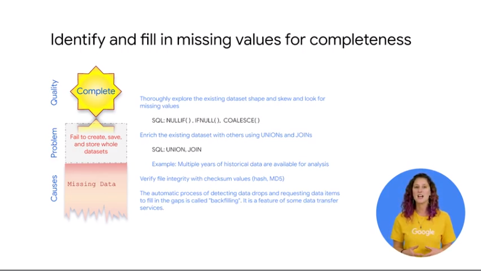
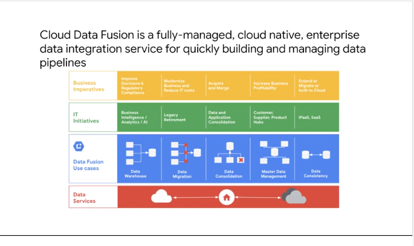

# 02IntroductiontoBatchDataPipelines

## EL, ELT, ETL


batch pipeline with bounded input
ex
all day data and transactions and do the books


selection depends on T and quality
create pipeline in bigquery
you might need etl in some cases


el = extract and load // data imported as is ex db import
elt = import raw data and transf // ex view 
etl = when a lot T  // in dataflow before in bigquery


el = load of logs // use rest api if data is clean and correct
elt = load the same as el 
data is appended
for T we can do a few ways
ex
use of view to access the transformed date and make it accessible

## Quality considerations


about quality of data

each dim is independent from each one
all are important
let's see how to detect these defects and how to address them in bigquery
```
coz dups data the result might be invalidd about data distribution
you can fix with countdistinct 
```

## How to carry out operations in BigQuery


invalid = corrupted data
```
missing ts
```
use views to filter out the data with issues
```
views to show data where ts is not null only
```
> null and blank are 2 diff things


consistency = computation from data not correct
```
group by >1 you can dups where not expected
```


test vs known good value
```
subquery or join on a known valid values
```

compactness =  missing value
```
union from another source to fill missing data
```
> back filling


uniformity = storing in diff scale
```
storing mm and the data is in cm => not uniform but still correct adata
sql format or cast
```

## Shortcomings

you need etl when elt is not enough


in these example the T cannot be expressed in sql or too complext to do in sql


use T extertnall y ebfore laoding


build pipeline inf dataflow and land the result in bigquery
extract data from
pub/sub  cloud spanner or other source
T data in dataflow
pipeline the data in bigquery

raw data needs to be checked and complex T

dataflow supports streaming 


several data proc and T processes in gcp
- cloud dataflow
- cloud data proc
- cloud data fusion

bigquery simple elt only

cloud dataproc is based on apache hadoop

cloud dataflow based on apache beam to support batch and streaming pipeline
> you can use template to rapidly deploy pipelines

cloud datafusion simple UI to build etl pipelines deployed in dataproc clusters


## ETL to solve data quality issues

use dataflow and biquery if possible
latency 100 milliseconds
less for BI
millions rows per seconds in bigquery table

if you need more
use bigtable

if you want to resue spark pipelines
use dataproc 

id you have need for visual building with analyst
use data fusion //dag and drop
> as dataflow need to code in java or python 


ssas for 
-  batch processing 
- querying
- streaming 
- machine learning 

hadoop workloads
has autoscale
integration with gcp
very cost effective


data fusion ssas
for data pipelines
- transf
- cleanup
- ensure data consistency 
// visually no it team for code
there is api you can use to code anyway


data lineage is important
for trouble shooting with odd results
need for trust and regolatory
you need keep metadata
use for use case
cloud data catalog


add label to org your resource
can attach labels to datasets tables and views

> you can filter resource using the label

```
billing if you attach labels to compute 
engine instances to buckets and to data 
flow pipelines information about those 
labels will be forwarded to the billing 
system this allows you ways to break 
down your billing charges by label
```


metadata ssas
use api 
unified view of the data
not only text tags


