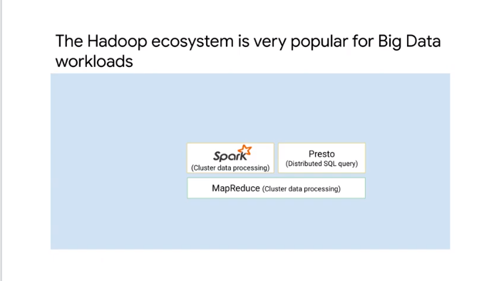
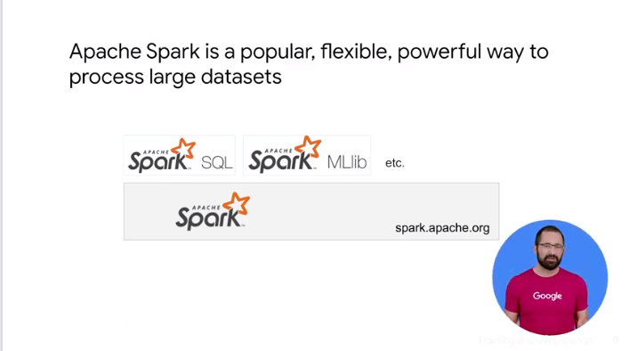
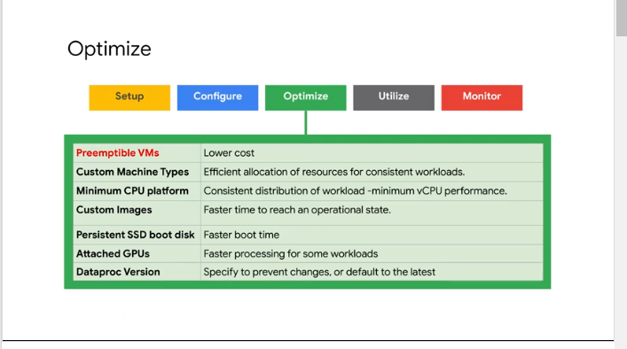
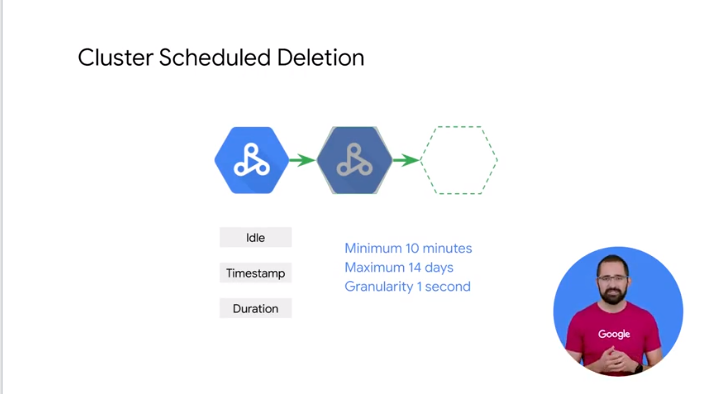
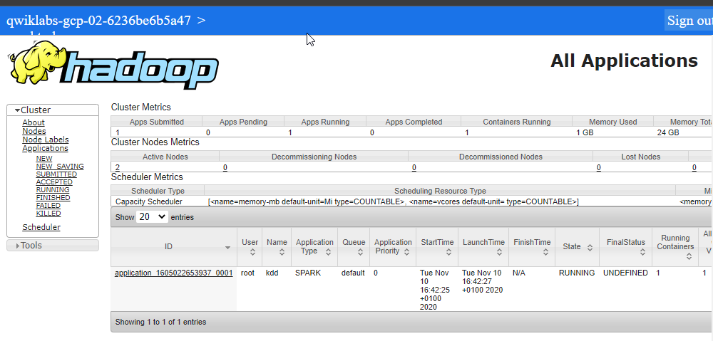

# 03ExecutingSparkonCloudDataproc

how to run hadoop on dataproc
use gfs instead of hdfs
opt dataproc

a bit of history

processing was exp and space was cheap
data locality

2000

distributed processing in cluster of computers
hdfs stored data in the machine in the cluster
and m/r compute on that data

these daya m/r on premise compute


spark process batch and streaming
rdd and dataframe


running m/r on cluster has to be tuned for the job and resources

```
pict and iot at the same time in m/r is complicated
```
spark able to mix apps and use  the resources efficiently

- spark sql
- spark ml

the data is stored in hdfs


is it part of the cluster // disadvantage of coupling computer and storage
on premise = your responsibility
- cluster tuning // conf
- resource utilization // queues

expensive when not being used
order more hw when needed to add more resources

we can do  hadoop in the cloud to address this

limitations of on premise hadoop
- work in not elastic
- long processing for ml
- cluster sitting idle


dataproc
- built for hadoop
- ssas
- add remove nodes via the ui in minutes
- versioning system for updates
- flexible jon conf


create as many cluster as you need instead with a 1 big cluster with a lot of software
```
spin up a cluster for a workload and turn it down, and persist data outside the cluster
```

## Running Hadoop on Cloud Dataproc

process the same hadoop but in the cloud 


low-cost cloud data proc is priced at 1 cent per virtual CPU per cluster per  hour on top of any other GCP resources you use 
`preemptive instances vm` 
- billing min by minute
- spin up in 90 sec
- open source ecosystem // no learn new tool 
- fully managed // no devops only api and console
- versioning of diff vers of spark and hadoop
- integrated with bigtable / bigquery and monitoring

```
tb of raw data etl
```
init of spin up with scripts
conf of the cluster


customize cluster with
- preconfigured opt components // when deploying the cluster
- initialization action // specific scripts to run on all nodes after spin up


create a cluster using the sdk

https://github.com/GoogleCloudDataproc/initialization-actions


master node vm and worker nodes
> worker can be part of a `mng instance groups` // same template for each vm
you can spin up more vm you need to simplify the cluster resizing
minutes to + or - nodes

think about it as short lived cluster

about hdfs whr cluster is down => use storage that is off cluster 


instead of native hdfs use cluster bucket via `hdfs connector`
// small change like hdfs:// to gdfs://

instead of hbase use bigtable
analytical workload in bigquery


steps left to right


create a cluster using he cluster
- console
- cmd line
- export yaml file from a cluster
- deplyment manageger
- api 


from for dev and exp to ha = 3 masters

you can choose  between a region and a zone or select  the global region and allow this service  to choose the zone for you the cluster  defaults to a global endpoint but  defining a regional endpoint may offer  increased isolation and in certain cases  lower latency 
the master node is where  the HDFS name node runs as well as the  yarn node and job drivers 
HDFS  replication defaults to 2 and cloud dataproc 

cluster properties are runtime prop 
user label to tag cluster for reporting reasons

you can specify init actions to customize the worker nodes
vm metadata can be used to share state 


- the main reason to use `vpreemptable` of VMs or P VMs is to lower costs for fault tolerant workloads
- balance mem and cpu to tune the vm 
- custom image = install software instead script
- persistent ssd boot disk


you can submit a job via
- console
- `gcloud` 
- rest api
- orchestration services

> don't use Hadoop direct interfaces to  submit jobs because the metadata will  not be available to Cloud Data proc for  job and cluster management and for  security they're disabled by default 


use `stack driver`

## GCS instead of HDFS


2004 wp data was local at compute 
there inet was slow
today pbyte speed


lift and shift hadoop on premise to cloud

separate compute and storage


super fast way to connect
bisectional bandwith server at full network speed
> use the data where is stored separtly 


colossus storage and jupiter network

and now


simply change from hdfs to gfs 
use bigquery for analytical workload


separation 
ephemeral resources


use cloud storage connector to migrate only storage
significant latency


object store 
> dir rename are not the same


use distcp 
you want to use a push based model for any data that you know you'll need while 
a pull based may be a useful model if there's a lot of data that you might not ever need to migrate


## Optimizing Dataproc


closter zone close in distance
use `autozone` in the region you choose
use bucket int the same region


avoid net bottle neck


how many input files and Hadoop  partitions are you trying to deal with  make sure you're not dealing with more  than around and say 10,000 input files  
if you do find yourself in this  situation try to combine or Union the  data into larger file sizes 
if this file  volume reduction means that now you're  working with larger data sets like more  than 50,000 Hadoop partitions you should  consider adjusting this setting for your  block size to a larger value accordingly  
now the configuration parameter is `sfgc.blocksize` and that helps the job  


standard persistent disk scale with volume


understand the workfload with real data is crucial to get vm 
resize the cluster for the task with ephemeral nodes


some calc to make to get a cluster size

```
50 node with 12 cores and 2ht per core =  tot 

2 option in compute engine
1200 4 vcpu
600 8 vcpu

```
FIXME: check more the details of the calculation

## Optimizing Dataproc Storage

a lot of files 
a lot of mutable action 
mv data in the hdfs
use of append operation
a lot of partition writes


oth use it as init and final in the data pipeline


reduce disk req and lower cost
keep data in cloud storage // use smaller disk
separate the computer and storage


at least 100 mb


option for hdfs for intensive 
1 digit milliseocnd latency


pd sssd as primary for master


latency req from different regions


you can store data into diff storage product
- bitable for sparse data // hbase api compatible
- bigquery for dwh and analytical


limitation:
very expensive 
keep in hdfs data and you cannot share with other tools

migrate thinking cluster per job  not on huge and long lived cluster // epehemeral mode


dont pay for what you dont use

def ts, duration min 10 minutes to 14 days


shift from monolithical cluster and delete the cluster when job is completed
if needed make it small and resize it when needed


def job scoped clustered
// dev stage and prod and run on separate cluster 
add acl to protect the data

use the cluster when a job is needed


follow this process 
- create a properly  configured cluster 
- run your job setting  the output to cloud storage or another  persistent location 
- delete your cluster  
- use the job output  
- view those logs and stack  driver or cloud storage


costly  and not indicated


## Optimizing Dataproc Templates and Autoscaling

`yaml` to create a new cluster, submit and holds jobs and delete a cluster
use cloud and api  // not the console


template submitted adding the actual param values

ex

- what it need to be installed
- use gcloud to create a new cluster // template to be used and machine type and vers
- add a job // saprk job in python that exist in a bucker, added to the template
- submit as workflow template


use autoscaling 
no need to intervent
choose standard ot pemp
- not good for idle cluster or streaming

> use dataflow scale more efficiently and by default 


set initial min instead to rely only on autoscale `min_workers`
`scale_up.factor` can be 1 to  add node or more to make it faster
`cooldown_period` to avoid to start and kill node in the same time

https://cloud.google.com/dataproc/docs/reference/rest/v1/projects.locations.autoscalingPolicies#basicautoscalingalgorithm
TODO: read the docs

## Optimizing Dataproc Monitoring

check the driver output and log generated


use gcloud cmd 

logs are in the cluster
possible check the containers logs from spark web ui / history server


yarn log in stackdriver logs 

filter by id 
check app id from driver 


to get resource creation log


`drive log level`
spark context


cluster cpu disk network and yarn usage
create your dashboard

dataproc runs on top of compute engine


## Lab Intro:Running Apache Spark jobs on Cloud Dataproc
- migrate existing job
- use gfs
- monitor the job


## Running Apache Spark jobs on Cloud Dataproc

```
Welcome to Cloud Shell! Type "help" to get started.
Your Cloud Platform project in this session is set to qwiklabs-gcp-02-6236be6b5a47.
Use “gcloud config set project [PROJECT_ID]” to change to a different project.
student_02_f044531c5df9@cloudshell:~ (qwiklabs-gcp-02-6236be6b5a47)$ gcloud auth list
           Credentialed Accounts
ACTIVE  ACCOUNT
*       student-02-f044531c5df9@qwiklabs.net

To set the active account, run:
    $ gcloud config set account `ACCOUNT`

student_02_f044531c5df9@cloudshell:~ (qwiklabs-gcp-02-6236be6b5a47)$ gcloud config list project
[core]
project = qwiklabs-gcp-02-6236be6b5a47

Your active configuration is: [cloudshell-2373]
student_02_f044531c5df9@cloudshell:~ (qwiklabs-gcp-02-6236be6b5a47)$

```


```
export DP_STORAGE="gs://$(gcloud dataproc clusters describe sparktodp --region=us-central1 --format=json | jq -r '.config.configBucket')"
gsutil -m cp ~/training-data-analyst/quests/sparktobq/*.ipynb $DP_STORAGE/notebooks/jupyter

 
student_02_f044531c5df9@cloudshell:~ (qwiklabs-gcp-02-6236be6b5a47)$ gsutil -m cp ~/training-data-analyst/quests/sparktobq/*.ipynb $DP_STORAGE/notebooks/jupyter
Copying file:///home/student_02_f044531c5df9/training-data-analyst/quests/sparktobq/02_gcs.ipynb [Content-Type=application/octet-stream]...
Copying file:///home/student_02_f044531c5df9/training-data-analyst/quests/sparktobq/01_spark.ipynb [Content-Type=application/octet-stream]...
Copying file:///home/student_02_f044531c5df9/training-data-analyst/quests/sparktobq/03_automate.ipynb [Content-Type=application/octet-stream]...
Copying file:///home/student_02_f044531c5df9/training-data-analyst/quests/sparktobq/05_functions.ipynb [Content-Type=application/octet-stream]...
Copying file:///home/student_02_f044531c5df9/training-data-analyst/quests/sparktobq/04_bigquery.ipynb [Content-Type=application/octet-stream]...
Copying file:///home/student_02_f044531c5df9/training-data-analyst/quests/sparktobq/05_functions_dw.ipynb [Content-Type=application/octet-stream]...
- [6/6 files][121.9 KiB/121.9 KiB] 100% Done
Operation completed over 6 objects/121.9 KiB.

```


```
export PROJECT_ID=$(gcloud info --format='value(config.project)')
gsutil mb gs://$PROJECT_ID
```
and copy 
```
wget http://kdd.ics.uci.edu/databases/kddcup99/kddcup.data_10_percent.gz
gsutil cp kddcup.data_10_percent.gz gs://$PROJECT_ID/
```



ex
```

#!/bin/bash
gcloud dataproc jobs submit pyspark \
       --cluster sparktodp \
       --region us-central1 \
       spark_analysis.py \
       -- --bucket=$1

...

student_02_f044531c5df9@cloudshell:~ (qwiklabs-gcp-02-6236be6b5a47)$ ./submit_onejob.sh $PROJECT_ID
Job [87d48d7d090545ccae0d70f7e61e0445] submitted.
Waiting for job output...
20/11/10 15:58:35 INFO org.spark_project.jetty.util.log: Logging initialized @2926ms
20/11/10 15:58:35 INFO org.spark_project.jetty.server.Server: jetty-9.3.z-SNAPSHOT, build timestamp: unknown, git hash: unknown
20/11/10 15:58:35 INFO org.spark_project.jetty.server.Server: Started @3016ms
20/11/10 15:58:35 INFO org.spark_project.jetty.server.AbstractConnector: Started ServerConnector@7efe0422{HTTP/1.1,[http/1.1]}{0.0.0.0:42355}
20/11/10 15:58:36 INFO org.apache.hadoop.yarn.client.RMProxy: Connecting to ResourceManager at sparktodp-m/10.128.0.2:8032
20/11/10 15:58:36 INFO org.apache.hadoop.yarn.client.AHSProxy: Connecting to Application History server at sparktodp-m/10.128.0.2:10200
20/11/10 15:58:36 INFO org.apache.hadoop.conf.Configuration: resource-types.xml not found
20/11/10 15:58:36 INFO org.apache.hadoop.yarn.util.resource.ResourceUtils: Unable to find 'resource-types.xml'.
20/11/10 15:58:36 INFO org.apache.hadoop.yarn.util.resource.ResourceUtils: Adding resource type - name = memory-mb, units = Mi, type = COUNTABLE
20/11/10 15:58:36 INFO org.apache.hadoop.yarn.util.resource.ResourceUtils: Adding resource type - name = vcores, units = , type = COUNTABLE
20/11/10 15:58:38 INFO org.apache.hadoop.yarn.client.api.impl.YarnClientImpl: Submitted application application_1605022653937_0004
20/11/10 15:58:46 INFO org.apache.hadoop.mapred.FileInputFormat: Total input files to process : 1
+-------------+------+
|protocol_type| count|
+-------------+------+
|         icmp|283602|
|          tcp|190065|
|          udp| 20354|
+-------------+------+
+-------------+---------+----------+--------------+--------------+-------------+-------------------+-----------------+--------------------+-------------------+------------------+
|protocol_type|    state|total_freq|mean_src_bytes|mean_dst_bytes|mean_duration|total_failed_logins|total_compromised|total_file_creations|total_root_attempts|total_root_acceses|
+-------------+---------+----------+--------------+--------------+-------------+-------------------+-----------------+--------------------+-------------------+------------------+
|         icmp|   attack|    282314|        932.14|           0.0|          0.0|                  0|                0|                   0|            0.0|                 0|
|          tcp|   attack|    113252|       9880.38|        881.41|        23.19|                 57|             2269|                  76|            1.0|               152|
|          tcp|no attack|     76813|       1439.31|       4263.97|        11.08|                 18|             2776|                 459|           17.0|              5456|
|          udp|no attack|     19177|         98.01|         89.89|      1054.63|                  0|                0|                   0|            0.0|                 0|
|         icmp|no attack|      1288|         91.47|           0.0|          0.0|                  0|                0|                   0|            0.0|                 0|
|          udp|   attack|      1177|          27.5|          0.23|          0.0|                  0|                0|                   0|            0.0|                 0|
+-------------+---------+----------+--------------+--------------+-------------+-------------------+-----------------+--------------------+-------------------+------------------+

Traceback (most recent call last):
  File "/tmp/87d48d7d090545ccae0d70f7e61e0445/spark_analysis.py", line 70, in <module>
    ax[0].get_figure().savefig('report.png');
NameError: name 'ax' is not defined
20/11/10 15:59:13 INFO org.spark_project.jetty.server.AbstractConnector: Stopped Spark@7efe0422{HTTP/1.1,[http/1.1]}{0.0.0.0:0}
ERROR: (gcloud.dataproc.jobs.submit.pyspark) Job [87d48d7d090545ccae0d70f7e61e0445] failed with error:
Google Cloud Dataproc Agent reports job failure. If logs are available, they can be found at:
https://console.cloud.google.com/dataproc/jobs/87d48d7d090545ccae0d70f7e61e0445?project=qwiklabs-gcp-02-6236be6b5a47&region=us-central1
gcloud dataproc jobs wait '87d48d7d090545ccae0d70f7e61e0445' --region 'us-central1' --project 'qwiklabs-gcp-02-6236be6b5a47'
https://console.cloud.google.com/storage/browser/dataproc-staging-us-central1-930497806368-bl3o2br6/google-cloud-dataproc-metainfo/7ddc5494-c90
```


logs


https://cloud.google.com/logging/docs/view/logs-viewer-preview?_ga=2.222384927.-545519523.1605022041

## Summary

a brief recap you saw how you can run  your entire Hadoop ecosystem on the  cloud with cloud data proc we covered  the advantages of separating compute and  storage for cost efficiency and  performance by using GCS instead of HDFS  lastly we discussed how you can optimize  cloud data proc by resizing your cluster  as your needs change and enable smart  features like automatically turning down  the cluster after a certain period of  non-use
