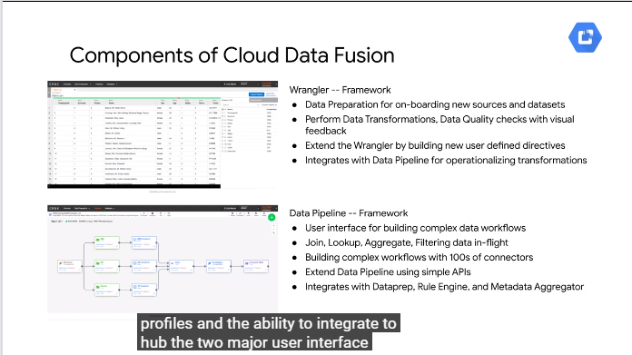
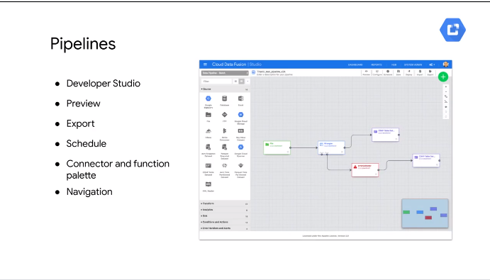
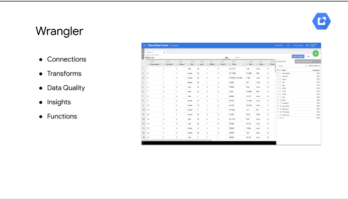
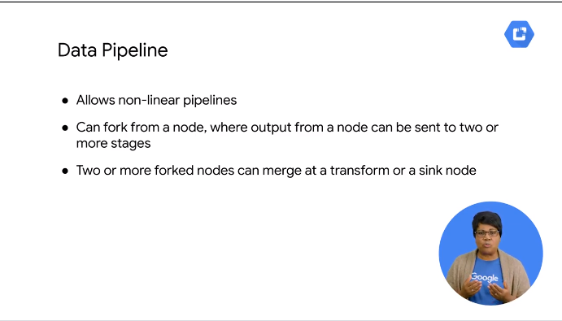

# 04ManageDataPipelineswithCloudDataFusionandCloudComposer


how to manage data pipelines with cloud data fusion and cloud composer

build data integration pipelines
> UX no code tool


behind the scenes it does deploy ephemeral execution env
supports data proc cluster where you can run spark batch and streaming
> cluster is ephemeral for the execution of the pipeline

you can use terraform to  avoid to  prevision cluster


define regions where to deploy the cluster

services run by dataflow
- pipeline lifecycle mng
- orchetsration
- coordination
- metadata mng

a long running but idle instance does not incur in charge over time
only get charged when actually running the pipeline

```
create instances in 
gke cluster 
inside tenant prj
```

create datafusion instance using
- gcp console


data fusion runs in containerized env with these 5 services each time // at least

df abstracts these for you so you can focus on the data analysis 


tou can test and debug each node of the pipeline

you cna tag each pipeline
use unified search to fins keyword in pipelines and schemas

data lineage is tracked 




focus on the `wrangler ui` and the `data pipeline`

more features


rules engine where BA can define checks
eng can use these rules in a pipeline

use metadata aggr to access each field in the UX
> create a data dictionary  for the schema


## Components of Data Fusion

let's check the UX now:


under control center multiple datapipeline associated with apps

you can see anc search what you need






## Building a Pipeline

hwo to build a pipeline


dag 
each stage is a node //diff types
ex
```
pull dat from cloud storage
parse the csv
join together
pass to 2 separate sinks 
```


a node can fork to avoid block
you cna combine data into 1  single output


studio is where you create the pipelines

- canvas = where you drag na drop the nodes
- minimap = to navigate huge pipeline
- canvas control panel
- pipeline actions toolbar 
> you can reuse pipeline

use `preview mode` you be sure of what it will run
you can click on the nodes to check the data and error
when running you get stats of the execution

ex

parse tweets and parsing them before loading in sinks
> use the tag feature


you can view start and overall summary 

use compute profile


clicking on the node
input 
outputs and errors
for the node

check anomalies looking 
```
rec/s
avg processing time
max processing time
```

you can setup the run on the pipeline at time schedules
def max # of concurrent times


> designed for batch pipeline


## Exploring Data using Wrangler

use wrangler to explore the ds


explorer insights in ds


def connection to ds
add new connection 
customer complaints sample
explore the data 
add calculated fields - drop  columns etc

def `data tr recipe` and use in the data pipeline to run in intervals

## Building and Executing a Pipeline Graph with Data Fusion


https://cloud.google.com/data-fusion/docs/how-to/create-instance


> Note: Creation of the instance can take around 15 minutes.

```
export BUCKET=$GOOGLE_CLOUD_PROJECT
gsutil mb gs://$BUCKET
gsutil cp gs://cloud-training/OCBL017/ny-taxi-2018-sample.csv gs://$BUCKET
```

Wrangler is an interactive, visual tool that lets you see the effects of transformations on a small subset of your data before dispatching large, parallel-processing jobs on the entire dataset. On the Cloud Data Fusion UI, choose Wrangler. On the left side, there is a panel with the pre-configured connections to your data, including the Cloud Storage connection.

### Task 2: Loading the data


`cloud-datafusion-management-sa@j315230980a2b65cdp-tp.iam.gserviceaccount.com`

click on `view instance`


### Task 3: Cleaning the data


joiner


sink


deploy


associated dataproc cluster


running 


## Orchestrating work between GCP services with Cloud Composer


ssas workflow runner //  apache aieflow


code is the dag

you can do a lot of things

## Apache Airflow Environment


cloud composer instance
> you can 1+ //e ach one separate airflow instance with related dags
```
specify projectid at airflow level
```


click on the link

2nd icon where the code is stored
gcs bucket


## DAGs and Operators


dag artifcat and operators

// 1 py file for each dag


visual rep of the code as nodes and edges

>task in py is a node here
```
3 tasks
and success and error 
```

operators

usually in 1 operator per task


bigquery op

TODO: check the operators


retrain and redeploy the model


airflow is open source 
new operator to new services added

https://airflow.apache.org/

ex of pipeline

4 task and 4 operators
1 and 2 to gte fresh model data from bigquery ds into gcs for ml consumption later

ex

top 100 most pop for a given date range

> the filter in the where clause are param in the sql statement


you can make param dynamic too if you want


op to retrain the model
and deploy the update model to app engine

ex

schedule jobs and sent in the automated wf
specify id for the task running and the prj top run on 


redeploy appengine prj with latest model
>just redeploy, less params

dependencies


t1 had to complete before t2 can run 
dependencies in the workflow

after you load the dag file in the folder you can see the graph in the airflow ui as graph/chart or list
> check the flow task order


## Workflow scheduling

after composer and task list in dag for airflow let's check the scheduling
- period //set schedule - once a day or on sat
- trigger based //wf to run when a new csv is loaded in a bucket or new data in a topic to which you are subscribed


2 dags

- composer sample simple has daily 


- the bigquery is driven by `cloud function`, there is no schedule


`schedule_inteval`


push event architecture


a lot of way to trigger on venets


ex ml wf with late arrival use push architecture
cloud storage trigger for our function

then def event type and 


code to run // js file

> a lot of boilerplate
// def func name 


which dag is used

be sure to specify the right dag


const to build the url to be used in the post req

def body of req


kick the rq to airflow


cloud func is active and monitor the bucket

> next section how to check it with monitor and logging


## Monitoring and Logging


investigate the historical runs of the wf

> you can define auto retry 

in the dag runs you can monitor the hsitorical run
> click from the dag page

ex
6 runs on the last 6 days

in the main page

200+ failure and 0 pass for the 1st dag

click on the name to get visual representation

1 is green 2 is red 3 is pink was skipped

to troubleshoot check the logs 

`invalid bucket name` for the output bucket

or

general gcp logs in stackdriver

check the normal gcp logs when using the cloud functions
// cloud function a re case sensitive 


https://airflow.apache.org/

Core concepts
https://airflow.apache.org/concepts.html#dags

A Directed Acyclic Graph is a collection of all the tasks you want to run, organized in a way that reflects their relationships and dependencies.

https://airflow.apache.org/concepts.html#operators

The description of a single task, it is usually atomic. For example, the BashOperator is used to execute bash command.

https://airflow.apache.org/concepts.html#tasks

A parameterised instance of an Operator; a node in the DAG.

https://airflow.apache.org/concepts.html#task-instances

A specific run of a task; characterized as: a DAG, a Task, and a point in time. It has an indicative state: running, success, failed, skipped, ...

You can read more about the concepts https://airflow.apache.org/concepts.html#


Note: Cloud Composer only schedules the workflows in the /dags folder.


check the logs


filter on airflow


