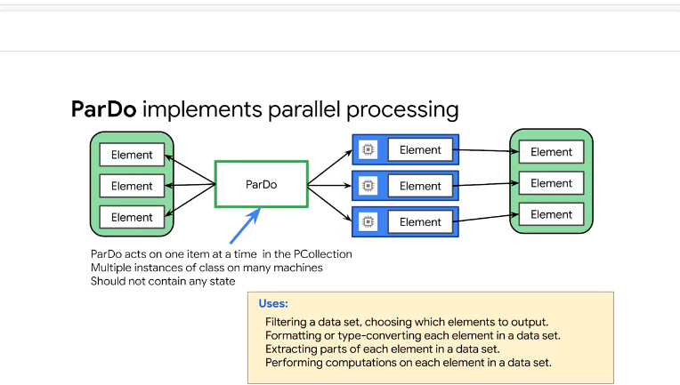

# 05ServerlessDataProcessingwithCloudDataflow

## Cloud Dataflow


it supports both batch and streaming


using apache beam
write your pipeline and give to your runner 
> pipeline is portable // you can run even outside gcp

with dataflow no need to cluster mng
autoscale is fine grade
b(atch)(str)eam


it supports streaming 


learn both 
dataproc better 
- if you have spark code
- want to mng devops task 
- lift and shift

> dataflow is recommended approach
- process data asap
- allocate executor automatically


in the past batch and streaming were separated processing

punch cards called batch
job start and end when all data is processed

in 70's data processing is ongoing
data keeps coming and you process the data
> done in micro-batch
today = combined


apache beam unify programming and processing


former concepts are:
- p-transformations 
- p-collection  
- pipelines
- pipeline runners

a pipeline def what data to be processed and action
data is hold in p-collect //abstract container for batch data or streaming data
it's immutable from p-collection to a new one
the actions contained in a p-transform
the data in p-collection is passed from a p-t to another p-t
the pipeline that runs on kub can be run on local pc //diff on scale 
now mem is not exp or scarce so we favour the immutability // to simplify the access control of distributed processing


dag with branch and aggreg called dataflow graph


each green box is p-transf on a p-collection 
no size limit to p-coll bunded or unbounded // parallel collection
more data in it and more the data is distributed on parallel workers


each element in a p-collection can be processed // element
runner implement the transformation on each element

data is serialized and stored as `byte stream` // no need to serde for the network
only deserialized for the action of a p-transform

## Why customers value Dataflow


beam pipeline says what to do
the dataflow how to do

read data + process data applying t + save data to sink


graph optimized


breaks the work and schedule to workers


opt is on going and rebalancing is automatic


no wait for last 3 busy worker 
the workload is spread to others idle worker


late data arrivals with `intelligent watermarking`


some of the vm will fail
the service will auto heal and re-distribute the work
you can monitor the service in the ui and the logs


adv:
- fully ssas


opt


autoscale auto // new workers


ex of using dataflow
``` 
read from biquery to bigtable 
read from pub/sub and write to cloud sql
```

## Building Cloud Dataflow Pipelines in code


3 p-transform
`|` means apply transformation


in parallel


start with a source
write the output to a sink
```
p 
passed to // read text
apply f to the row  input and concatenate outputs // flatmap
apply countwords // to N
apply write 
```

it is batch so when we exit the `with clause` we stop the pipeline


now we can run the pipeline
```
dataflowrunner
```
run locally and ont the cloud same code


## Key considerations with designing pipelines

to design pipelines you need to know how each step works on the element in the p-collection

start with input and output

start with `beam.Pipeline` to  crete the pipeline `p`

read csv file `beam.io.readFromText` // use * wildcard
read from pub/sub topic `beam.io.readFromPubSub`
read from bigquery `beam.io.Read` pass ead function


now write to sink


write to bigquery table `clients` and `bigquery.TableReference` // establish the ref to the table
use `beam.io.writeToBigQuery`
// truncate the table at each load as this is ab acth pipeline


create collection in mem
// for small data like lookup table and use it as we sourced from somewhere else

## Transforming data with PTransforms

let's how we can T the element in the P-collection


`yield` preserves the state of the func
`flatmap` iterates over one to many relationship


`pardo` = parallel do
```
filter elements
formatting the elements conversion
parse the field you want to consider
computation on elements in a P-coll and output in a new  p-coll
```

provide a `DoFN` // define a distributed function
it has to be 
- fully seriablizbel
- idempotent
- thread safe

TODO: check more

ex
```
count the el in a line and returning that INT
```


ex


## Lab:Building a Simple Dataflow Pipeline


ssas data analysis

## Serverless Data Analysis with Dataflow: A Simple Dataflow Pipeline (Python)

```
git clone https://github.com/GoogleCloudPlatform/training-data-analyst

sudo ./install_packages.sh

```

[here](./grep.py)

```py
import apache_beam as beam
import sys

def my_grep(line, term):
   if line.startswith(term):
      yield line

if __name__ == '__main__':
   p = beam.Pipeline(argv=sys.argv)
   input = '../javahelp/src/main/java/com/google/cloud/training/dataanalyst/javahelp/*.java'
   output_prefix = '/tmp/output'
   searchTerm = 'import'

   # find all lines that contain the searchTerm
   (p
      | 'GetJava' >> beam.io.ReadFromText(input)
      | 'Grep' >> beam.FlatMap(lambda line: my_grep(line, searchTerm) )
      | 'write' >> beam.io.WriteToText(output_prefix)
   )

   p.run().wait_until_finish()

```

What files are being read?
*.java
What is the search term?
import
Where does the output go?
/tmp
There are three transforms in the pipeline:

What does the transform do?
read flatmap and writetotext


[here](./grepc.py)

```py
import apache_beam as beam

def my_grep(line, term):
   if line.startswith(term):
      yield line

PROJECT='cloud-training-demos'
BUCKET='cloud-training-demos'

def run():
   argv = [
      '--project={0}'.format(PROJECT),
      '--job_name=examplejob2',
      '--save_main_session',
      '--staging_location=gs://{0}/staging/'.format(BUCKET),
      '--temp_location=gs://{0}/staging/'.format(BUCKET),
      '--region=us-central1',
      '--runner=DataflowRunner'
   ]

   p = beam.Pipeline(argv=argv)
   input = 'gs://{0}/javahelp/*.java'.format(BUCKET)
   output_prefix = 'gs://{0}/javahelp/output'.format(BUCKET)
   searchTerm = 'import'

   # find all lines that contain the searchTerm
   (p
      | 'GetJava' >> beam.io.ReadFromText(input)
      | 'Grep' >> beam.FlatMap(lambda line: my_grep(line, searchTerm) )
      | 'write' >> beam.io.WriteToText(output_prefix)
   )

   p.run()

if __name__ == '__main__':
   run()

```

```
python3 grepc.py
```


```
gsutil cp gs://$BUCKET/javahelp/output* .
cat output*
```


TODO: look
https://github.com/apache/beam/blob/master/sdks/python/apache_beam/examples/wordcount.py


## Aggregating with GroupByKey and Combine


after map there is usually a `shuffle` phase on (k,v) pairs 
a single (k, L(v1,v2, ...)) 

ex
```
find all the zip code associated with the city
```
group by key  and you get the result


be aware of skewed data
ex
``` 
billions of records
```
in our case with naive groupbykey X worker will take much more than Y worker

dataflow is designed to keep the data in balance

to mitigate in your app you need subsequent steps


`cogroupbykey`
it groups results across several p-coll by key 
relational join of 2 + same key type


now the reduce phase // calc total/avg (aggre) on the p-coll?
`combine` is used to combine collections 
combined globall Fn reduces p-coll to single value by applying the FN/ func


`combinePerKey` by combining function or a callable that takes an iterable

you muts provide the func to implement the logic to combine the ele
// there are already for sum/min/max

for more complex situation use a derived class from combiner


the combine function must be commutative and associative //it can be called multiple time on the given key
data distributed on workers it can be called multiple times on the sub-set of the collection

for more complex case subclass of combine function
 


4 op overriding the methods

```
- create_acc
- add_input
- merge_acc
- extrat_output
```
local accumulator tracks some values // ex avg


combinebykey  faster than >>> groupbykey
df knows how to parall a combine step
in the pict:
in groupbykey we can 1 use only 1 worker per key
in combinebykey first we aggr values on the same key and then process pre-aggregrated (k,v) with multiple workers +  less data is passed over the network

you can create a custom combiner as long you have ass + commm properties


`flatten` merge multiple p-coll obj into a single one


`partition` trasnform p-coll on the same type
splits a single p-coll in N smaller p-coll

ex
```
calculate perc on quartile and top quartile has diff processing of the others
```

## Lab:MapReduce in Cloud Dataflow


## Side Inputs and Windows of data


side input 
view od the data 
useful to inject additional data determined at run-time


availbel to all the wroker when needs


it works with bounded collection


no N so it's a problem for group by and shuffle


`beam.Window`


use `time based windows`


TODO: read the docs

fixed windows of 1 daya and df will do math giving the aggr value onver the window

## Lab:Practicing Pipeline Side Inputs


```
BUCKET=$(gcloud config get-value project)
echo $BUCKET

echo $DEVSHELL_PROJECT_ID
```

https://cloud.google.com/dataflow/docs/reference/rest/?apix=true


## Creating and re-using Pipeline Templates

create template for the team
to build df job


no code written 


users had to be dev

now


template separate dev from execution // users
limited need to recompile the job


`gcloud dataflow`

https://cloud.google.com/dataflow/docs/guides/templates/provided-batch


optional 


java ex


nested values with metadata


_metadata suffix

## Cloud Dataflow SQL pipelines


steraming from bigquery

associate schema with obj

write result 

use df in bigquery engine

cloud dataflow sequel integrates with  Apache beam sequel and supports a  variant of the Zetas sequel query syntax  you can use that a sequel streaming  extensions to define your streaming data  parallel processing pipelines use your  existing sequel skills to develop and  run streaming pipelines from the  bigquery web UI you don't need to set up  an SDK environments or know how to  program in Java or Python join streams  such as cloud pub/sub with snapshotted  data sets such as bigquery tables query  your streams our static data sets with  sequel by associating schemas with  objects such as tables files and cloud  pub/sub topics write your results into  bigquery tables for analysis and  dashboarding selecting cloud dataflow as  the execution engine for sequel  statements using the bigquery web UI is  currently available only as an alpha  release and you should not use it in  production 


so let's do a quick recap  earlier in the course you learned how to  do batch processing of your Hadoop and  spark jobs using Cloud Data proc this is  an ideal first steps of the cloud for  existing jobs simply run them on Zeta  proc and they just work he learns that  cloud dataflow takes a lot of the  cluster resizing and other management  tasks and automates them for you as it's  true server list product use cloud  dataflow if you're writing new pipelines  or if you're ready to rewrite and  migrate your Hadoop jobs to faster  processing with Apache Biman dataflow  you then saw how to build pipelines  using Apache beam which is open source  for the pipeline's to work we created  inputs with a beam geo syntax and walked  through how you can read CSV files from  GCS streaming message queues from pub  sub and structure data already living in  bigquery we then looked at some key  considerations when designing your  pipeline recall that you should consider  using combine when you can instead of  group by key especially if your data is  heavily skewed this will prevent a  single worker from being a bottleneck if  you have a high cardinality data set to  do the actual transformations you  practice writing P transforms in your  labs remember that the p and p  transforms and p collections me  parallel recall that the peak collection  itself is immutable data is never  processed in place a new peak collection  is always created and that the  individual elements of a peak collection  are massively distributed over many  workers to perform the parallel  transform this is the whole map part of  MapReduce for the reduced part of  MapReduce we looked at aggregation  functions like group by key and combined  keep in mind you can have multiple  parallel parts of your pipeline combined  into a single p transform like an  aggregation the pipeline does not have  to execute in serial unless you've set  it up that way with dependencies after  that you practice with side inputs in  your lab and how to create windows of  data even for batch datasets  lastly you saw how to create and save  new data flow templates for your team to  use and where you can see Google's  pre-made templates and our public github  we ended our discussion with data flows  new ability to run sequel on your  pipelines


