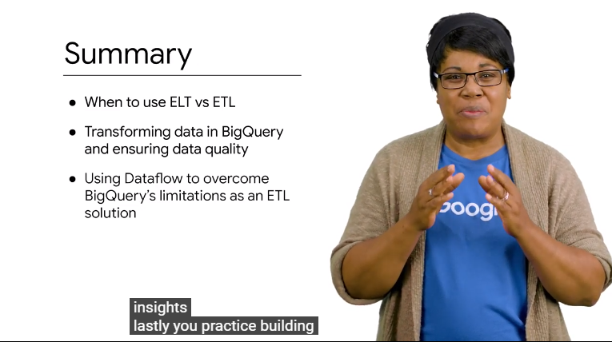
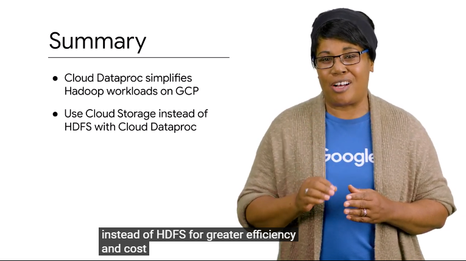
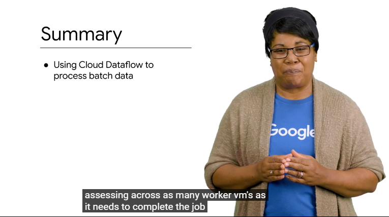
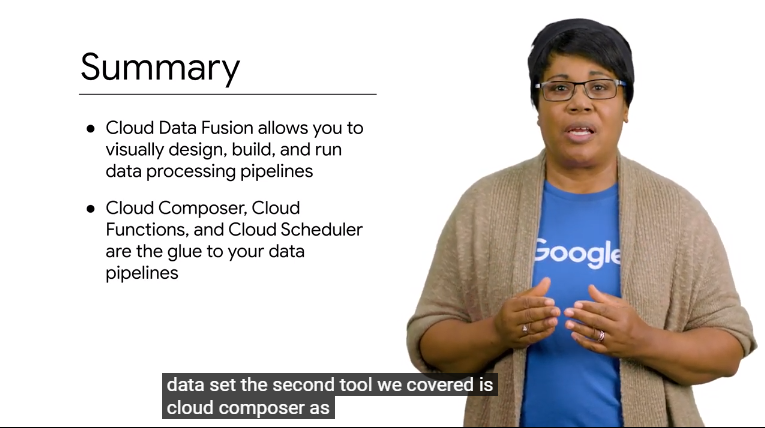

# 06Summary

you've made it to the end of this course  on building batch data pipelines let's  recap what you've learned in this course  we covered the different methods of  loading data into your data leaks and  warehouses remember alt vs. ETL and when  to use each each LT of extra-low  transform is a common pattern for when  the transformations you want on the data  set are minor and then can be handled  after you load the data an example is  loading the data into bigquery first and  then doing sequel on the raw data and  storing the transformed version as a new  table on the other hand ETL or  transforming before loading is common  when you have data that needs more  complex transformations or the sheer  volume of data makes it better to do  those transformations before loading and  that's where you would want to use a  batch pipeline like cloud dataflow next  we discussed how to transform data in  bigquery using sequel and you saw the  common operations you can perform to  ensure your structured data is ready for  insights  

lastly you practice building batch  pipelines in the surveillance way with  cloud dataflow in our hadoop module we  discuss cloud data proc in detail you  learned that you can lift and shift your  existing hadoop were close to the cloud  with no code changes and they will just  work however what's in the cloud there  were additional optimizations you could  make like using GCS off cluster storage  instead of HDFS for greater efficiency  and cost savings 

we then use cloud  dataflow to build batch data pipelines  using dataflow templates and by writing  them ourselves  recall that the fundamental unit of  logical data in the pipeline is the peak  collection which stands for a parallel  collection dataflow will automatically  split up your data set into many pieces  and farm out  assessing across as many worker vm's as  it needs to complete the job cloud  dataflow is a service application which  means you will have some control over  the maximum number of workers the actual  processing work and auto scaling of  workers up and down has the demand  requires in our module on managing data  pipelines with GCP 

we discussed two new  tools cloud data fusion and cloud  composer recall that cloud data fusion  allows data analyst and ETL developers  to wrangle data and build pipelines in a  visual way the technology then builds  and executes the pipelines on a runner  currently cloud data proc but dataflow  support it's coming soon  with cloud data fusion you also get  access to the lineage of each data field  which is the series of any  transformation logic that happened  before and after the field reaches your  data set the second tool we covered is  cloud composer as a workflow  Orchestrator cloud composers managed  apache airflow and allows you to at a  high level command GCP services in a dag  to perform complex operations these tags  can be used or scheduled or event-driven  with Google Cloud functions we call the  example where when a new CSV was  uploaded to our GCS bucket a Google  Cloud function was triggered to start a  cloud dataflow pipeline for processing  and then sync the data into bigquery  g