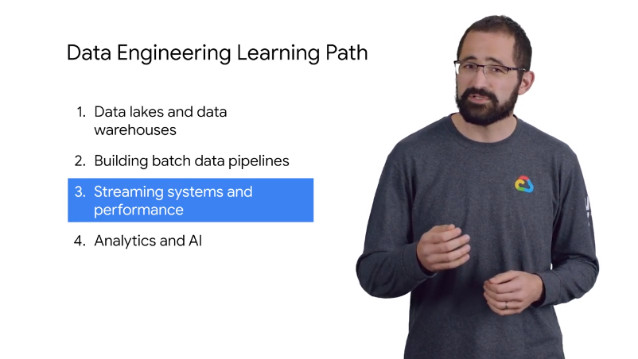

# 01Introduction

streaming analytics 

- what streaming vs batch
- using pub/sub dataflow and bigquery //ingest process and get insight
- bigtable // hight throughput 
- bigquery adv capabilities

