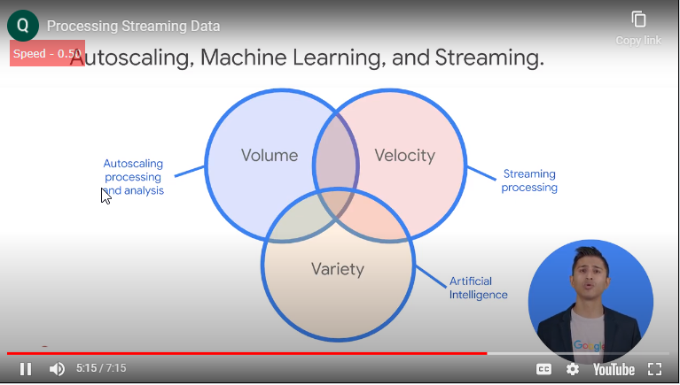
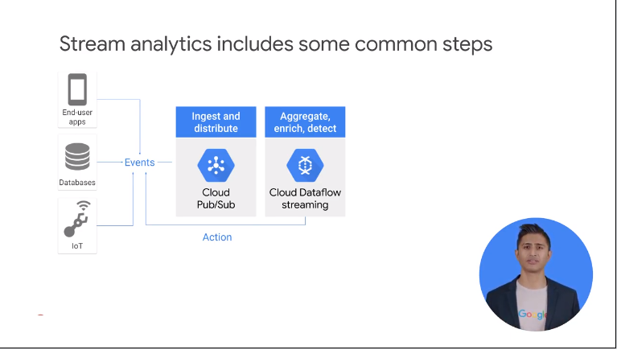

# 02IntroductiontoProcessingStreamingData

- about streaming process
- when streaming makes sense
- challenges associated


the split to  bigquery or bigtable if you need to  write aggregate or individual records 


why do we stream
stream enables to get real time info to see the state of the biz
ex
```
new your city cyber command

use pub/sub and dataflow to min latency for each step of the ingest and process
amount data volume changes over time  // peek time 5T
it can scales to PB using the cloud
security analysts access data as queries or data studio 
```


access data in realtime
better decisions 
ex
realtime reccomndatrioation
financa backoffice apps


system deal with huge amount of data but fast =>challenge in design phase

Volume = how to ingest the data in the system, how to store and organize the data
Velocity = given the use case tens of thousands records /sec transferred, it can change when you have peek time
Variety = type and format of data from unstructured data // img or invoice



use 3 products to address
pub/sub = handle changing data volume
dataflow =processing data 
bigquery = ad hoc reporting 


let's discuss approaches on the few key steps that are common


events are generated somehow


distribute these events with cloud pub/sub //async msg bus to hold events before they are consumed by other systems
// usually dataflow consumes these msgs to  enrich the data so you can generate meaningful insights


next to bigquery or bigtable or use ml


dataflow again in batch mode 
- back filling
- reprocess the data differently dim


