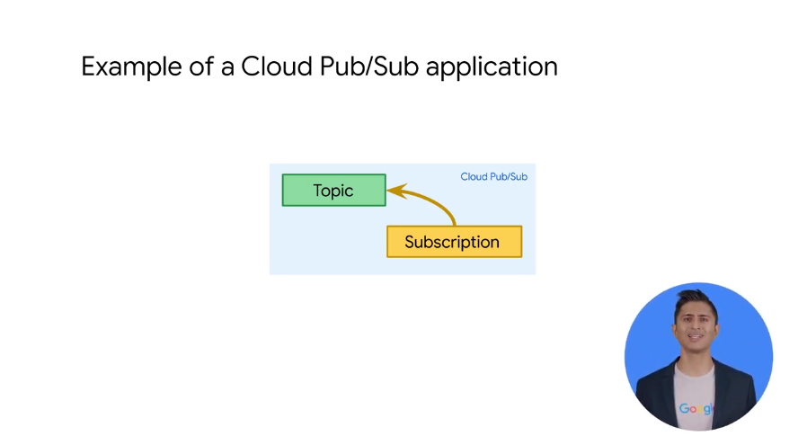

# 03ServerlessMessagingwithCloudPubSub

## Introduction to Cloud Pub/Sub

deep dive in pub/sub and how it works


fully managed data ingestion and distribution system
p/s is async mg bus to holds msg until they are consumed by external processes
p/s can be used to connect other app (in and outside gcp for hybrid solutions)
the app no need to be online and available all the time
p/s simplify system design
ex
```
email sending
```
p/s ready to use service ssas
client lib in c# go nodejs python java to write your code
// these wrap REST API calls which can be made in any language
pub/sub fits streaming solution
 - highly available
 - p/s services wun on all the regions around the world //global data access
 - msgs are stored in multiple locations for availability and durability
 - by defaults msgs re saved up to 7days
 - highly scalable 

ex
in google for google search internally 100M msg per second 
more than once per hour on popular sites
google index the web up to 3 times a day

it's HIPAA compliance for end to end encryption
msg encrypted in transit and at rest
we need resilience
ex
```
black friday transaction
```
we need buffer to feed msgs and to keep the extra msg until ready to be consumed
use cloud pub/sub as `intermediator` 


let's see how it works in details:
topic and subscription as 2 abstraction indip of any worker or subscriber
the p/s client that creates the topic is called the `publisher`
msgs are published to the topic
the p/s client that created the subscription is called the `subscriber`
publisher publishes events and msg in a topic 
to receive msg from a topic you must create a subscription to that topic
we can have 1+ subscriber to a topic
a subscription belongs to a single topic

ex

hr topic related to new hire
notification notifies other system of new employee


ex of subscriber


multiple subscription and multiple subscriber
badge security / payroll
decoupled from one and another
hr system can go offline and the msg continues its process


all of them ppl get the msg


contractor goes using the vendor office //another sys able to use the same topic,  same flow applied as it goes int he hr topic, this because the decoupling

## Cloud Pub/Sub Push vs Pull


diff colors are = diff msgs


simple:
1 Publisher publish 1 msg to 1 topic and the subscriber get the msg as it was subscriber to the subscription


fan in or load balancing:
N Pub to the same topic and M Sub from the same topic as part of the same Subscription

fan out or all the data data sent to many subscriber


push and pull delivery

- in pull model client calls for msg to p/s from time to tim, the msg is ack as separate step back to p/s when received fully


- in push model p/s initiates requests to your subscriber application to deliver messages the cloud 
pub/sub server sends each message as an HTTP  request to the subscriber application at a pre-configured end point 
in the push scenario you just respond with status  200 okay for the HTTP call and that  tells pub/sub the message delivery was successful 
> push delivery is ideal when  multiple topics must be processed by the same web hook 


the way the  acknowledgments work is to ensure every  message gets delivered at least once  what happens is when you acknowledge a  message you acknowledge on a per  subscriber and the other one not  acknowledged then the one that was  acknowledged will continue to get  subsequent messages while pub/sub will  continue to try to redeliver the  unacknowledged message
there is a replay too to replay msg too
you can define the ack deadline per subscription basis

ex
on avg 15 seconds to process a msg in the work queue set ack to 20s, so it does not try to  redeliver the msg


subscriber can work as individual or as group
ex
1 sub get all the msg
multiple sub sharing the same subscription

## Publishing with Pub/Sub code

let s look at the code
client lib for p/s


create the topic


pub the topic

or do in code

N> the `b` as raw bytes, so you can send msg, not only txt up to 10 mb
author is extra attributes 
p/s keeps makes this metadata to flow (not part of the msg but it stick along with)
(k,v) pairs , some have special meaning 

let's setup a `pull`
it can be a sync pull or an async pull


asynchronous pulling provides higher  throughput in your application by not  requiring your application to block for  new messages messages can be received in  your application using a long running  message listener and acknowledged one  message at a time 

1- we'll start  by selecting the topic 
2- we'll name  the subscription 
3- we will define a callback 


 

sync // cap on how much client can retrieve at given time


more efficiency but more latency


control the batch setting in py

## Summary
for scalability

earlier msg arriving later
> no chat app can be used with p/s


use dataflow with p/s to mng the duplicates

## Lab Intro:Publish Streaming Data into Pub/Sub


```
export DEVSHELL_PROJECT_ID=$(gcloud config get-value project)
```


```
Create your topic and publish a simple message.

gcloud pubsub topics create sandiego
Publish a simple message.

gcloud pubsub topics publish sandiego --message "hello"
Create a subscription for the topic.

gcloud pubsub subscriptions create --topic sandiego mySub1
Pull the first message that was published to your topic.

gcloud pubsub subscriptions pull --auto-ack mySub1
```

ex
```
student_01_0cfd898ebfd7@cloudshell:~/training-data-analyst/courses/streaming/publish (qwiklabs-gcp-01-f3db1dcc37a9)$ gcloud pubsub topics list
Listed 0 items.
student_01_0cfd898ebfd7@cloudshell:~/training-data-analyst/courses/streaming/publish (qwiklabs-gcp-01-f3db1dcc37a9)$ gcloud pubsub topics create sandiego
Created topic [projects/qwiklabs-gcp-01-f3db1dcc37a9/topics/sandiego].
student_01_0cfd898ebfd7@cloudshell:~/training-data-analyst/courses/streaming/publish (qwiklabs-gcp-01-f3db1dcc37a9)$ gcloud pubsub topics publish sandiego --message "hello"
messageIds:
- '1840922152205051'
student_01_0cfd898ebfd7@cloudshell:~/training-data-analyst/courses/streaming/publish (qwiklabs-gcp-01-f3db1dcc37a9)$ gcloud pubsub subscriptions create --topic sandiego mySub1
Created subscription [projects/qwiklabs-gcp-01-f3db1dcc37a9/subscriptions/mySub1].
student_01_0cfd898ebfd7@cloudshell:~/training-data-analyst/courses/streaming/publish (qwiklabs-gcp-01-f3db1dcc37a9)$ gcloud pubsub subscriptions pull --auto-ack mySub1
Listed 0 items.
student_01_0cfd898ebfd7@cloudshell:~/training-data-analyst/courses/streaming/publish (qwiklabs-gcp-01-f3db1dcc37a9)$

student_01_0cfd898ebfd7@cloudshell:~/training-data-analyst/courses/streaming/publish (qwiklabs-gcp-01-f3db1dcc37a9)$ gcloud pubsub topics publish sandiego --message "hello man"
messageIds:
- '1840950965681417'
student_01_0cfd898ebfd7@cloudshell:~/training-data-analyst/courses/streaming/publish (qwiklabs-gcp-01-f3db1dcc37a9)$ gcloud pubsub subscriptions pull --auto-ack mySub1
┌───────────┬──────────────────┬──────────────┬────────────┬──────────────────┐
│    DATA   │    MESSAGE_ID    │ ORDERING_KEY │ ATTRIBUTES │ DELIVERY_ATTEMPT │
├───────────┼──────────────────┼──────────────┼────────────┼──────────────────┤
│ hello man │ 1840950965681417 │              │            │                  │
└───────────┴──────────────────┴──────────────┴────────────┴──────────────────┘

```

get data
```
gsutil cp gs://cloud-training-demos/sandiego/sensor_obs2008.csv.gz .
```
[](./send_sensor_data.py)

run

```
./send_sensor_data.py --speedFactor=60 --project $DEVSHELL_PROJECT_ID
```


pull 

```
gcloud pubsub subscriptions create --topic sandiego mySub2
gcloud pubsub subscriptions pull --auto-ack mySub2


student-01-0cfd898ebfd7@training-vm:~$ gcloud pubsub subscriptions pull --auto-ack mySub2
Listed 0 items.
student-01-0cfd898ebfd7@training-vm:~$ gcloud pubsub subscriptions pull --auto-ack mySub2
┌────────────────────────────────────────────────────────┬──────────────────┬────────────┐
│                          DATA                          │    MESSAGE_ID    │ ATTRIBUTES │
├────────────────────────────────────────────────────────┼──────────────────┼────────────┤
│ 2008-11-01 00:00:00,32.749679,-117.155519,163,S,1,71.2 │ 1840951681645386 │            │
└────────────────────────────────────────────────────────┴──────────────────┴────────────┘
student-01-0cfd898ebfd7@training-vm:~$ gcloud pubsub subscriptions pull --auto-ack mySub2
┌────────────────────────────────────────────────────────┬──────────────────┬────────────┐
│                          DATA                          │    MESSAGE_ID    │ ATTRIBUTES │
├────────────────────────────────────────────────────────┼──────────────────┼────────────┤
│ 2008-11-01 00:00:00,32.749679,-117.155519,163,S,2,65.1 │ 1840951681645387 │            │
└────────────────────────────────────────────────────────┴──────────────────┴────────────┘
student-01-0cfd898ebfd7@training-vm:~$ gcloud pubsub subscriptions pull --auto-ack mySub2
┌──────────────────────────────────────────────────────┬──────────────────┬────────────┐
│                         DATA                         │    MESSAGE_ID    │ ATTRIBUTES │
├──────────────────────────────────────────────────────┼──────────────────┼────────────┤
│ 2008-11-01 00:00:00,32.780922,-117.089026,8,W,1,76.5 │ 1840951681645388 │            │
└──────────────────────────────────────────────────────┴──────────────────┴────────────┘
student-01-0cfd898ebfd7@training-vm:~$ 


````