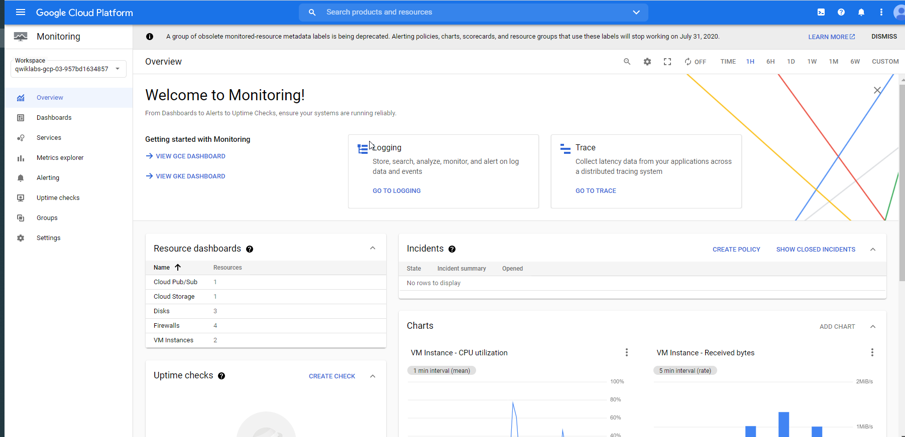

# 04CloudDataflowStreamingFeatures

## Streaming Data Challenges


dataflow streaming features


unbounded from streaming jobs


.png)
scalalbility = when data goes up
fault tolerance = larger you get more sensitive to have downtown
model = use streaming or batch
timing = latency of the data


challenge of doing aggregation
ex
avg of data
n is always changing
divide into `time windows`


reading from p/s every msg has timestamp associated -  we can use to use the time windows


you can def your ts on the other metadata

ex
a sensor msg has its ts in the msg in a weather report cell
due to delays the sampling goes into the system late
if you want to aggr accurately you need to pick the right ts // reading taken not when msg was delivered
=> data transformation to do that on the msg to create a new ts 


## Cloud Dataflow Windowing

strenght of dataflow in steaming 


3 types


sliding windows:
divided into time slices

ex
hourly
daily

consistent non overlapping intervals


sliding windows can overlap

session  windows are defined by a minimum gap  duration and the timing is triggered by  another element
> where the communication is bursty
ex
web session where user logs and does something and then leave, you can use that as session

any key in your data can be used  as a session key it will have a timeout  period and it will flush the window at  the end of that timeout period 


ex
```
window.FixedWindows
window.SlidingWindows(30,5)  (lenght 30 sec, every 5 sec new window)
window.Sessions(10*60) (session windows 10 minutes ) 
```


if there was no letancy //ideal world everything istantanuos 

fixed windows would just flush at the end of the window

in real world latency happens
```
process delay
network 
```


wait a bit longer 


1 min window and expect data avaliable in the respective window
data 1 arrives in window 2 //late
data 2 arrives a bit in delay
data 3 is ok

expected arrival time vs actual arrival time = `lag time`
dataflow can track of this lag using `watermark`


dataflow wait until watermark computed has elapsed
ex
```
sys lag 3 or 4 sec, then we wait 4 sec before to flush the window
```

late data of 2 min 
1 min after window is closed
data then is discarded
no late data is allowed in this config

data can arrive late in the system anyway so we have to consider in th aggr, 

default behavior is to trigger aggregation on the watermark


`after watermark` trigger is the only event type  trigger currently supported 


Apache beam  determines when all the elements with a  date/time stamp that falls within the  window have been processed this is the  watermark the passing of watermark  causes the aggregation step to be  performed and after the watermark has  passed the default event time trigger is  activated its behavior is to emit the  results of the aggregation one time and  discard any data that arrives late in  Java pipelines you can override this  behavior and do something with late data  in a Python pipeline currently the late  data is discarded unconditionally 


`after processing time` progressed operate on  the time at which an element is  processed at some point in the pipeline  has determined by a system clock you  could set an after processing time  trigger on unbounded data contained in a  global window


`data-driven trigger` is  associated with the condition of data  contained in the element itself  currently this simply counts each  element that has been processed in the  window 
ex
```
trigger every 15 elements
```


you can define a `composite trigger`
ex
```
data-driven followed  by event-time trigger
```


sliding window of 60 sec and slides every 5 seconds
in afterwatermark we have early to delay 30 sec
and late after count

2nd is about composite trigger
either for accumulation ot every 60 seconds

1 window duration


def `accumulation mode`

when you set a trigger you need  to choose either `accumulate mode or  discard mode` 
this example shows that  different behaviors caused by the  intersection of windowing trigger and  accumulation mode 
here you see  temperatures divided into ten minute  windows using a data driven trigger with  after account two 
this means that after  every two temperature readings the  window will get flushed the user will  only see two temperatures but if I said  to accumulate I will see the original 2 plus the next  2 plus the next 2 
if you  are doing elementw-ise processing then it  probably makes sense  to discard because if you have seen it  once you have seen the data or use the  data and you are done with it. 
however if you  are doing something like computing the  moving average you might want all of the data to be refiled so that the latest  results will be included in that average  
one thing to remember when it comes to  memory utilization using data flow  workers if you set the accumulation mode  to accumulate and you set the lateness  to let's say 1 hour this means it needs to  keep track of all the messages that  arrived for the last hour in addition to the new messages

## Lab Intro:Streaming Data Pipelines


## Streaming Data Processing: Streaming Data Pipelines


```
# Create the DEVSHELL_PROJECT_ID on a VM
curl "http://metadata.google.internal/computeMetadata/v1/project/project-id" -H "Metadata-Flavor: Google" > Project_ID
awk '{print "export DEVSHELL_PROJECT_ID=" $0, "\n" "export BUCKET=" $0, "\n" "export JAVA_HOME=/usr/lib/jvm/java-8-openjdk-amd64/jre" }' Project_ID > env.txt
source env.txt
echo $DEVSHELL_PROJECT_ID
```

```

git clone https://github.com/GoogleCloudPlatform/training-data-analyst

source /training/project_env.sh

/training/sensor_magic.sh
```


https://github.com/GoogleCloudPlatform/training-data-analyst/blob/master/courses/streaming/process/sandiego/run_oncloud.sh
```bash
t-03-ce99433f5a9a@training-vm:~/training-data-analyst/courses/streaming/process/sandiego$ cat run_oncloud.sh 
#!/bin/bash

if [ "$#" -lt 3 ]; then
   echo "Usage:   ./run_oncloud.sh project-name bucket-name classname [options] "
   echo "Example: ./run_oncloud.sh cloud-training-demos cloud-training-demos CurrentConditions --bigtable"
   exit
fi

PROJECT=$1
shift
BUCKET=$1
shift
MAIN=com.google.cloud.training.dataanalyst.sandiego.$1
shift

echo "Launching $MAIN project=$PROJECT bucket=$BUCKET $*"

export PATH=/usr/lib/jvm/java-8-openjdk-amd64/bin/:$PATH
mvn compile -e exec:java \
 -Dexec.mainClass=$MAIN \
      -Dexec.args="--project=$PROJECT \
      --stagingLocation=gs://$BUCKET/staging/ $* \
      --tempLocation=gs://$BUCKET/staging/ \
      --runner=DataflowRunner"


# If you run into quota problems, add this option the command line above
#     --maxNumWorkers=2 
# In this case, you will not be able to view autoscaling, however.
```


cd ~/training-data-analyst/courses/streaming/process/sandiego/src/main/java/com/google/cloud/training/dataanalyst/sandiego


https://github.com/GoogleCloudPlatform/training-data-analyst/blob/master/courses/streaming/process/sandiego/src/main/java/com/google/cloud/training/dataanalyst/sandiego/AverageSpeeds.java

```java
/*
 * Copyright (C) 2016 Google Inc.
 *
 * Licensed under the Apache License, Version 2.0 (the "License"); you may not
 * use this file except in compliance with the License. You may obtain a copy of
 * the License at
 *
 * http://www.apache.org/licenses/LICENSE-2.0
 *
 * Unless required by applicable law or agreed to in writing, software
 * distributed under the License is distributed on an "AS IS" BASIS, WITHOUT
 * WARRANTIES OR CONDITIONS OF ANY KIND, either express or implied. See the
 * License for the specific language governing permissions and limitations under
 * the License.
 */

package com.google.cloud.training.dataanalyst.sandiego;

import java.util.ArrayList;
import java.util.List;

import org.apache.beam.runners.dataflow.options.DataflowPipelineOptions;
import org.apache.beam.sdk.Pipeline;
import org.apache.beam.sdk.io.gcp.pubsub.PubsubIO;
import org.apache.beam.sdk.io.gcp.bigquery.BigQueryIO;
import org.apache.beam.sdk.options.Default;
import org.apache.beam.sdk.options.Description;
import org.apache.beam.sdk.options.PipelineOptionsFactory;
import org.apache.beam.sdk.transforms.DoFn;
import org.apache.beam.sdk.transforms.Mean;
import org.apache.beam.sdk.transforms.ParDo;
import org.apache.beam.sdk.transforms.windowing.SlidingWindows;
import org.apache.beam.sdk.transforms.windowing.Window;
import org.apache.beam.sdk.values.KV;
import org.apache.beam.sdk.values.PCollection;
import org.joda.time.Duration;
import org.joda.time.Instant;

import com.google.api.services.bigquery.model.TableFieldSchema;
import com.google.api.services.bigquery.model.TableRow;
import com.google.api.services.bigquery.model.TableSchema;

/**
 * A dataflow pipeline that computes average speeds in each lane
 * 
 * @author vlakshmanan
 *
 */
public class AverageSpeeds {

  public static interface MyOptions extends DataflowPipelineOptions {
    @Description("Over how long a time period should we average? (in minutes)")
    @Default.Double(60.0)
    Double getAveragingInterval();

    void setAveragingInterval(Double d);

    @Description("Simulation speedup factor. Use 1.0 if no speedup")
    @Default.Double(60.0)
    Double getSpeedupFactor();

    void setSpeedupFactor(Double d);
  }

  @SuppressWarnings("serial")
  public static void main(String[] args) {
    MyOptions options = PipelineOptionsFactory.fromArgs(args).withValidation().as(MyOptions.class);
    options.setStreaming(true);
    Pipeline p = Pipeline.create(options);

    String topic = "projects/" + options.getProject() + "/topics/sandiego";
    String avgSpeedTable = options.getProject() + ":demos.average_speeds";

    // if we need to average over 60 minutes and speedup is 30x
    // then we need to average over 2 minutes of sped-up stream
    Duration averagingInterval = Duration
        .millis(Math.round(1000 * 60 * (options.getAveragingInterval() / options.getSpeedupFactor())));
    Duration averagingFrequency = averagingInterval.dividedBy(2); // 2 times
    // in
    // window
    System.out.println("Averaging interval = " + averagingInterval);
    System.out.println("Averaging freq = " + averagingFrequency);

    // Build the table schema for the output table.
    List<TableFieldSchema> fields = new ArrayList<>();
    fields.add(new TableFieldSchema().setName("timestamp").setType("TIMESTAMP"));
    fields.add(new TableFieldSchema().setName("latitude").setType("FLOAT"));
    fields.add(new TableFieldSchema().setName("longitude").setType("FLOAT"));
    fields.add(new TableFieldSchema().setName("highway").setType("STRING"));
    fields.add(new TableFieldSchema().setName("direction").setType("STRING"));
    fields.add(new TableFieldSchema().setName("lane").setType("INTEGER"));
    fields.add(new TableFieldSchema().setName("speed").setType("FLOAT"));
    fields.add(new TableFieldSchema().setName("sensorId").setType("STRING"));
    TableSchema schema = new TableSchema().setFields(fields);

    PCollection<LaneInfo> currentConditions = p //
        .apply("GetMessages", PubsubIO.readStrings().fromTopic(topic)) //
        .apply("ExtractData", ParDo.of(new DoFn<String, LaneInfo>() {
          @ProcessElement
          public void processElement(ProcessContext c) throws Exception {
            String line = c.element();
            c.output(LaneInfo.newLaneInfo(line));
          }
        }));

    PCollection<KV<String, Double>> avgSpeed = currentConditions //
        .apply("TimeWindow",
            Window.into(SlidingWindows//
                .of(averagingInterval)//
                .every(averagingFrequency))) //
        .apply("BySensor", ParDo.of(new DoFn<LaneInfo, KV<String, Double>>() {
          @ProcessElement
          public void processElement(ProcessContext c) throws Exception {
            LaneInfo info = c.element();
            String key = info.getSensorKey();
            Double speed = info.getSpeed();
            c.output(KV.of(key, speed));
          }
        })) //
        .apply("AvgBySensor", Mean.perKey());

    avgSpeed.apply("ToBQRow", ParDo.of(new DoFn<KV<String, Double>, TableRow>() {
      @ProcessElement
      public void processElement(ProcessContext c) throws Exception {
        TableRow row = new TableRow();
        String stationKey = c.element().getKey();
        Double speed = c.element().getValue();
        String line = Instant.now().toString() + "," + stationKey + "," + speed; // CSV
        LaneInfo info = LaneInfo.newLaneInfo(line);
        row.set("timestamp", info.getTimestamp());
        row.set("latitude", info.getLatitude());
        row.set("longitude", info.getLongitude());
        row.set("highway", info.getHighway());
        row.set("direction", info.getDirection());
        row.set("lane", info.getLane());
        row.set("speed", info.getSpeed());
        row.set("sensorId", info.getSensorKey());
        c.output(row);
      }
    })) //
        .apply(BigQueryIO.writeTableRows().to(avgSpeedTable)//
            .withSchema(schema)//
            .withWriteDisposition(BigQueryIO.Write.WriteDisposition.WRITE_APPEND)
            .withCreateDisposition(BigQueryIO.Write.CreateDisposition.CREATE_IF_NEEDED));

    p.run();
  }
}
```


projects/qwiklabs-gcp-03-957bd1634857/topics/sandiego


### Task 6: Determine throughput rates
One common activity when monitoring and improving Dataflow pipelines is figuring out how many elements the pipeline processes per second, what the system lag is, and how many data elements have been processed so far.


### Task 11: Explore metrics





https://cloud.google.com/monitoring/api/metrics_gcp


cd ~/training-data-analyst/courses/streaming/process/sandiego/src/main/java/com/google/cloud/training/dataanalyst/sandiego

https://github.com/GoogleCloudPlatform/training-data-analyst/blob/master/courses/streaming/process/sandiego/src/main/java/com/google/cloud/training/dataanalyst/sandiego/CurrentConditions.java


```java
/*
 * Copyright (C) 2016 Google Inc.
 *
 * Licensed under the Apache License, Version 2.0 (the "License"); you may not
 * use this file except in compliance with the License. You may obtain a copy of
 * the License at
 *
 * http://www.apache.org/licenses/LICENSE-2.0
 *
 * Unless required by applicable law or agreed to in writing, software
 * distributed under the License is distributed on an "AS IS" BASIS, WITHOUT
 * WARRANTIES OR CONDITIONS OF ANY KIND, either express or implied. See the
 * License for the specific language governing permissions and limitations under
 * the License.
 */

package com.google.cloud.training.dataanalyst.sandiego;

import java.util.ArrayList;
import java.util.List;

import org.apache.beam.runners.dataflow.options.DataflowPipelineOptions;
import org.apache.beam.sdk.Pipeline;
import org.apache.beam.sdk.io.gcp.bigquery.BigQueryIO;
import org.apache.beam.sdk.io.gcp.pubsub.PubsubIO;
import org.apache.beam.sdk.options.Default;
import org.apache.beam.sdk.options.Description;
import org.apache.beam.sdk.options.PipelineOptionsFactory;
import org.apache.beam.sdk.transforms.DoFn;
import org.apache.beam.sdk.transforms.ParDo;
import org.apache.beam.sdk.values.PCollection;

import com.google.api.services.bigquery.model.TableFieldSchema;
import com.google.api.services.bigquery.model.TableRow;
import com.google.api.services.bigquery.model.TableSchema;

/**
 * A dataflow pipeline that pulls from Pub/Sub and writes to BigQuery
 * 
 * @author vlakshmanan
 *
 */
@SuppressWarnings("serial")
public class CurrentConditions {

  public static interface MyOptions extends DataflowPipelineOptions {
    @Description("Also stream to Bigtable?")
    @Default.Boolean(false)
    boolean getBigtable();

    void setBigtable(boolean b);
  }

  public static void main(String[] args) {
    MyOptions options = PipelineOptionsFactory.fromArgs(args).withValidation().as(MyOptions.class);
    options.setStreaming(true);
    Pipeline p = Pipeline.create(options);

    String topic = "projects/" + options.getProject() + "/topics/sandiego";
    String currConditionsTable = options.getProject() + ":demos.current_conditions";

    // Build the table schema for the output table.
    List<TableFieldSchema> fields = new ArrayList<>();
    fields.add(new TableFieldSchema().setName("timestamp").setType("TIMESTAMP"));
    fields.add(new TableFieldSchema().setName("latitude").setType("FLOAT"));
    fields.add(new TableFieldSchema().setName("longitude").setType("FLOAT"));
    fields.add(new TableFieldSchema().setName("highway").setType("STRING"));
    fields.add(new TableFieldSchema().setName("direction").setType("STRING"));
    fields.add(new TableFieldSchema().setName("lane").setType("INTEGER"));
    fields.add(new TableFieldSchema().setName("speed").setType("FLOAT"));
    fields.add(new TableFieldSchema().setName("sensorId").setType("STRING"));
    TableSchema schema = new TableSchema().setFields(fields);

    PCollection<LaneInfo> currentConditions = p //
        .apply("GetMessages", PubsubIO.readStrings().fromTopic(topic)) //
        .apply("ExtractData", ParDo.of(new DoFn<String, LaneInfo>() {
          @ProcessElement
          public void processElement(ProcessContext c) throws Exception {
            String line = c.element();
            c.output(LaneInfo.newLaneInfo(line));
          }
        }));

    if (options.getBigtable()) {
      BigtableHelper.writeToBigtable(currentConditions, options);
    }

    currentConditions.apply("ToBQRow", ParDo.of(new DoFn<LaneInfo, TableRow>() {
      @ProcessElement
      public void processElement(ProcessContext c) throws Exception {
        TableRow row = new TableRow();
        LaneInfo info = c.element();
        row.set("timestamp", info.getTimestamp());
        row.set("latitude", info.getLatitude());
        row.set("longitude", info.getLongitude());
        row.set("highway", info.getHighway());
        row.set("direction", info.getDirection());
        row.set("lane", info.getLane());
        row.set("speed", info.getSpeed());
        row.set("sensorId", info.getSensorKey());
        c.output(row);
      }
    })) //
        .apply(BigQueryIO.writeTableRows().to(currConditionsTable)//
            .withSchema(schema)//
            .withWriteDisposition(BigQueryIO.Write.WriteDisposition.WRITE_APPEND)
            .withCreateDisposition(BigQueryIO.Write.CreateDisposition.CREATE_IF_NEEDED));

    p.run();
  }
}
```


```
cd ~/training-data-analyst/courses/streaming/process/sandiego

./run_oncloud.sh $DEVSHELL_PROJECT_ID $BUCKET CurrentConditions
```


## Lab Solution:Streaming Data Pipelines

let's look at cloud dataflow  windowing capabilities this is really  dataflow strength when it comes to  streaming data flow gives us three  different type of windows fixed sliding  and sessions the first kind of fixed  windows fixed windows are those that are  divided into time slices for example  hourly daily monthly fixed time windows  consist of consistent non-overlapping  intervals sliding-window are those that  you use for computing for example give  me five minutes worth of data and  compute that every 30 minutes  sliding time windows can overlap for  example in a running average session  windows are defined by a minimum gap  duration and the timing is triggered by  another element session windows are  defined by a minimum gap duration and  the timing is triggered by another  element session windows are for  situations where the communication is  bursty it might correspond to a web  session an example might be if a user  comes in and uses four to five pages and  leaves you can capture that as a session  window  here is  how we can set these different types of  windows in python in fixed window  example we can use this function beam  dot window into and window dot fixed  windows with argument 60 to get fixed  windows starting every 60 seconds in  second example this sliding time window  we use window dot sliding windows with  argument 30 and 5 here the first  argument refers to the length of the  window that is 30 seconds and the second  argument refers to how often new windows  open that is 5 seconds finally we have  the example of session windows we use  Windows dot sessions with an argument  10 x 60 to define accession windows with  time out of 10 minutes that is 600  seconds  how does been doing work all things  being equal this is how windowing ought  to work if there was no latency if we  had in an ideal world if everything was  instantaneous  then these fixed time windows would just  flush at the close of the window at the  vet microsecond at which the 1-minute  window ends all the data is flushed out  this is only if there is no latency but  in the real world  latency happens we have network delays  system backlogs processing delays  pub/sub latency etcetera so when do we  want to close the window should we wait  a little bit longer than a minute maybe  a few more seconds as you can see here  on the slide we are using one minute  window and we expect data to be  available in the respective windows data  one is expected in window one but in  reality it arrives in the duration of  window two data two arrives a bit late  outside window two data three looks okay  in this scenario we need to consider the  treatment for data one and data to our  system should be able to find out  difference between expected arrival time  and actual arrival time this is known as  lag time let time help system in  determining how the late-arriving data  can be handled data flow can  automatically keep track of this lag  time with the technique known as  watermark so what data flow is going to  do is continuously compute the watermark  which is how far behind are we data flow  ordinarily is going to wait until the  watermark it has computed has elapsed so  if it is running a system lag of three  or four seconds it is going to wait for  seconds before it flushes the window  because this is Vanek beliefs all of the  data should have arrived for that  particular time  what then happens too late data let's  say it gets an event with a time stamp  of 804 but now it's 806 it is two  minutes late one minute after the close  of the window what does it do with that  data the answer is you get to choose  that the default is just to discard it  but you can also tell it to reprocess  the window based on those late arrivals  beam's default windowing configuration  tries to determine when all the data has  arrived based on the type of data  sources and then advances the watermark  past the end of the window  this default  configuration does not allow late data  we know that data may arrive late in the  system and we may need to consider it in  the aggregations it is the default  behavior  to trigger an aggregation at  the watermark  let us spend some time  understanding it's working event time  triggers operate on date/time stamp  associated with each element  the default  figure is of this type the after  watermark trigger is the only event type  trigger currently supported    for example emitting data  every 30 seconds the data  never  it's the window never closes but interim  results are emitted every 30 seconds by  the trigger and    you could set after count to 15  and every 15 elements processed would  cause and emit composite triggers  combined effects for example consider if  you had a data-driven after count  trigger set to 15 every 15 elements it  would emit however if there are 14  elements in the P collection and no more  data arrived the 14 would sit in the  window forever in this case you could  add in an event time trigger to ensure  that the last 14 were serviced by an  emitter now we know different techniques  to handle accumulation late arrival data  we also know that triggers are used to  initiate the accumulation and watermarks  help in deciding the lag time and  related corrective actions for computing  accumulations on your screen you can see  a code which creates a sample trigger as  you can see in the code we are creating  a sliding window of 60 seconds and it  slides every 5 seconds  function after watermark method gives us  details about when to trigger the  accumulation the code uses two options  first early or speculative triggering  which is set to 30 seconds second late  for each late arriving date item the  second code segment demonstrates the  composite trigger the composite trigger  will get activated either hundred  elements are available for accumulation  or every 60 seconds irrespective of  watermark this code segment uses fixed  window of one minutes duration this is  how the window reprocesses this late  processing that I am describing only  works in Java implementation of Apache  Beam watermark support is part of the  open source software not directly  implemented by  Google    Toggle Course Outline Previous Activity Next Activity Lab Solution:Streaming Data Pipelines This site uses cookies from Google to deliver its services and to analyze traffic.   Introduction keyboard_arrow_up check ondemand_video Video Course Introduction Introduction to Processing Streaming Data keyboard_arrow_up check ondemand_video Video Processing Streaming Data Serverless Messaging with Cloud Pub/Sub keyboard_arrow_up check ondemand_video Video Introduction to Cloud Pub/Sub check ondemand_video Video Cloud Pub/Sub Push vs Pull check ondemand_video Video Publishing with Pub/Sub code check ondemand_video Video Summary check ondemand_video Video Lab Intro:Publish Streaming Data into Pub/Sub check science Hands-On Lab Streaming Data Processing: Publish Streaming Data into PubSub check ondemand_video Video Lab Solution:Publish Streaming Data into Pub/Sub Cloud Dataflow Streaming Features keyboard_arrow_up check ondemand_video Video Streaming Data Challenges check ondemand_video Video Cloud Dataflow Windowing check ondemand_video Video Lab Intro:Streaming Data Pipelines science Hands-On Lab Streaming Data Processing: Streaming Data Pipelines ondemand_video Video Lab Solution:Streaming Data Pipelines High-Throughput BigQuery and Bigtable Streaming Features keyboard_arrow_up ondemand_video Video Streaming into BigQuery and Visualizing Results ondemand_video Video Lab Intro:Streaming Analytics and Dashboards science Hands-On Lab Streaming Data Processing: Streaming Analytics and Dashboards ondemand_video Video Lab Solution:Streaming Analytics and Dashboards ondemand_video Video High-Throughput Streaming with Cloud Bigtable ondemand_video Video Optimizing Cloud Bigtable Performance ondemand_video Video Lab Intro:Streaming Data Pipelines into Bigtable science Hands-On Lab Streaming Data Processing: Streaming Data Pipelines into Bigtable ondemand_video Video Lab Solution:Streaming Data Pipelines into Bigtable Advanced BigQuery Functionality and Performance keyboard_arrow_up ondemand_video Video GIS Functions ondemand_video Video Demo:GIS Functions and Mapping with BigQuery ondemand_video Video WITH Clauses vs Permanent Tables ondemand_video Video Analytical window functions ondemand_video Video Lab Intro:Optimizing your BigQuery Queries for Performance science Hands-On Lab Optimizing your BigQuery Queries for Performance ondemand_video Video Performance Considerations ondemand_video Video Lab Intro:Creating Date-Partitioned Tables in BigQuery science Hands-On Lab Partitioned Tables in Google BigQuery Summary keyboard_arrow_up ondemand_video Video Course Summary Video transcript hello everyone in this particular quick laps we are going to talk about how to build streaming data processing pipelines on GCP as you have already seen in the quick laps how to initiate it and whenever you are going to start a lab a one GCP project instance will be initiated and it will be assigned it to you so that at least you can get some hands-on experience to build stuff out of it key objectives for this particular lab is we are going to launch our data flow and we are going to run on it after job we are going to understand how data elements flow through the transformation in a data flow pipeline we are going to connect data flow to the pubsub so that we can get the data or a stream data and finally connecting it so the bigquery we are going to create a big query table based on the pub sub data sets and we are going to run some queries on the bigquery table itself to see few of the transformations that we are doing and how we can process and how we can analyze the data in bigquery let's start the lab click on this start lab button so that it will give you a one GCP instance and it will be assign it to you as now you can see the lab counter has been started and a username and password has been assign it to you with the GCB project ID click open google console so that it will open the google cloud console you just need to copy the username password here then it will login in your new DCP project that has just been created you need not to update any phone number recovery email because it's a temporal instance you just need to confirm form the terms and condition and project has been set up now you can see this project is being ended by F F 2 F and you can directly confirm it from here F F 2 F region is your central one and the zone is your central 1a so let's start with the setup is now let's start with the preparation how we can do that if you can go to your compute engine and your VM instances you will see that one VM instance is currently running there screening VM let's close this pane cleaning VM is currently running we need to SSH into this one and there is a direct one click link to SSH into this business as soon as we click on the SSH it will open a new cloud window that will have your SSH instance for this particular VM this is already there we need to test exactly what's there because we need a one training folder for running directory here we need to check if it is there or not it's not there at the moment we need to wait for some time because at the moment this particular VM is being initiated it may take some time to install or at least to put all those directory structures in place just give a couple of minutes and after that it will be ready now you can see this particular directory has been created after certain time if you go check LS / training yeah it's there now we need to copy this particular repository and in our VM we need to download it so we need to run our copy command to run this particular directory now local VM the directory has been copied after that we need to set our environmental variables for this particular VM so that we can directly use it with our DCP process and GCB project it's done after that we need to create a bigquery data set and a cloud storage bucket so that the dataflow pipeline will be created and we can write the data into that particular data set for that we need to go back to our console click on this navigation pane go to your big query and a big data menu table click on the big query in the big query you will see that on the left hand side this is the name of the project if you click on this one there is nothing because nothing has been created yet we need to create a dataset click on click create data set and after that put a name as the name mentioned in in our lab we are going to name it as demos you can name it whatever you want and it will create a dataset then you can see the data set has been created if you click on this one you can see the data set ID when it's created and default table expiration but you cannot see any tables in this data set that we are going to create it using pub/sub good if you go back to your GCS bucket with the same name there must be a 1 GCS bucket available so if you if you go back to your storage on the browser you will see that there is a bucket already created with this name that was our first task to be completed to create a bigquery data and as well as to test the GCS bucket and that's done so after that you can click on this tracker check my progress it will create a green button and you can say that ok at this particular task or these 5 tasks has been created in the next task we are going to simulate the traffic sensor data into a pub/sub for that again we need to go back to our terminal in our virtual machines terminal and we are going to test it out how we can simulate the traffic sensor data in pub/sub we have already returned a script in our training folder sense of magic dot shell or not Sh you just need that but you need to run this particular shell script so that you will be able to simulate traffic sensor data once you do it you will see that the data will start coming in and this will initiate the pub/sub object now you will see that ok yeah the data is coming in its sleeping for 5 seconds and again it will create some more messaging so this particular instance we go on and on now it means we need a new connection to that particular training vm so that we can learn more commands you can learn more scripts on it so click on this gear button open new connection to training VM and it will open up a new SSH window for for the training VM the VM that we are currently using as a starting step what we did we need to set up our environmental variables we are going to use the exactly same shell script that we used in a previous VM and now that's done after this when you go back to your terminals if you work if you're going to see your terminal you can go back to your pub/sub because you can see the data is started coming in can go to the pub sub if you can go to the our topics you will see that this particular topic has been created with the name of a san diego if you can currently notice the subscription is nothing it's currently at 0 because we have not set the subscription it's just a topic that we have created and in this way this is the inert another task that we have completed as a next step we are going to launch a dataflow pipeline we need to verify that ok that Cloud dataflow API is enabled for this project or not you need to search for the dataflow API click on it it will open a navigation for the dataflow API if it's enabled it's ok it's enabled because there is an option for disable it means it's already enabled if no if it's not unable you need to enable it because we will be using data flow API after that we need to return to the second VM because the first p.m. we are using is for pub/sub we cannot use it here so this is the second training VM and we need to change the directory for this tab to this so that now we can start building our data flow pipeline after that we need to run in the script that will create and run a data flow pipeline it is with the name of run underscore on cloud and the shell script and it will create a dataflow pipeline if you will see this is a script for creating a dataflow pipeline here you can see there are three arguments project ID bucket name as well as class name there can be a foot potential argument that you can say as an option that's an optional argument and that is going to be discussed in later on into this particular class there are four Java files that you can choose from for class name each reads the traffic data from pub/sub and runs different aggregations and computations you can directly go into the java directory and identified source like average speeds dot java that's one of the transformations that we will be using the script given for that particular file average speeds dot java is here we'll see this is the script you can see the number of the different transformations that we are doing it here a lot many transformations if you want to see it in our github repository there is a link already given in your quick labs you can directly open it there and you will see the average speeds dot Java in github you can directly go and you can see that okay but what are the different transformations it's doing what are the different things that it's doing now for that we need to run a dataflow pipeline that will read data from pub/sub and it will directly write in our bigquery table that we have created so for that we need to run this on cloud shell command with few of the options like we discussed and that's it this particular operation will take some time because it's currently building up our bigquery table copying the data from our pub/sub to a bigquery table so that you will be able to see it now you can see our job has already been completed it's a successful job the total time taken was around 46 seconds total final memory has been taken and multiple other different metrics now after this one we need to go back to our data flow job pipeline to explore that what's that particular pipeline is talking about for that we need to go back to our terminal let's close this tab this is our console here you can I didn't find the data flow in a big data menu click on the data flow and here you will find this is the pipeline that we are currently using average speeds now if we go if you go back and check our pub subtopics you will see there is a topic there already there San Diego that we created previously the subscription was none and now you can see there is a one San Diego subscription sometimes you need to refresh the GCP project so that you will see exactly the things that are happening there these are the few things that we have created now we know that ok there is a one subscription we are getting data from pub/sub and we are writing the data into bigquery if we again go back to our data for a job you will see if you have the components there in the rate of flow job if you go back this is the average speed this is one off the data pipeline that we have created if you click on this one you will see the architecture that you can see it here multiple of the different steps multiple different boxes these boxes like get messages extract data these kind of different objects that you can say we provide you a different kind of an information click on those on these down streams you will see that what are the different elements associated to this particular messages or this particular a box from the time window you can get some really good output that what's a system lag right at the moment the system lag is 1 minute 35 seconds and you can get multiple different outputs that what are the different things that you're running into this particular pipeline if you go back to your last row this is where you are writing bigquery input output right here you can see the system lag is only 4 seconds that's moving very first elements added it's around like thousand four hundred it's pretty good if you again open it it will be having just one part of function or writing up it pair right or just a write function into the bigquery if we go back to our bigquery to confirm that okay hey if that particular table has already been created go to your big data click on the bigquery open it here you can see in the demos there is a one table average speeds has been created now you can see in the preview this is the sample data set or this is the data set has already been created you can undetermined the throughput rates from the data flow as we saw there okay what are the different times system legs and multiple other parameters and you can get multiple other information this is the final table that has been created from the data flow pipeline now you can process this data using any sequel queries you can run as many queries as you want and then you can see what are the different things that is talking about fuel the analysis that we are going to do it here in this particular window in this particular heater the first thing is we need to identify that okay what's the output or a sample output from this particular table if you're not using any preview if you want to run it a query you can directly get demos dot average speeds demos is our data set average speed is our table you are just limiting it to hundred and you are ordering it by time step in descending order if you click on a run it will look around like couple of seconds and you can see these are the sample hundred rows for the table that you have created if you want to see when was the last update was created you can run this query you are selecting the maximum of timestamp it means you are getting the latest results from this particular table and you will get when was the last update happened so this is the current time here 26 November around like 14 UTC the next use the time travel capability of bigquery to reference the state-of-the-art table at a previous point in time that's really really very very powerful capability of bigquery you can run any query or you can write a query that will return a subset of rows from this particular table average speeds that existed at 10 minutes ago if a query requests rows but the table did not exist at the reference pin point you will receive the following error message for an example you will be getting an error message like table not found or not found table or was not found at this particular location if you encounter this error try to reduce the scope of your time travel by lowering the minute value so this is one of the sample query that you can use this is the interval this is a minute interval that we are saying if you are running it on your getting this error invalid snapshot time because you cannot read before this time you need to reduce this interval time let's make it seven and we are still getting the error let's make it three and yeah we have data for that particular time period so it's there might we'll give you the time travel data for your table if you want to observe and understand the auto scaling of a data flow job you can go back to your data flow job and you can see how many workers are needed it also depends upon how much data is it and it will auto scale it's not like that it will be using all the workers again and again here you can see this is the rate of flow job that we are working on if you go down these are the number of workers that we are using at the moment it just auto scale from zero to one because at the moment one worker is sufficient for this particular data and this is what we are using at the moment as soon as you will be getting more data you can click on the see more history more workers will automatically get added and in the rationale you will be able to see why they are adding new workers while we are adding new workers why it's auto scaling and why we are adding that specific number of workers to that's a real cool rationale and you will be able to understand that yes this job has been not as skilled based upon the input parameters and based upon the performance metrics now at the moment we need to refresh the data simulations again we need to run go back to our SSH window that we have created on this one and this is the window that we use that we are using at the moment and it's ingesting data in pub/sub so it's currently running if you want to stop it you just need to press control C that's a keyboard interrupt and it will automatically stop the data if the script has passed the quota limit then you will see a repeating error message that credentials could not be refreshed and you may not be able to use control C to stop the script don't need to worry in that particular cause simply close the SSH terminal open a new SSH terminal the new session will have all the fresh coder just close that particular window now on the console you just need to go back to this compute engine and you just need to click that as a search button again and everything will be good for an example let's go to our compute engine VM instances and let's click on the screening VM and this is the third terminal has been created so in this terminal again we need to first set the environmental variables it's set and now we need to start a new sensor simulator it's done now you will see that ok it will start getting all the data it will start getting the data in our bigquery tables and that's how you can do it the next and the important parameter to build any kind of a system on GCP is to do some kind of logging to see exactly what's happening for that you can use a stack driver integration for that you can explore different data flow metrics you can build a chart builder dashboards for your metrics you can configure alerts and as well as you can user-defined your metrics whatever you want to do how you can explore metrics for that you need to go back to your console in the console on the navigation menu you need to go and search for the stack driver it will have its own menu like this you need to click on the monitoring click on the monitoring if it is going to ask you to log in with your credentials do it again with the same credentials that you are using for this particular GCP project otherwise in majority of the chances it will automatically build your work place it will take hardly 30 40 seconds and yep it's there now now you will see on the monitoring overview the charts are being loading as soon as the charts being loaded you can see exactly what's happening into this particular project how many VMs are there how many great offer jobs are currently running just give it a couple of minutes yeah now you can see the all these dashboards all these charts has already been loaded now you can say that block storage volume is three two instances VM instances are currently running one data flow job and one cloud storage if you want to build any kind of a specific metrics you can go to the resources click on the resources after that you can click on the metrics Explorer you can build any specific kind of a metrics for an example if you want to check get a flood job you can identify exactly whatever you want if you want to get the system lag you can see it here that's how you can get it and you can build any kind of filter any kind of aggregator if you want to do and that's how you can create or you can explore your metrics if you want to create any kind of an alert so that you will be able to get some kind of a notification based upon some kind of a thresholds you need to build some kind of an alerting mechanism in the alerting click on the alerting then click on the policy overviews we need to build a policy click on the add policy we need to build a condition build some add condition in the target we are checking for for an example dataflow job in the data flow job we are checking for system lag click on the system lead if you want to create any kind of filters you can do that too if you want to is any kind of regulatory Zook you can do but the next important part is the conditions for an example if you are using conditions is above and threshold as five for every one for one minute and you can save it it will create a one condition like this system left after that you need to create some kind of a notification for an example if you want to get some modification based on email you want to get it on your DCP console on your pager on your slide channel somebody else at the moment they are not connected with this particular DCP project you can click on the email address and you can add any channel this can be a 1 and you can add a notification channel it will automatically create a notification channel and you will be getting notifications whenever the system that crosses five like the threshold will cross five this is like another example to set up any kind of uh notifications for that if you want to build or set up any kind of our dashboards you just need to go to the dashboard click on the dashboard you can create a new dashboard give it a name for an example data flow dashboard in this one you need to add a chart click on the chart you can give whatever they want to whatever the chart title that you want to give for an example system lag this is a chart idle that we will be using and we are using data flow system lag as metric just select that particular system lag as a metric and you can see that okay yes you will start getting it as as an output this is a chart that you have created for this one and you just click on save as soon as you save it you will see that around this dashboard this chart has been created you can add as many charts as you want depending upon your requirements and you can build a one specific dashboard for different kind of an audience for an example one dashboard for your executive audience one dashboard for your analyst and so on and on and on now if you want to launch another streaming pipeline what you need to do we need to run another shell script that we have created this particular job is currently running we need to go back to our terminal SSH terminal and here we need to run another shell script that we have created with the names of current conditions because that will be another table that we want to create script has already been shared at quick labs this one on it this is the script that we are that we are using it here for current conditions as you can say the total number of transformations are very very less as compared to speeds the previous screaming pipeline the previous screaming table that we have created you can again see it in your github that what kind of a script that it's currently using so we need to currently run it and let's run this particular script as soon as you will run it as you can see as you can see that yes the pipeline has been created this trimming pipeline and as soon as you will see in your big query you will be able to identify and you will be able to see this particular table has also been created there because the build has been successful and let's go to a big query it may take a few minutes to see that particular table in your big query click on your big query in this particular project at the moment it's only demos but after certain point of a time after certain after several minutes you will be able to see another table has been created here in this particular project in this particular data set itself let's refresh the project again to see if the table has been created and now you can see this current condition table has been created based on the new streaming data if we see on a preview this is the rate as we are talking about that's all from this particular lab thank you so much 