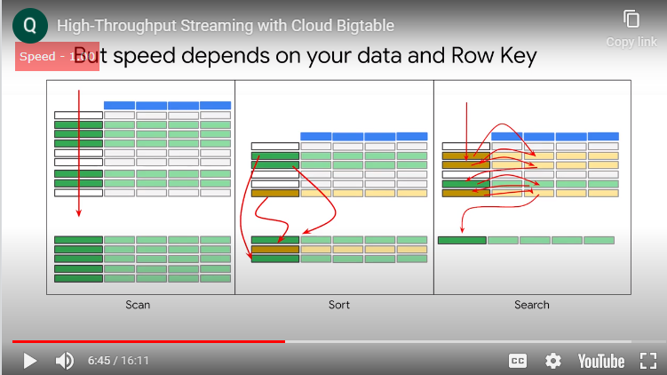

# 05HighThroughputBigQueryandBigtableStreamingFeatures

## Streaming into BigQuery and Visualizing Results


streaming data into bq in real time
data available in sec
100k rows insert
consider streaming quota

batch loading is not charged
streaming loading is charged


`insert_rows`


use sql to  analyse data

you can visualize in data studio


adv performance


ex of data source


if you share the source the report editor can see more data from that soruce too // extra columns

## Lab Intro:Streaming Analytics and Dashboards


## Streaming Data Processing: Streaming Analytics and Dashboards


query history

## High-Throughput Streaming with Cloud Bigtable

so far we looked at how to do queries on  data even if it's streaming in using  bigquery and displaying the data using  data studio  
bigquery is a very good general purpose  solution something that could work in  most cases that you are worried about  but every once in a while you will come  across a situation where the latency of  bigquery is going to be problematic in  bigquery the data that streaming in is  available in a matter of seconds and  sometimes you will want lower latency  than that you will hold your information  to be available in a matter of  milliseconds for example or microseconds  you may also have to run into issues  where the throughput of bigquery may not  be enough and you may want to deal with  a higher throughput and so what we will  be looking at this in this final chapter  is how to handle such throughput or  latency requirements when big queries is  not enough 


BigTable is ideal for applications  that need very high throughput and  scalability for non structured key value  data when each value is typically no  larger than 10 megabytes 
> not good for  highly structured data transactional  data  small data less than 1 terabytes  and anything requiring sequel queries  and sequel like joins 


BigTable use-case was originally for a  keyword search today it is a solution  for things like a transit system or an  employee badge with a unique ID that  uses a lookup table to find that data  and triggers an event


BT  stores data in a file system called  Colossus 
Colossus also contains data  structures like `tablets` that are used to  identify and manage the data and  metadata about the tablets is what it is  stored on the VMS in BigTable cluster  itself 
this design provides amazing  qualities to BT 
it has three  level of operation 
- it can manipulate the  actual later it can manipulate the  tablets that point to and describe the  data 
- it can manipulate the metadata  that points to the tablets rebalancing  tablets from one node to another is very  fast because only the pointers are  updated 
BT is a learning  system it detects `hotspots` where a lot  of activity is going through a single  tablet and splits the table into two it  can also rebalance the processing by  moving the pointer to a tablet to a  different VM in the cluster 
so it's best  use cases with big data above 300 gigs  and very fast access but constant use  over a longer period of a time  
this gives BT a chance to  learn about the traffic pattern and  rebalance the tablets and the processing  
we know that BigTable is a cluster based  implementation that means there are  multiple machines which host BigTable  service  and offer processing capabilities 
what  if one of the machine or node fails in  this cluster 
will data lost in this case  what will happen to processing 
answer to  all this question is BigTable is a  managed service and is fault tolerant by  default 
in case of a nodes failure only  pointers to the actual data will be lost  
> actual data will be available in  Colossus so a new replacement node will  come up and it will be provided with a  fresh copy of pointers or metadata which  was handled by faulty node 
> Colossus  maintains three replicas by default to  provide durability 


with that brief  overview let us dive deeper and see how  is data stored in BigTable cloud  BigTable stores data in tables and to  begin with it is just a table with rows  and columns however unlike other table  based data systems like spreadsheets our  sequel databases BT has only  `one index` that index is called as `rowkey` 
> there are no alternate indexes or  secondary indexes and when data is  entered it is organized like so  graphically by the rowkey
> the design  principle of BT is speed  through simplification 
if you take a  traditional table and simplify the  controls and operations you allow  yourself to perform on it then you can  optimize for those specific tasks  
- simplify the operations and when you do  not have to account for variations you  can make those that remain very fast 
in  BT the first thing we must  abandon in our design is sequel that is  a standard of all the operations our  database can perform and to speed things  up we will drop most of them and build  up from a minimal set of operations that  is why BT is called a `nosequel database` 
but all the data and not  all the queries are good use cases for  the efficiency that the cloud bit table  service offers but when it is a good  match BT is so consistently  fast that it is magical 



the green items  are  results you want to produce from the  query in the best case you are going to  scan the rookie one time from top to  bottom and you will find all the data  you want to retrieve in adjacent and  contiguous rules you might have to skip  some rows but the query takes a single  `scan` through the index from top down to  collect the results set 

the second  instance is sorting you are still only  looking at the rookie in this case the  yellow line contains data that you want  but it is out of order you can collect  the data in a single scan but the  solution set will be disorderly so you  have to take the extra step of sorting  
the intermediate results to get the  final results now think about this what  about the additional sorting operation to do the timing it introduces a couple  of variables 
-  if the solution set is only  a few rows then the sorting operation  will be quick but if the solution set is  huge the sorting will take more time the  size of the solution set becomes a  factor in timing 
- the `orderliness` of the  original data is another factor if most  of the rows are already in order there  will be less manipulation required then  if there are many rows out of order the  orderliness of the original data becomes  a factor in timing so introducing  sorting means that the time it takes to  produce the result is much more variable  than scanning 

the third instance is  searching in this case one of the  columns contains critical data you  cannot tell whether a row is a member of  a solution set or not without examining  the data contained in the critical  column 
> the row key is no longer  sufficient 
so now you are bouncing back  and forth between  Roky and column contents 
there are many  approaches to searching you can divide  it up into multiple steps one scan  through the rookies and subsequent scans  through the columns and then perhaps a  final sort to get the data in the order  you want and it gets more complicated if  the conditions of solution set  membership involve a logic such as a  value in one column and  a value in another column or a value in  one column or a value in another column  however any algorithm or strategy you  used to produce the result is going to  be slower and more variable than  scanning or sorting 
what is the lesson  from this exploration: that to get the  best performance with the design of the  BT service you need to get  your data in order first if possible and  you need to select or construct a row  key that minimizes sorting and searching  and turns your most common queries into  scans 


let us take an example and  understand the BigTable design practices  implementation tips so we are  considering the flights data for all the  airlines and all flight routes operated  on each entry records the occurrence of  one flight the data includes city of  origin and the date and time of  departure and destination city and date  and time of arrival each airplane has a  maximum capacity and related to this is  a number of passengers that were  actually aboard each flight finally  there is information about the aircraft  itself including the manufacturer called  the make the model number and the  current age of the aircraft at the time  of the flight 
in this example the row  key will be defined for the most common  use cases 


the query is find all the  flights originating from the Atlanta  Airport and arriving between March 21st  and 29th the airport where the flight  originates is the origin field and the  date when the aircraft landed is listed  in the arrival field if you use the  arrival field as the row key it will be  easy to pull out all the flights between  March 21st and 29th but the airport of  origin won't be recognized 
so you will  be searching through the arrival column  to produce the solution set 
in the third  example a row key has been constructed  from information extracted from the  origin field and the arrival field  creating us constructed rowkey because  the data is organized like so  graphically by the rowkey  the Atlanta flights will appear in a  group and sorted by date of arrival  
using this rowkey you can generate the  solution set with only a scan in this  example the data was transformed when it  arrived so constructing a rowkey during  the transformation process is  straightforward 


BT also  provide column families by accessing the  `column family` you can pull some of the  data you need without pulling all of the  data from the row or having to search  for it and assemble it  this makes access more efficient
for  example you may most of the time only  need flight information and do not  really care about aircraft details 
say  the most common query is for current  arrival delays in Atlanta that will  involve averaging flight delays over the  last 30 minutes  hence origin arrival we want this at the  top of the table has RTS


most recent rowkey
N most recent events as TOP N


when  you delete data the row is marked for  deletion and skipped during subsequent  processing it is not immediately removed  
if we want to make a change to data the  neuro is appended sequentially to the  end of the table and the previous  version is marked for deletion  so both rows exist for a period of time  periodically BT `compacts` the  table  removing rows marked for deletion and  reorganizing the data for read and  efficiency

 
distributing the right across  nodes provides the best right  performance one way to accomplish this  is by choosing rows keys that are  randomly distributed however choosing a  rookie that groups related rows so they  are adjacent makes it much more  efficient to read multiple rows at one  time in our airline example if we were  collecting weather data from the airport  cities we might construct a key  consisting of a hash of the city name  along with the name stamp the example  row keys shown would enable pulling all  the data for Delhi India as a contiguous  range of rows 
whenever there are rows  containing multiple column values that  are related it is a good idea to group  them into a column family 
some NOSQL  databases suffer performance degradation  if there are too many column families  BT can handle up to 200  column families without losing  performance and it is much more  efficient to retrieve data from one or  more column families than retrieving all  of the data in a row 
there are currently  no configuration settings in cloud  BigTable for compression  
however random data cannot be compressed  as efficiently as organized data  
compression works best if identical  values are near each other either in the  same row or in adjoining rows 
if you  arrange your row keys so that rows with  identical data are adjacent the data can  be compressed more efficiently 
BT periodically rewrites your  table to remove deleted entries and to  reorganize your data so that reads and  writes are more efficient 
it tries to  distribute reads and writes equally  across all BT nodes


in this  example a b c d e are not data but  rather pointers or references and cache  which is why rebalancing is not  time-consuming we are just moving  pointers actual data is in tablets in  Colossus file system 
based on the learnt  access patterns BigTable rebalances data  accordingly and balances the work  across the nodes 
with a well-designed  schema reads and writes should be  distributed fairly evenly across an  entire table and cluster


however in some  cases it is inevitable that certain  rules will be accessed more frequently  than others in these cases cloud  BigTable will redistribute tablets so  that reads are spread across nodes in  the cluster evenly  
note that ensuring an even distribution  of reads has taken priority over evenly  distributing storage across the cluster   

## Optimizing Cloud Bigtable Performance


in the next few slides we will look at how you can further optimize BigTable performance there are several factors that can result in slower performance that people's schema is not designed correctly it's essential to design a schema that allows reads and writes to be evenly distributed across the cloudBigTable cluster otherwise individual nodes can get overloaded that may results in slowing performance the workload isn't appropriate for cloudBigTable testing with a small amount of data for example less than 300 gigs or for a very short period of a time seconds rather than minutes or hours
BigTable won't be able to properly optimize your data it needs time to learn your excess patterns and it needs large and of shards of data to make use of all of the nodes in your cluster the
BT cluster doesn't have enough nodes typically performance increases linearly with the number of nodes in a cluster adding more nodes can therefore improve performance 
use the monitoring tools to check whether a cluster is overloaded 


scale linear 


rows are sorted => rowkey is crucial
data evenly distributed


replication 
copying it across multiple regions or multiple zones within the same region
failover is manual or automatic, it depends on app profile


```
at the time of this writing a 10 nodeSSD cluster with 1 KB rows and a write only workload can process 10,000 rows per second at a 6 millisecond delays
```


`key visualizer` is a tool that helps you analyze your cloudBigTable usage patterns it generates visual reports for your tables that break down your usage based on the rowkeys that you access key visualizer automatically generates hourly and dailyscans for every table in your instance that meets at least one of the followingcriteria during the previous 24 hours the table contained at least 30 gigs of data at some point of time during the previous 24 hours the average of all thereads are all the writes was at least10,000 rows per second the core of a keyvisualizer scan is the heat map which shows the value of a metric over time broken down into contiguous ranges of row 
keys the x-axis of the `heat map` represents time and the y-axis represents row keys if the metric had alow value for a group of row keys at a point in the time the metric is cold and it appears in a dark color a high value is hot and appears in a bright color the highest value appears in white by learning such patterns you may be able to take actions to help keep big table performance optimal

## Lab Intro:Streaming Data Pipelines into Bigtable


## Streaming Data Processing: Streaming Data Pipelines into Bigtable

```
cd ~/training-data-analyst/courses/streaming/process/sandiego
./install_quickstart.sh
```

```
cd ~/training-data-analyst/courses/streaming/process/sandiego

nano run_oncloud.sh
```

```
cd ~/training-data-analyst/courses/streaming/process/sandiego

./create_cbt.sh
```

Run the Dataflow pipeline to read from PubSub and write into Cloud Bigtable.

```
cd ~/training-data-analyst/courses/streaming/process/sandiego

./run_oncloud.sh $DEVSHELL_PROJECT_ID $BUCKET CurrentConditions --bigtable
```


````
Bigtable Options
BigtableOptions{dataHost=bigtable.googleapis.com, adminHost=bigtableadmin.googleapis.com, port=443, projectId=qwiklabs-gcp-02-f21db7da5a15, instanceId=sandiego, appProfileId=, userAgent=cpb210, credentialType=SuppliedCredentials, dataChannelCount=4, retryOptions=RetryOptions{retriesEnabled=true, allowRetriesWithoutTimestamp=false, statusToRetryOn=[UNAVAILABLE, ABORTED, UNAUTHENTICATED, DEADLINE_EXCEEDED], initialBackoffMillis=5, maxElapsedBackoffMillis=60000, backoffMultiplier=1.5, streamingBufferSize=60, readPartialRowTimeoutMillis=60000, maxScanTimeoutRetries=3}, bulkOptions=BulkOptions{asyncMutatorCount=2, useBulkApi=true, bulkMaxKeyCount=125, bulkMaxRequestSize=1048576, autoflushMs=0, maxInflightRpcs=40, maxMemory=94070374, enableBulkMutationThrottling=true, bulkMutationRpcTargetMs=100}, callOptionsConfig=CallOptionsConfig{useTimeout=false, shortRpcTimeoutMs=60000, longRpcTimeoutMs=600000, mutateRpcTimeoutMs=600000, readStreamRpcTimeoutMs=600000}, usePlaintextNegotiation=false, useCachedDataPool=false, useBatch=false, useGCJClient=false}
```

```
cd ~/training-data-analyst/courses/streaming/process/sandiego/quickstart

./quickstart.sh
```


```
scan 'current_conditions', {'LIMIT' => 2}

Type "exit<RETURN>" to leave the HBase Shell
Version 1.2.4, r67592f3d062743907f8c5ae00dbbe1ae4f69e5af, Tue Oct 25 18:10:20 CDT 2016

hbase(main):001:0> scan 'current_conditions', { 'LIMIT' =>2 }
ROW                                             COLUMN+CELL                                                                                                                               
 15#S#1#9223370811336475807                     column=lane:direction, timestamp=1225518300, value=S                                                                                      
 15#S#1#9223370811336475807                     column=lane:highway, timestamp=1225518300, value=15                                                                                       
 15#S#1#9223370811336475807                     column=lane:lane, timestamp=1225518300, value=1.0                                                                                         
 15#S#1#9223370811336475807                     column=lane:latitude, timestamp=1225518300, value=32.723248                                                                               
 15#S#1#9223370811336475807                     column=lane:longitude, timestamp=1225518300, value=-117.115543                                                                            
 15#S#1#9223370811336475807                     column=lane:sensorId, timestamp=1225518300, value=32.723248,-117.115543,15,S,1                                                            
 15#S#1#9223370811336475807                     column=lane:speed, timestamp=1225518300, value=71.4                                                                                       
 15#S#1#9223370811336475807                     column=lane:timestamp, timestamp=1225518300, value=2008-11-01 05:45:00                                                                    
 15#S#1#9223370811336775807                     column=lane:direction, timestamp=1225518000, value=S                                                                                      
 15#S#1#9223370811336775807                     column=lane:highway, timestamp=1225518000, value=15                                                                                       
 15#S#1#9223370811336775807                     column=lane:lane, timestamp=1225518000, value=1.0                                                                                         
 15#S#1#9223370811336775807                     column=lane:latitude, timestamp=1225518000, value=32.723248                                                                               
 15#S#1#9223370811336775807                     column=lane:longitude, timestamp=1225518000, value=-117.115543                                                                            
 15#S#1#9223370811336775807                     column=lane:sensorId, timestamp=1225518000, value=32.723248,-117.115543,15,S,1                                                            
 15#S#1#9223370811336775807                     column=lane:speed, timestamp=1225518000, value=71.1                                                                                       
 15#S#1#9223370811336775807                     column=lane:timestamp, timestamp=1225518000, value=2008-11-01 05:40:00                                                                    
2 row(s) in 0.6080 seconds

hbase(main):002:0> 
```

```

hbase(main):026:0> scan 'current_conditions', {'LIMIT' => 10, STARTROW => '15#S#1', ENDROW => '15#S#999', COLUMN => 'lane:speed'}
ROW                                             COLUMN+CELL                                                                                                                               
 15#S#1#9223370811334975807                     column=lane:speed, timestamp=1225519800, value=75.3                                                                                       
 15#S#1#9223370811335275807                     column=lane:speed, timestamp=1225519500, value=75.2                                                                                       
 15#S#1#9223370811335575807                     column=lane:speed, timestamp=1225519200, value=74.8                                                                                       
 15#S#1#9223370811335875807                     column=lane:speed, timestamp=1225518900, value=71.2                                                                                       
 15#S#1#9223370811336175807                     column=lane:speed, timestamp=1225518600, value=74.9                                                                                       
 15#S#1#9223370811336475807                     column=lane:speed, timestamp=1225518300, value=71.4                                                                                       
 15#S#1#9223370811336775807                     column=lane:speed, timestamp=1225518000, value=71.1                                                                                       
 15#S#1#9223370811337075807                     column=lane:speed, timestamp=1225517700, value=71.1                                                                                       
 15#S#1#9223370811337375807                     column=lane:speed, timestamp=1225517400, value=71.3                                                                                       
 15#S#1#9223370811337675807                     column=lane:speed, timestamp=1225517100, value=75.3                                                                                       
10 row(s) in 0.1220 seconds

```


