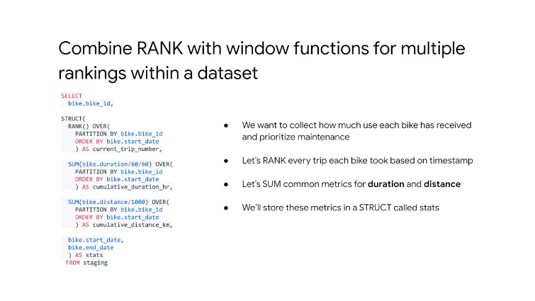

# 06AdvancedBigQueryFunctionalityandPerformance


3 Biz questions 


2 tables


use duration field


distance calculation
we have names 


we have long and lat and we can use `ST_DISTANCE`


get data from 2 tbl
> use `STRUCT`


result of join 
> denormlaitzaiton
ok as data is saved in columanr storage


get gis point
ex
661 meters


use sql to cal the Biz answers


output


use `geoviz`

## Demo:GIS Functions and Mapping with BigQuery


## WITH Clauses vs Permanent Tables


use `WITH` to create named subquery
chain more than 1 with a comma


predicate pushdown


## Analytical window functions


ts come in and come out and time sat in the docker
// look back in time 


diff from 1 record before


array


bike stats


use rank


bike to be mantained


bike_id with any single trip taken by the bike
rank() is analytical func
sum() is aggr func


drill into details with `ARRAY_AGG`


with array agg you have multiple level of aggr


## Lab Intro:Optimizing your BigQuery Queries for Performance


see sql in 
05-Building-Resilient-Streaming-Analytics-Systems-on-GCP\06AdvancedBigQueryFunctionalityandPerformance\lab01.pdf

## Performance Considerations


Toggle Cour we'll close this module with recap on  bigquery performance and pricing topics  there are five key areas for performance  optimization in bigquery and they are  input/output how many bytes were read  from disk shuffling how many bytes were  passed to the next query processing  stage grouping how many bytes were  passed through to each group  materialization how many bytes were  written permanently out to disk and  lastly functions and UDF's  how computationally expensive is the  query on your CPU here's a cheat sheet  of best practices that you should follow  starting from the top don't select more  data columns than you need that means  avoid select star at all costs when you  can if you have a super huge data set  consider using approximate aggregation  functions instead of regular ones  next make liberal use of the where  Clause at all times to filter data then  don't have an order by on a with clause  or sub queries or any other sub queries  that you have only order is the last  thing that you do for joins put the  larger table on the Left if you can  that'll help bigquery optimize it and  how it does its joins if you forget  bigquery will likely do those  authorizations for you so you might not  even see any difference you can use  wildcards in table suffixes to query  multiple tables but try to be as  specific as possible as you can with  those wild cards for your group buys if  you're grouping by the names of every  Wikipedia author ever which means high  distinct values or high cardinality  that's a bad practice for an  anti-pattern stick to low unique value  group bys lastly use partition tables  when you can you'll practice creating  these in a lab later 


there are two major  ways to partition tables in bigquery  when you first ingest the data as a  destination table or is an actual column  that you can partition on the first  example shows that you can create a  table with ingestion time partitioning  by day  and the other two examples show how to  promote an already-existing comment you  have in a data set to be a partitioned  column the columns must be of type dates  timestamp our newly added as an integer  range column 


partitioning can improve  query cost and performance by reducing  the amount of data that's scanned since  bigquery is access to the partition  metadata it can avoid partitions of data  that it knows will be of zero value to  the query asked like ignoring all data  before a certain date filter as you can  see here   


## Partitioned Tables in Google BigQuery


```sql
#standardSQL
SELECT DISTINCT
  fullVisitorId,
  date,
  city,
  pageTitle
FROM `data-to-insights.ecommerce.all_sessions_raw`
WHERE date = '20180708'
LIMIT 5
```

Before the query runs, the query engine does not know whether 2018 data exists to satisfy the WHERE clause condition and it needs to scan through all records in a non-partitioned table.


```sql
#standardSQL
SELECT *
FROM `data-to-insights.ecommerce.partition_by_day`
WHERE date_formatted = '2018-07-08'
```

The query engine knows which partitions already exist and knows that no partition exists for 2018-07-08 (the ecommerce dataset ranges from 2016-08-01 to 2017-08-01).

