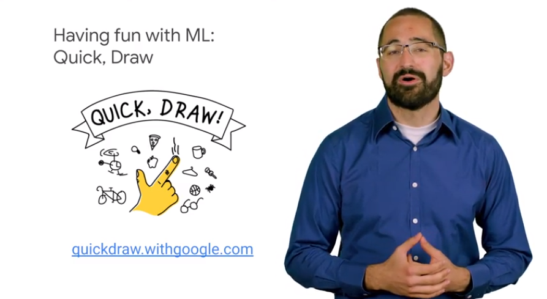

# 02IntroductiontoAnalyticsandAI

## what is ml

use general alg to make prediction

bi for od data
ml to generate new results -  predictive insights

can BA make single decision for single products? NO
we need ml to scale

ml uses standarad alg but you can train them to do different things

we need multiple samples

label and inputs

learn and generalize
the f(x) learn how to distingue between cases changing the imgs for the train

ml models are as good as the training provided

## Machine Learning and AI

ai is the field/discipline 
ml is toolset to solve some
deep learning works on unstructured 

ex

collect a lot of img 
hw/sw to power ml model in the cloud

## ML options on Google Cloud Platform

options and user level

ds with skill def custom tf models

use `cloud automl` for tailor specifics without writing lines of code

use pretrained ml model by google

## Game:Reviewing key ML concepts

ex

it's powered by AI

it used deep learning 

use the play ground 

