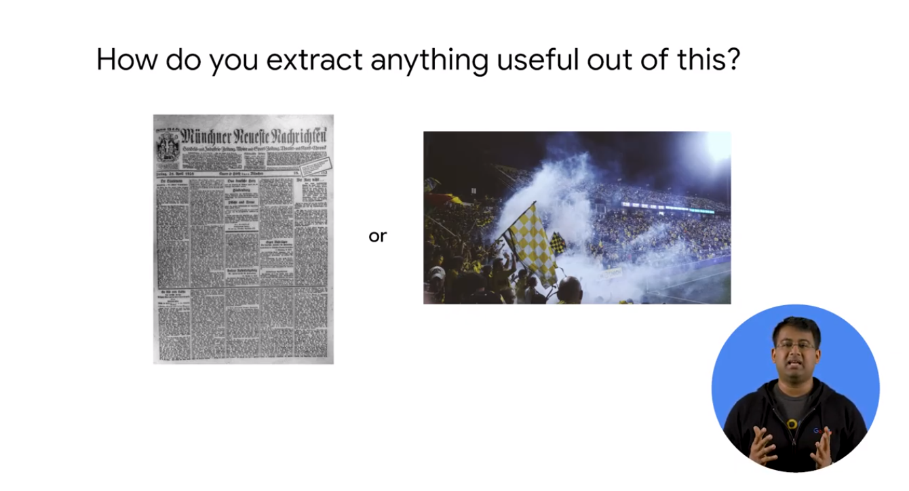
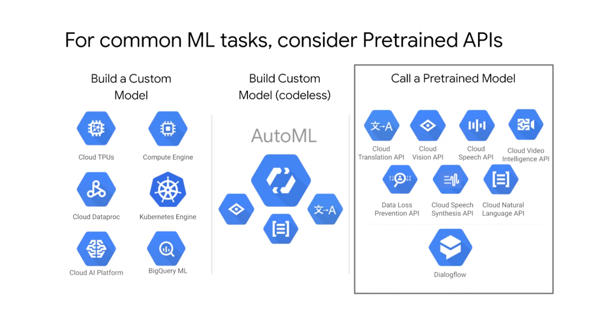
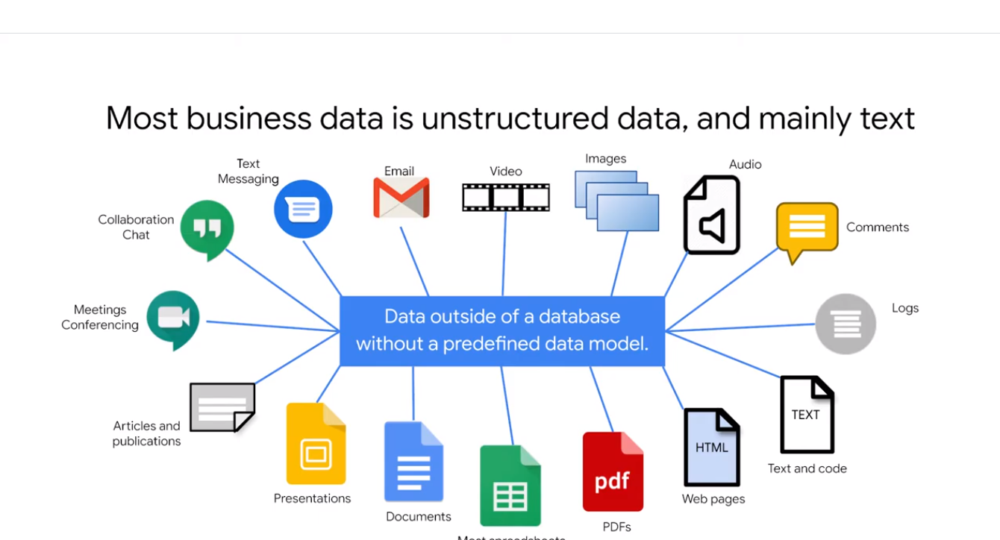
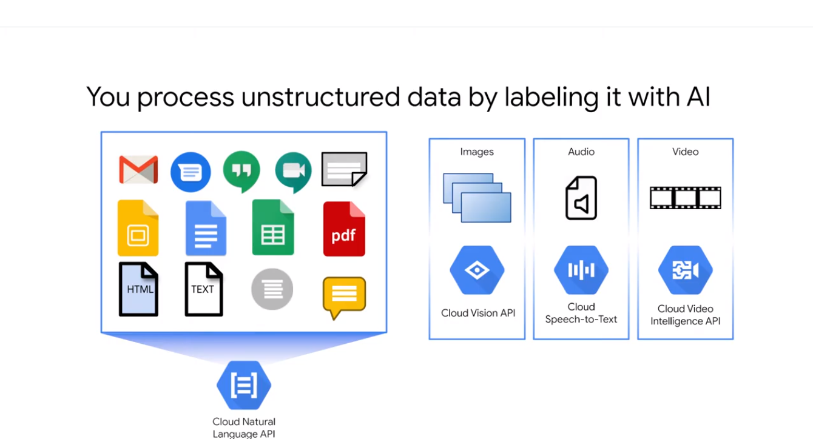
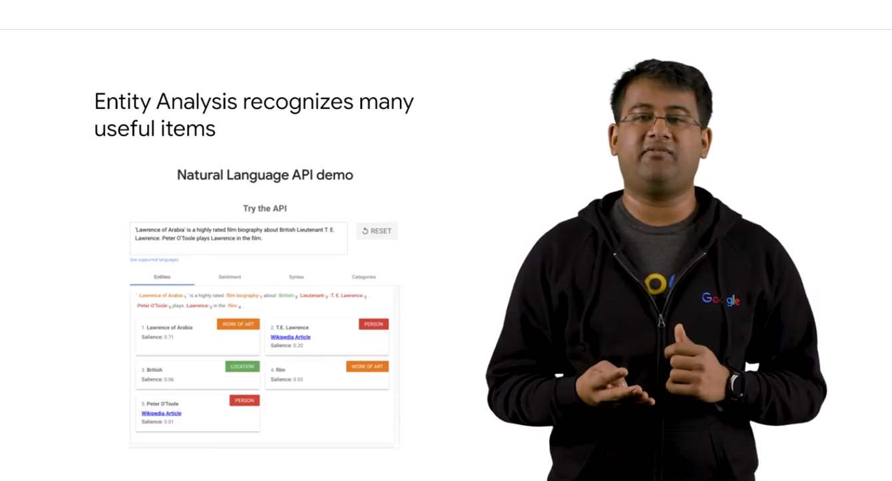
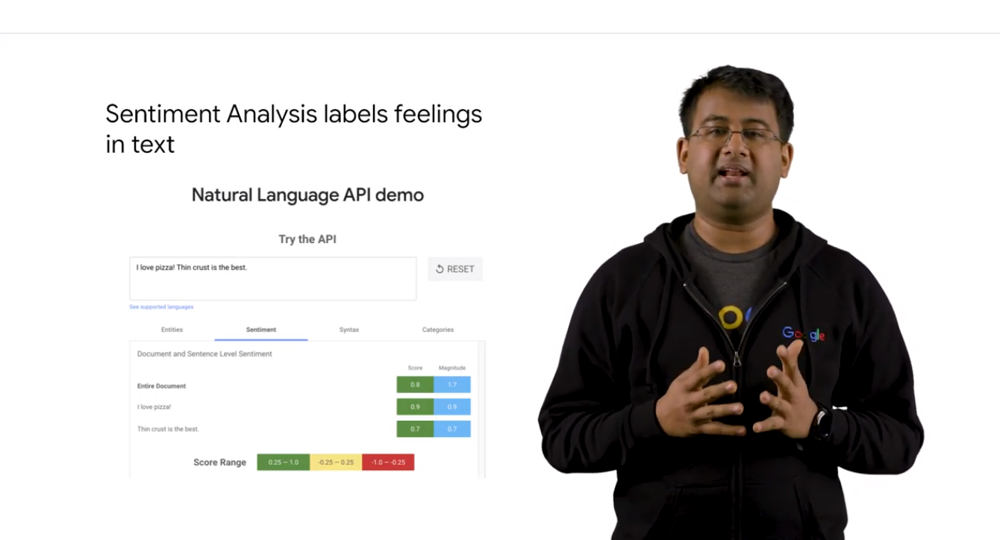

# 03PrebuiltMLmodelAPIsforUnstructuredData

## Unstructured Data is Hard

data like audio/video/fre form text



how to extarct infor from imsg
we have some tools to  get metadata
```
language of the newspaper
flag type
```


cloud vision api
cloud flow

use data to pai and you get predictions

## ML APIs for Enriching Data


a lot of not structured data


focus in this module on text
but same for the others

to apply  label to  inputs


syntactic analysis => token and values

you can use the api to  test


it can recognize the items


sentiment analysis  = public opinion of a text
like positive and negative
score is 0 to 1
