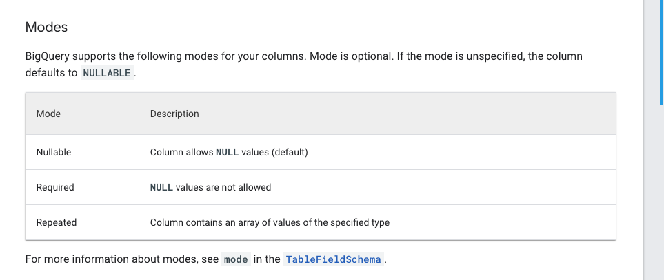

# `https:§§cloud.google.com§bigquery§docs§nested-repeated#python`

> <https://cloud.google.com/bigquery/docs/nested-repeated#python>

## Define nested and repeated columns

about modes


nested data => `RECORD` data type 
a record field is a `struct` in classis aql (ordered field container)

repeated data => `REPEATED` data type
a repeated field is an `array` in classic sql (list of items)
a record can have repeated mode => array of struct
a repeated can have a record mode => struct with arrays

## Limitations
Nested and repeated schemas are subject to the following limitations: A schema cannot contain more than 15 levels of nested RECORD types.

Columns of type RECORD can contain nested RECORD types, also called
child records. The maximum nested depth limit is 15 levels. 


## Example schema
The following example shows sample nested and repeated data. This table contains
information about people. It consists of the following fields:
id first_name last_name dob (date of birth) addresses (a nested and repeated field) addresses.status (current or previous) addresses.address addresses.city addresses.state addresses.zip addresses.numberOfYears (years at the address)

The JSON data file would look like the following. Notice that the addresses
column contains an array of values (indicated by [ ]). The multiple addresses
in the array are the repeated data. The multiple fields within each address are the nested data.
```json
{"id":"1","first_name":"John","last_name":"Doe","dob":"1968-01-22","addresses":[{"status":"current","address":"123 Fi "}
{"id":"2","first_name":"Jane","last_name":"Doe","dob":"1980-10-16","addresses":[{"status":"current","address":"789 An"}
```
The schema for this table looks like the following:

```json
[
   {
      "name":"id",
      "type":"STRING",
      "mode":"NULLABLE"
   },
   {
      "name":"first_name",
      "type":"STRING",
      "mode":"NULLABLE"
   },
   {
      "name":"last_name",
      "type":"STRING",
      "mode":"NULLABLE"
   },
   {
      "name":"dob",
      "type":"DATE",
      "mode":"NULLABLE"
   },
   {
      "name":"addresses",
      "type":"RECORD",
      "mode":"REPEATED",
      "fields":[
         {
            "name":"status",
            "type":"STRING",
            "mode":"NULLABLE"
         },
         {
            "name":"address",
            "type":"STRING",
            "mode":"NULLABLE"
         },
         {
            "name":"city",
            "type":"STRING",
            "mode":"NULLABLE"
         },
         {
            "name":"state",
            "type":"STRING",
            "mode":"NULLABLE"
         },
         {
            "name":"zip",
            "type":"STRING",
            "mode":"NULLABLE"
         },
         {
            "name":"numberOfYears",
            "type":"STRING",
            "mode":"NULLABLE"
         }
      ]
   }
]
```

## Specify nested and repeated columns in table schemas | BigQuery

View on GitHub (https://github.com/googleapis/python-bigquery/blob/35627d145a41d57768f19d4392ef235928e00f72/docs/snippets.py)

```py
# from google.cloud import bigquery # client = bigquery.Client() # project = client.project # dataset_ref = bigquery.DatasetReference(project, 'my_dataset')
schema = [ 
    bigquery.SchemaField("id", "STRING", mode="NULLABLE"), 
    bigquery.SchemaField("first_name", "STRING", mode="NULLABLE"), 
    bigquery.SchemaField("last_name", "STRING", mode="NULLABLE"),
    bigquery.SchemaField("dob", "DATE", mode="NULLABLE"), 
    bigquery.SchemaField("addresses", "RECORD", mode="REPEATED", 
        fields=[
            bigquery.SchemaField("status", "STRING", mode="NULLABLE"), 
            bigquery.SchemaField("address", "STRING", mode="NULLABLE"), 
            bigquery.SchemaField("city", "STRING", mode="NULLABLE"), 
            bigquery.SchemaField("state", "STRING", mode="NULLABLE"), 
            bigquery.SchemaField("zip", "STRING", mode="NULLABLE"), 
            bigquery.SchemaField("numberOfYears", "STRING", mode="NULLABLE"), 
        ], 
    ), 
    ] 
table_ref = dataset_ref.table("my_table") 
table = bigquery.Table(table_ref, schema=schema) 
table = client.create_table(table) # API request
print("Created table {}".format(table.full_table_id))
```

## Modify nested and repeated columns
After you add a nested column or a nested and repeated column to a table's
schema definition, you can modify the column as you would any other type of
column. 


## When to use nested and repeated columns
BigQuery performs best when your data is denormalized. Rather
than preserving a relational schema such as a star or snowflake schema, denormalize your data and take advantage of nested and repeated columns. Nested and repeated columns can maintain relationships without the performance impact
of preserving a relational (normalized) schema.

BigQuery supports loading nested and repeated data from source formats that support object-based schemas, such as JSON files, Avro files, Firestore export files, and Datastore export files.

Table security
To control access to tables in BigQuery, see
Introduction to table access controls (/bigquery/docs/table-access-controls-intro).

Next steps

[https://cloud.google.com/bigquery/docs/nested-repeated](/https:§§cloud.google.com§bigquery§docs§nested-repeated/readme.md)

7/8

19/08/2021

Specify nested and repeated columns in table schemas | BigQuery

To insert and update rows with nested and repeated columns, see
Data manipulation language syntax (/bigquery/docs/reference/standard-sql/dml-syntax).
Except as otherwise noted, the content of this page is licensed under the Creative Commons Attribution 4.0 License (https://creativecommons.org/licenses/by/4.0/), and code samples are licensed under the Apache 2.0 License (https://www.apache.org/licenses/LICENSE-2.0). For details, see the Google Developers Site Policies (https://developers.google.com/site-policies). Java is a registered trademark of Oracle and/or its affiliates.
Last updated 2021-08-17 UTC.

[https://cloud.google.com/bigquery/docs/nested-repeated](/https:§§cloud.google.com§bigquery§docs§nested-repeated/readme.md)

8/8

