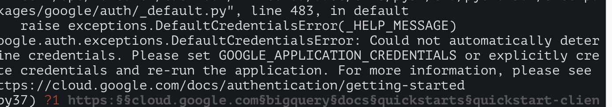

# https:§§cloud.google.com§bigquery§docs§quickstarts§quickstart-client-libraries

> <https://cloud.google.com/bigquery/docs/quickstarts/quickstart-client-libraries>

use bq api in your fav programming language

## before  you  begin

- select prj
- enable api
- create sa
- set GOOGLE_APPLICATION_CREDENTIALS

```bash
GOOGLE_APPLICATION_CREDENTIALS='~/SA_BASIC_OWNER_PRIVATE_KEY.json'
export GOOGLE_APPLICATION_CREDENTIALS
```

## Install the client library

```bash
pip install --upgrade google-cloud-bigquery
```

## Import the libraries

[https://github.com/googleapis/python-bigquery/blob/35627d145a41d57768f19d4392ef235928e00f72/samples/snippets/simple_app.py](/https:§§github.com§googleapis§python-bigquery§blob§35627d145a41d57768f19d4392ef235928e00f72§samples§snippets§simple_app.py/readme.md)

```py
from google.cloud import bigquery
```

## Initialize a BigQuery client

[https://googleapis.dev/python/bigquery/latest/generated/google.cloud.bigquery.client.Client.html](/https:§§googleapis.dev§python§bigquery§latest§generated§google.cloud.bigquery.client.Client.html/readme.md)

```py
client = bigquery.Client()
```

> note set  


## Running query

```sql
SELECT
  CONCAT(
    'https://stackoverflow.com/questions/',
    CAST(id as STRING)) as url,
  view_count
FROM `bigquery-public-data.stackoverflow.posts_questions`
WHERE tags like '%google-bigquery%'
ORDER BY view_count DESC
LIMIT 10
```

> the client libraries default to standard SQL syntax

Query using the authenticated BigQuery client.

[https://googleapis.dev/python/bigquery/latest/generated/google.cloud.bigquery.client.Client.html](/https:§§googleapis.dev§python§bigquery§latest§generated§google.cloud.bigquery.client.Client.html/readme.md)

```py
query_job = client.query(
    """
    SELECT
      CONCAT(
        'https://stackoverflow.com/questions/',
        CAST(id as STRING)) as url,
      view_count
    FROM `bigquery-public-data.stackoverflow.posts_questions`
    WHERE tags like '%google-bigquery%'
    ORDER BY view_count DESC
    LIMIT 10"""
)

results = query_job.result()  # Waits for job to complete.
```

[https://cloud.google.com/bigquery/docs/query-overview](/https:§§cloud.google.com§bigquery§docs§query-overview/readme.md)
[https://cloud.google.com/bigquery/docs/running-queries](/https:§§cloud.google.com§bigquery§docs§running-queries/readme.md)
[https://cloud.google.com/bigquery/docs/writing-results](/https:§§cloud.google.com§bigquery§docs§writing-results/readme.md)

## Displaying the query result

[https://googleapis.dev/python/bigquery/latest/generated/google.cloud.bigquery.table.RowIterator.html](/https:§§googleapis.dev§python§bigquery§latest§generated§google.cloud.bigquery.table.RowIterator.html/readme.md)
[https://googleapis.dev/python/bigquery/latest/generated/google.cloud.bigquery.table.Row.html](/https:§§googleapis.dev§python§bigquery§latest§generated§google.cloud.bigquery.table.Row.html/readme.md)

```py
for row in results:
    print("{} : {} views".format(row.url, row.view_count))
```
[https://cloud.google.com/bigquery/docs/managing-table-data#browse-table](/https:§§cloud.google.com§bigquery§docs§managing-table-data#browse-table/readme.md)
[https://cloud.google.com/bigquery/docs/loading-data](/https:§§cloud.google.com§bigquery§docs§loading-data/readme.md)

## Complete source code

[https://github.com/googleapis/python-bigquery/blob/35627d145a41d57768f19d4392ef235928e00f72/samples/snippets/simple_app.py](/https:§§github.com§googleapis§python-bigquery§blob§35627d145a41d57768f19d4392ef235928e00f72§samples§snippets§simple_app.py/readme.md)

```py
from google.cloud import bigquery


def query_stackoverflow():
    client = bigquery.Client()
    query_job = client.query(
        """
        SELECT
          CONCAT(
            'https://stackoverflow.com/questions/',
            CAST(id as STRING)) as url,
          view_count
        FROM `bigquery-public-data.stackoverflow.posts_questions`
        WHERE tags like '%google-bigquery%'
        ORDER BY view_count DESC
        LIMIT 10"""
    )

    results = query_job.result()  # Waits for job to complete.

    for row in results:
        print("{} : {} views".format(row.url, row.view_count))


if __name__ == "__main__":
    query_stackoverflow()
```

