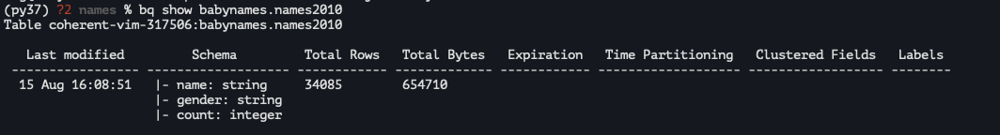

# `https:§§cloud.google.com§bigquery§docs§quickstarts§quickstart-command-line`

> <https://cloud.google.com/bigquery/docs/quickstarts/quickstart-command-line>

## Before you begin
enable `big query api`


## Examine a table

public sample
https://console.cloud.google.com/bigquery?p=bigquery-public-data&d=samples

examine
```
bq show shakespeare
```


```
bq help
```

## Run a query

use bq query

```
bq query --use_legacy_sql=false 'SELECT word,SUM(word_count) AS count FROM `bigquery-public-data`.samples.shakespeare WHERE word LIKE "%raisin%" GROUP BY word'
```


## Create a new table

get dataset sample 

## create dataset

use 
```
bq ls
```
use 

```
bq ls publicdata:
```


create it as
```
bq mk babynames
```


> A dataset name can be up to 1,024 characters long and consist of A-Z, a-z, 0-9, and the underscore. The name cannot start with a number or underscore, and it cannot have spaces

## upload the table

```
bq load babynames.names2010 yob2010.txt \
name:string,gender:string,count:integer
```


show info

```
bq show babynames.names2010
```


## clean up

remove them as

```
bq rm --recursive=true babynames
```

## Next

https://cloud.google.com/bigquery/docs/bq-command-line-tool
https://cloud.google.com/bigquery/docs/loading-data
https://cloud.google.com/bigquery/docs/query-overview
https://cloud.google.com/bigquery/docs/reference/libraries