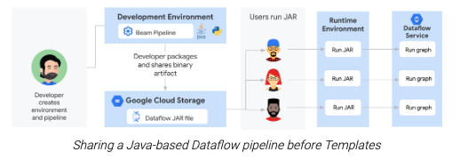
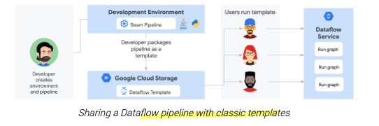
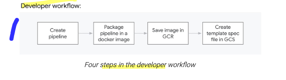
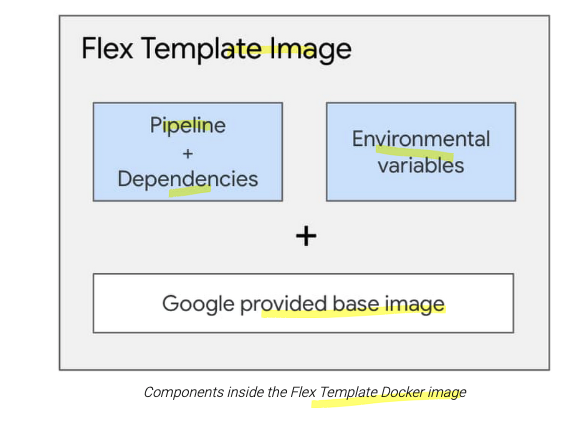
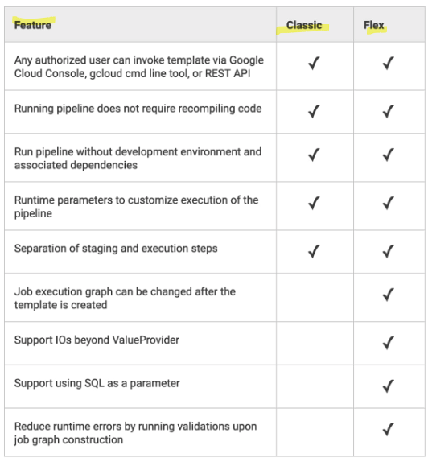
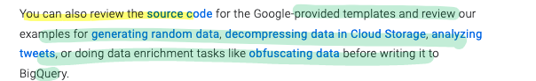
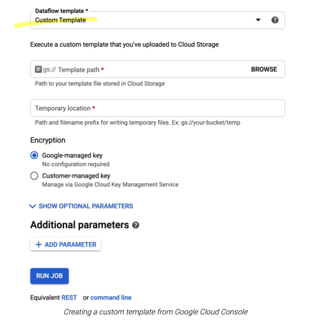

# Turn any Dataflow pipeline into a reusable template

> title is different from the page 

new dataflow flex templates
[https://cloud.google.com/dataflow/docs/concepts/dataflow-templates#templated-dataflow-jobs](/https:§§cloud.google.com§dataflow§docs§concepts§dataflow-templates#templated-dataflow-jobs/readme.md)
vs
classic templates
[https://cloud.google.com/dataflow/docs/concepts/dataflow-templates#templated-dataflow-jobs](/https:§§cloud.google.com§dataflow§docs§concepts§dataflow-templates#templated-dataflow-jobs/readme.md)

classic templates more rigid 
- execution graph is fixed
- limited list of source and sink  // ValueProvider dependency 

flex templates
- allow minor variation at run time // change the source or sink file format

## Why sharing Dataflow pipelines has been challenging

apache beam pipeline can be very sophisticated
then you need a Runner to execute them

when you ask to  run a dataflow pipeline
- an execution graph  is built
- the graph object is serialized into json
- the json is submitted to  the dataflow service
- dataflow service validates it 
- dataflow optimize it
- dataflow creates job 

before templates
- create local dev env
- share artifacts // artifactory or cloud storage bucket
- fetch artifacts

## Sharing Dataflow pipelines with classic templates

with classic templates
- pipeline converted in a dataflow template // stored in cloud storage

[https://cloud.google.com/dataflow/docs/guides/templates/creating-templates#creating-and-staging-templates](/https:§§cloud.google.com§dataflow§docs§guides§templates§creating-templates#creating-and-staging-templates/readme.md)
it consists 
- json execution graph
- dep //pipeline artifacts and 3rd party

users can invoke it 
- gcloud cmd
- rest api  // https://cloud.google.com/dataflow/docs/guides/templates/running-templates#using-the-rest-api
- dataflow ui /// https://cloud.google.com/dataflow/docs/guides/templates/running-templates#custom-templates
- cloud scheduler // https://cloud.google.com/scheduler

## Sharing Dataflow pipelines with Flex Templates

main diff 
- instead of staging  template file  use of docker images and docker registry  // https://cloud.google.com/dataflow/docs/guides/templates/using-flex-templates#python_only_creating_and_building_a_container_image
- def template spec file in cloud storage  // https://cloud.google.com/dataflow/docs/guides/templates/using-flex-templates#creating_a_flex_template

we have google provided base image with some pipeline artifacts we can reuse 

the staged docker images is built 
- using google base image
- pipeline artifacts
- env vars

[https://github.com/GoogleCloudPlatform/DataflowTemplates/tree/master/v2/streaming-data-generator#creating-template-spec](/https:§§github.com§GoogleCloudPlatform§DataflowTemplates§tree§master§v2§streaming-data-generator#creating-template-spec/readme.md)
contains all the info to run the job

execute it 
- gcloud comand
[https://cloud.google.com/sdk/gcloud/reference/beta/dataflow/flex-template](/https:§§cloud.google.com§sdk§gcloud§reference§beta§dataflow§flex-template/readme.md)
- rest api
- dataflow
- cloud scheduler 
- terraform
- airflow

## Comparing classic vs. Flex Templates

## Create your first Dataflow Flex Template

start with https://cloud.google.com/dataflow/docs/guides/templates/provided-templates
if not found what you need use https://cloud.google.com/dataflow/docs/guides/templates/using-flex-templates
source cod https://github.com/GoogleCloudPlatform/DataflowTemplates

### samples

[https://cloud.google.com/blog/products/gcp/analyzing-tweets-using-cloud-dataflow-pipeline-templates?hl=id](/https:§§cloud.google.com§blog§products§gcp§analyzing-tweets-using-cloud-dataflow-pipeline-templates?hl=id/readme.md)
[https://cloud.google.com/blog/products/data-analytics/dataflow-flex-template-streaming-data-generator](/https:§§cloud.google.com§blog§products§data-analytics§dataflow-flex-template-streaming-data-generator/readme.md)
[https://cloud.google.com/blog/products/gcp/analyzing-tweets-using-cloud-dataflow-pipeline-templates?hl=id](/https:§§cloud.google.com§blog§products§gcp§analyzing-tweets-using-cloud-dataflow-pipeline-templates?hl=id/readme.md)
[https://github.com/GoogleCloudPlatform/dlp-dataflow-deidentification](/https:§§github.com§GoogleCloudPlatform§dlp-dataflow-deidentification/readme.md)

and when done share the flex template with team
