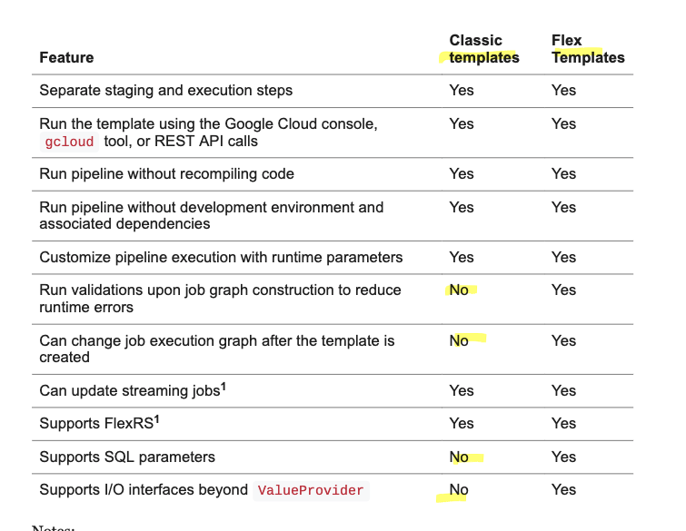

# Dataflow templates

stage pipelines def and run them using 
- gcloud cmd line
- rest api calls
- gcloud console

2 types of template
- classic // saved tmp in gcloud storage
- flex // pkg as docker images in container registry

template benefits
- run with nod ev env setup
- separate pipeline def from pipeline execution 
- runtime parameters 

## Comparing non-templated and templated jobs

### Dataflow jobs without templates

without templates
- create dev python env  // pip apache beam sdk [gcp] and other dep
- build py code 
- run pipeline from dev env 
- tmp gcloud bucket is need to stage tmp artifacts to be submitted to dataflow service //api

### Templated Dataflow jobs

staging and execution are separates steps

with templates
- create dev python env  // pip apache beam sdk [gcp] and other dep
- classic : develop pipeline and create a template file and save it in gcloud storage
- flex : develop pipeline and create a docker image amd save as `flextemplate` file in gcloud storage
- run the job submitting the template to dataflow service

job submission:
- clone the job
- change an input field where necessary 
TODO: add sample

## Evaluating which template type to use
with flex you can add variation to the job submission
execution graph built at runtime

### Comparing templated jobs

2 types of staging artifacts
- classic // template with json serialize execution graph
- flex // docker image with py code 

## SDK version requirements
- apache beam sdk [gcp]
- have Cloud SDK version138.0.0 or higher
 

(base) mamat@FVFF93ACQ05N https-cloud.google.com.com.git % gcloud dataflow --help

