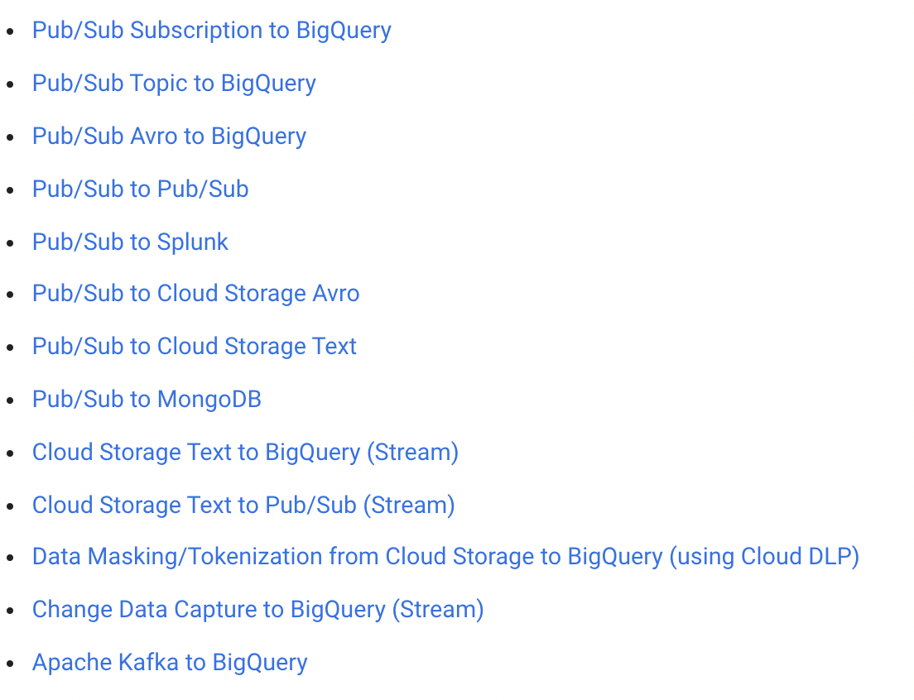
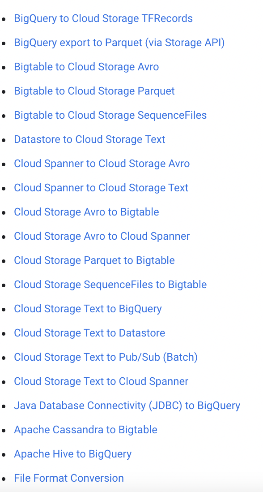
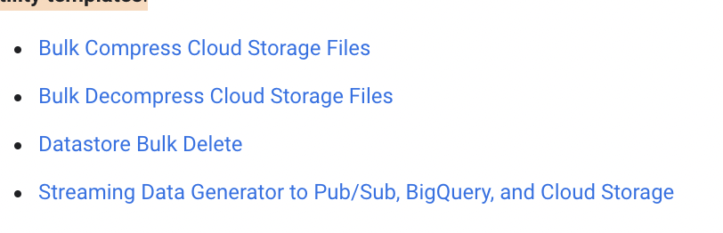
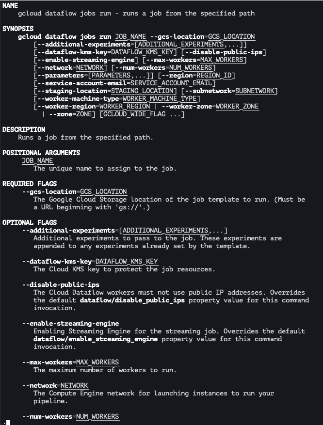

# Get started with Google-provided templates

check the repo
https://github.com/GoogleCloudPlatform/DataflowTemplates

## Streaming templates - Templates for processing data continuously:

https://cloud.google.com/dataflow/docs/guides/templates/provided-streaming#cloudpubsubsubscriptiontobigquery
...


## Batch templates - Templates for processing data in bulk:

https://cloud.google.com/dataflow/docs/guides/templates/provided-batch#bigquerytogcstfrecords
...


## Utility templates:

https://cloud.google.com/dataflow/docs/guides/templates/provided-utilities#bulkcompressgcsfiles
...



## WordCount
> DEPRECATED
TODO: check other samples if needed, this one is using old api 

## Running the ~~~WordCount~~~ template

- dataflow ui
- gcloud

```
# execute MyTemplate 
gcloud dataflow jobs run JOB_NAME \
    --gcs-location gs://dataflow-templates/latest/MyTemplate \
    --parameters \
    inputFile=gs://dataflow-samples/shakespeare/kinglear.txt output=gs://BUCKET_NAME/output/my_output

```

gcloud dataflow jobs run --help



-- rest api

```
POST https://dataflow.googleapis.com/v1b3/projects/PROJECT_ID/templates:launch?gcsPath=gs://dataflow-templates/latest/MyTemplate
{
    "jobName": "JOB_NAME",
    "parameters": {
       "inputFile" : "gs://dataflow-samples/shakespeare/kinglear.txt",
       "output": "gs://BUCKET_NAME/output/my_output"
    },
    "environment": { "zone": "us-central1-f" }
}
```