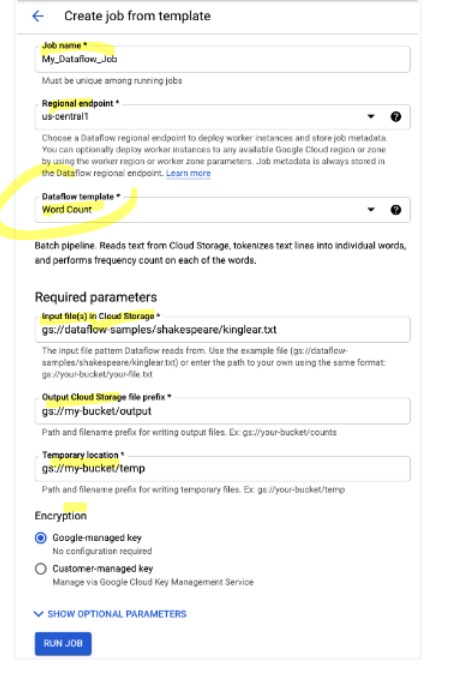
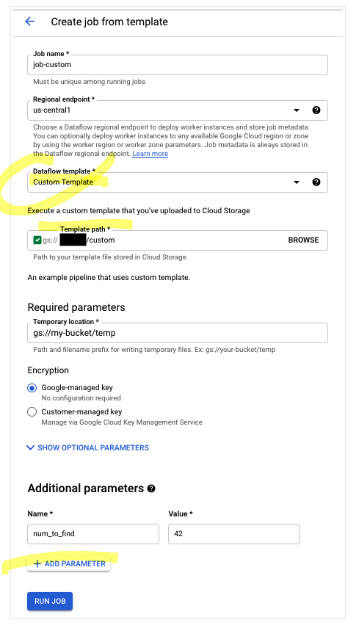
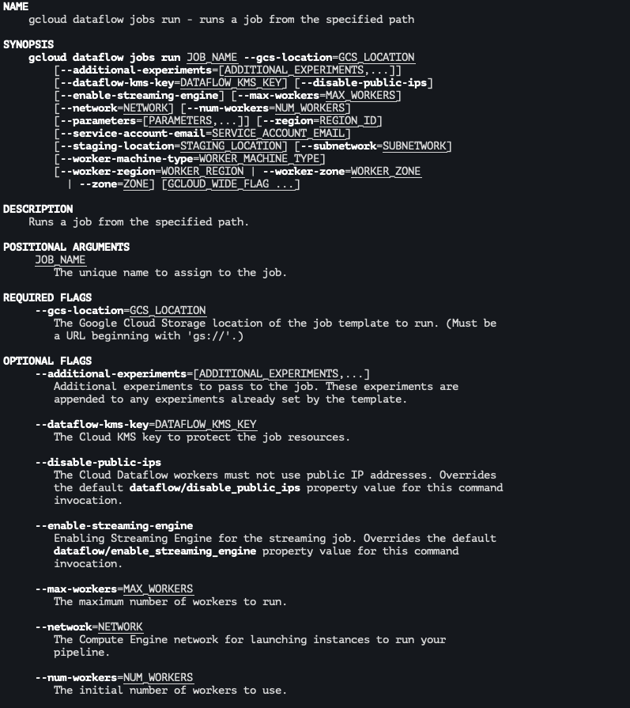

# Running classic templates

template file references files at template creation

## Using the Cloud Console

### Google-provided templates

https://console.cloud.google.com/dataflow/



select template and set parameters

### Custom templates



set custom template and set template path generated at previous step
use additional param to pass to the logic

## Using the REST API

use rest api request

https://cloud.google.com/dataflow/docs/reference/rest/v1b3/projects.templates/launch
> authorization is required

response is type 
https://cloud.google.com/dataflow/docs/reference/rest/v1b3/LaunchTemplateResponse

### Example 1: Creating a custom template batch job

a batch job from a template that reads a text le and writes an output text lenght 

```json
POST https://dataflow.googleapis.com/v1b3/projects/YOUR_PROJECT_ID/locations/LOCATION/templates:launch?gcsPath=gs://YOUR_BUCKET_NAME/templates/TemplateName
    {
        "jobName": "JOB_NAME",
        "parameters": {
            "inputFile" : "gs://YOUR_BUCKET_NAME/input/my_input.txt",
            "outputFile": "gs://YOUR_BUCKET_NAME/output/my_output"
        },
        "environment": {
            "tempLocation": "gs://YOUR_BUCKET_NAME/temp",
            "zone": "us-central1-f"
        }
    }
```

### Example 2: Creating a custom template streaming job

creates a streaming job from a template threads from a Pub/Sub topic and writes to a BigQuery table. 
> The BigQuery table must already exist with the appropriate schema. 

```json
 POST https://dataflow.googleapis.com/v1b3/projects/YOUR_PROJECT_ID/locations/LOCATION/templates:launch?gcsPath=gs://YOUR_BUCKET_NAME/templates/TemplateName
    {
        "jobName": "JOB_NAME",
        "parameters": {
            "topic": "projects/YOUR_PROJECT_ID/topics/YOUR_TOPIC_NAME",
            "table": "YOUR_PROJECT_ID:YOUR_DATASET.YOUR_TABLE_NAME"
        },
        "environment": {
            "tempLocation": "gs://YOUR_BUCKET_NAME/temp",
            "zone": "us-central1-f"
        }
    }
```

### Example 3: Updating a custom template streaming job

you how to update a template streaming job

```json
 POST https://dataflow.googleapis.com/v1b3/projects/YOUR_PROJECT_ID/locations/LOCATION/templates:launch?gcsPath=gs://YOUR_BUCKET_NAME/templates/TemplateName
    {
        "jobName": "JOB_NAME",
        "parameters": {
            "topic": "projects/YOUR_PROJECT_ID/topics/YOUR_TOPIC_NAME",
            "table": "YOUR_PROJECT_ID:YOUR_DATASET.YOUR_TABLE_NAME"
        },
        "environment": {
            "tempLocation": "gs://YOUR_BUCKET_NAME/temp",
            "zone": "us-central1-f"
        }
        "update": true
    }
```

to verify job update you can use the 

https://cloud.google.com/dataflow/docs/guides/using-monitoring-intf#accessing_the_cloud_dataflow_monitoring_interface

## Using the Google API Client Libraries

> Consider using the Google API Client Libraries to easily make calls to the Dataflow REST APIs
https://developers.google.com/api-client-library/

```python
from googleapiclient.discovery import build

# project = 'your-gcp-project'
# job = 'unique-job-name'
# template = 'gs://dataflow-templates/latest/Word_Count'
# parameters = {
#     'inputFile': 'gs://dataflow-samples/shakespeare/kinglear.txt',
#     'output': 'gs://<your-gcs-bucket>/wordcount/outputs',
# }

dataflow = build('dataflow', 'v1b3')
request = dataflow.projects().templates().launch(
    projectId=project,
    gcsPath=template,
    body={
        'jobName': job,
        'parameters': parameters,
    }
)

response = request.execute()
```

## Using gcloud

The gcloud command-line tool can run either a custom or a Google-provided template using the gcloud dataflow jobs run command.

### Example 1: Custom template, batch job

```bash
gcloud dataflow jobs run JOB_NAME \
    --gcs-location gs://YOUR_BUCKET_NAME/templates/MyTemplate \
    --parameters inputFile=gs://YOUR_BUCKET_NAME/input/my_input.txt,outputFile=gs://YOUR_BUCKET_NAME/output/my_output
```



## Example 2: Custom template, streaming job

creates a streaming job from a template threads from a Pub/Sub topic and writes to a BigQuery table. 
> The BigQuery table must already exist with the appropriate schema. 

```bash
gcloud dataflow jobs run JOB_NAME \
    --gcs-location gs://YOUR_BUCKET_NAME/templates/MyTemplate \
    --parameters topic=projects/project-identifier/topics/resource-name,table=my_project:my_dataset.my_table_name
```


## Monitoring and Troubleshooting

to monitor a job
https://cloud.google.com/dataflow/docs/guides/using-monitoring-intf

for failed jobs you can trouble shoot
https://cloud.google.com/dataflow/docs/guides/troubleshooting-your-pipeline