# Using Flex Templates

## Objective

create and run a flex template
with custom docker image
using the `gcloud` cmd line

## Costs

example going to use
DataflowPub/SubCloud StorageCloud SchedulerApp EngineContainer RegistryCloud BuildBigQuery

[https://cloud.google.com/products/calculator](/https:§§cloud.google.com§products§calculator/readme.md)

[https://cloud.google.com/dataflow/pricing](/https:§§cloud.google.com§dataflow§pricing/readme.md)
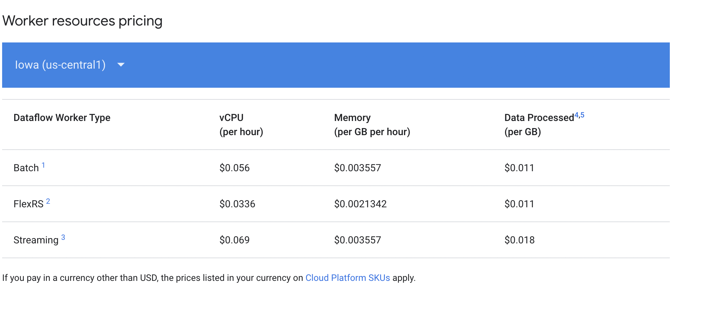

small sample 
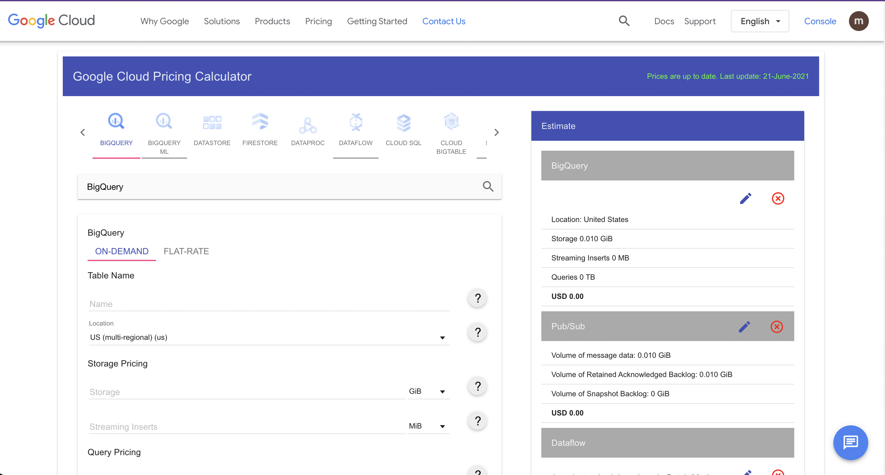

## Before you begin

- [X] enable api

Enable the Dataflow, Compute Engine, Logging, Cloud Storage, Cloud StorageJSON, BigQuery, Pub/Sub, Resource Manager, App Engine, Cloud Scheduler, andCloud Build APIs

[https://console.cloud.google.com/flows/enableapi?apiid=dataflow,compute_component,logging,storage_component,storage_api,bigquery,pubsub,cloudresourcemanager.googleapis.com,appengine.googleapis.com,cloudscheduler.googleapis.com,cloudbuild.googleapis.com](/https:§§console.cloud.google.com§flows§enableapi?apiid=dataflow,compute_component,logging,storage_component,storage_api,bigquery,pubsub,cloudresourcemanager.googleapis.com,appengine.googleapis.com,cloudscheduler.googleapis.com,cloudbuild.googleapis.com/readme.md)

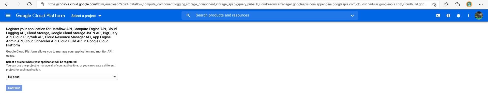

FIXME: in the trial account 

- [X] create service account 

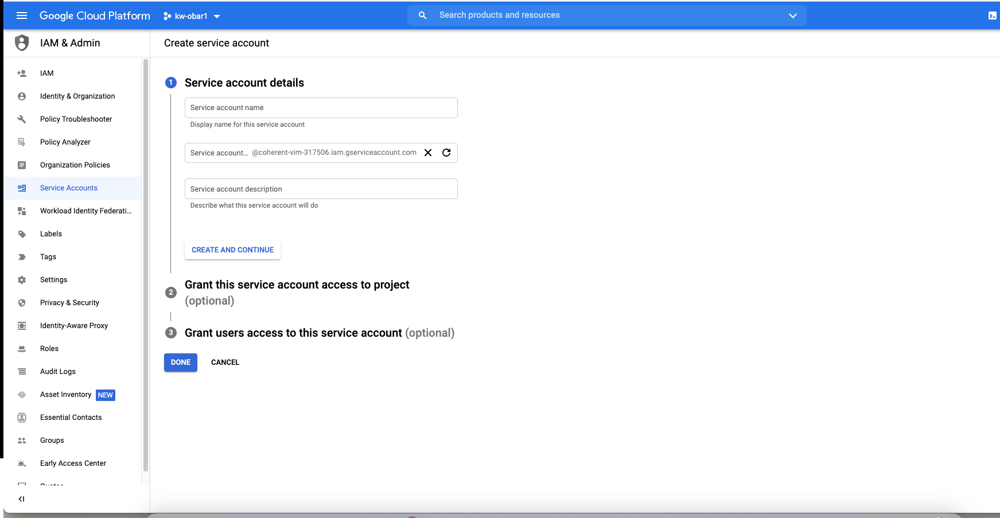

> delete the project when done to save money

create it `sa`
add `owner`

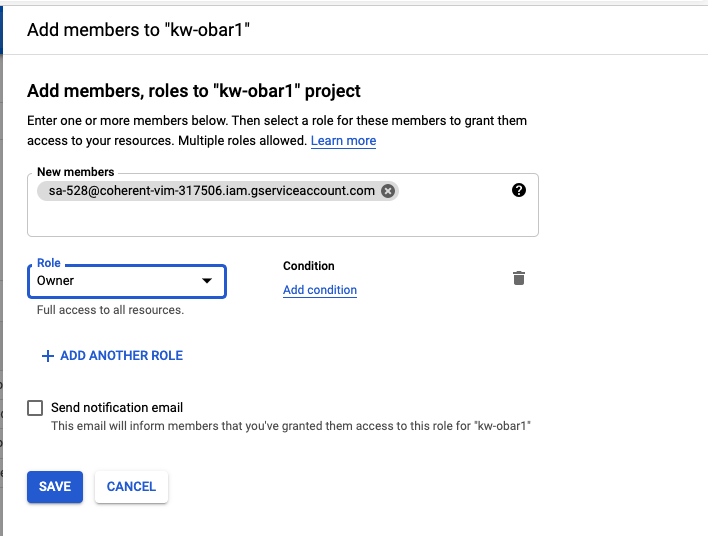

- [X] create new json key and save it 

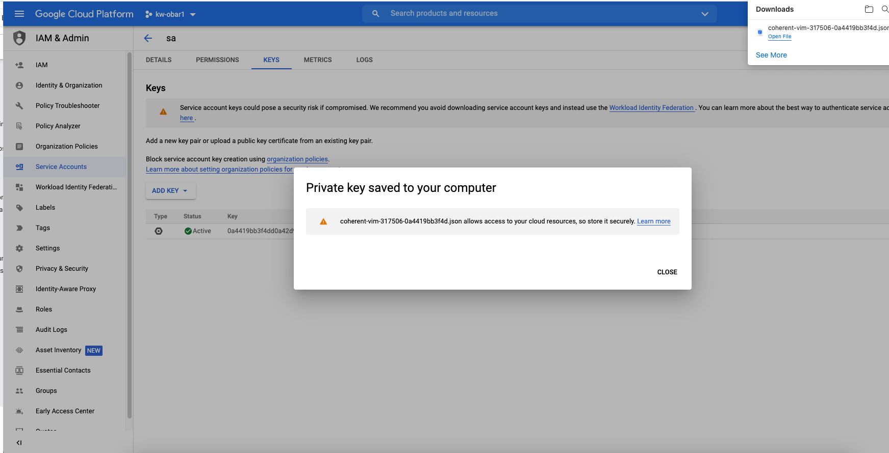

- [X] set `GOOGLE_APPLICATION_CREDENTIALS`

```
export GOOGLE_APPLICATION_CREDENTIALS="KEY_PATH"
```

## Creating the example source and sink

- streaming source of data using pub/sub
- a dataset to load data into  bigquery

### Create a Cloud Storage bucket

[https://cloud.google.com/storage/docs/gsutil/commands/mb](/https:§§cloud.google.com§storage§docs§gsutil§commands§mb/readme.md)

```bash
export BUCKET="my-storage-bucket"
gsutil mb gs://$BUCKET
```

### Create a Pub/Sub topic and a subscription to that topic

```bash
export TOPIC="messages"
export SUBSCRIPTION="ratings"

gcloud pubsub topics create $TOPIC
gcloud pubsub subscriptions create --topic $TOPIC $SUBSCRIPTION
```
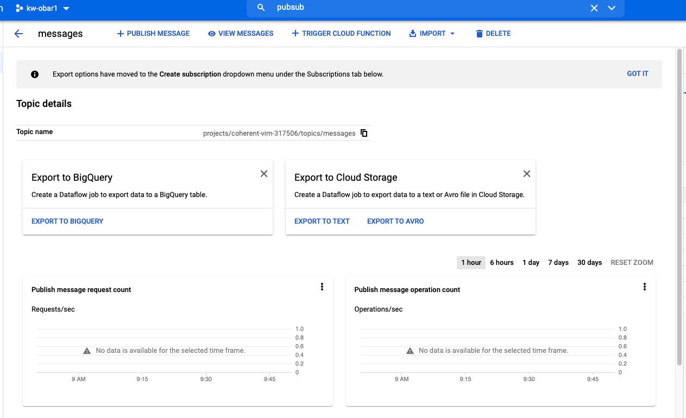

[https://cloud.google.com/sdk/gcloud/reference/pubsub/topics/create](/https:§§cloud.google.com§sdk§gcloud§reference§pubsub§topics§create/readme.md)

### Create a Cloud Scheduler job

positive and negative ratings

```bash
gcloud scheduler jobs create pubsub positive-ratings-publisher \
  --schedule="* * * * *" \
  --topic="$TOPIC" \
  --message-body='{"url": "https://beam.apache.org/", "review": "positive"}'

gcloud scheduler jobs create pubsub negative-ratings-publisher \
  --schedule="*/2 * * * *" \
  --topic="$TOPIC" \
  --message-body='{"url": "https://beam.apache.org/", "review": "negative"}'

```

run the cloud scheduler

```
gcloud scheduler jobs run positive-ratings-publisher
gcloud scheduler jobs run negative-ratings-publisher
```

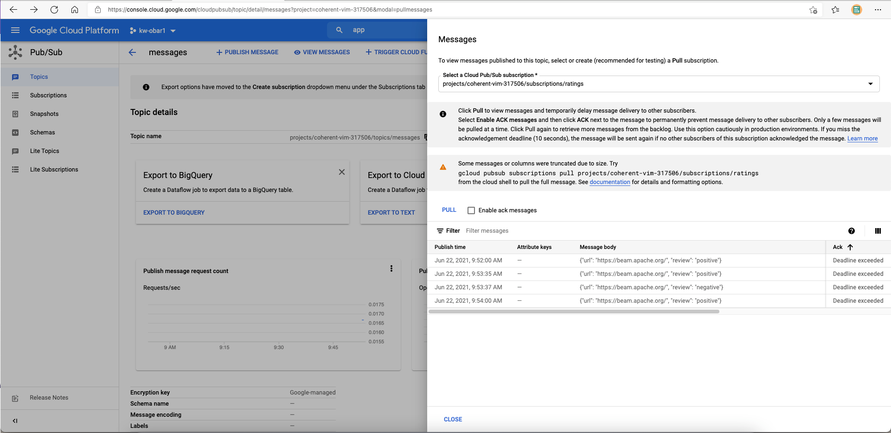

### Create a BigQuery dataset

[https://cloud.google.com/bigquery/docs/reference/bq-cli-reference#bq_mk](/https:§§cloud.google.com§bigquery§docs§reference§bq-cli-reference#bq_mk/readme.md)

```bash
export PROJECT="$(gcloud config get-value project)"
export DATASET="beam_samples"
export TABLE="streaming_beam_sql"

bq mk --dataset "$PROJECT:$DATASET"
```
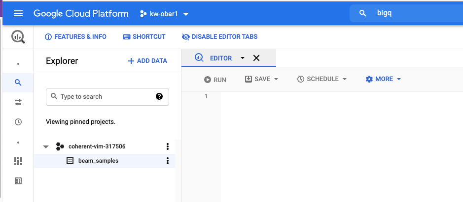

## Downloading the code sample

```bash
git clone https://github.com/GoogleCloudPlatform/python-docs-samples.git
cd python-docs-samples/dataflow/flex-templates/streaming_beam
```
> copied [here](./streaming_beam/README.md)

use `TEMPLATE_IMAGE`

```bash
export TEMPLATE_IMAGE="gcr.io/$PROJECT/samples/dataflow/streaming-beam-sql:latest"
```

## Setting up your development environment

[https://cloud.google.com/python/docs/setup#installing_python](/https:§§cloud.google.com§python§docs§setup#installing_python/readme.md)

## Python only: Creating and building a container image

- [X] enable kaniko

```
gcloud config set builds/use_kaniko True
```

[https://cloud.google.com/build/docs/kaniko-cache](/https:§§cloud.google.com§build§docs§kaniko-cache/readme.md)


- [X] create docker file 

> a sample to customize

```Docker
  FROM gcr.io/dataflow-templates-base/python3-template-launcher-base

  ARG WORKDIR=/dataflow/template
  RUN mkdir -p ${WORKDIR}
  WORKDIR ${WORKDIR}
  
  # Due to a change in the Apache Beam base image in version 2.24, you must to install
  # libffi-dev manually as a dependency. For more information:
  #   https://github.com/GoogleCloudPlatform/python-docs-samples/issues/4891
  RUN apt-get update && apt-get install -y libffi-dev && rm -rf /var/lib/apt/lists/*

  COPY requirements.txt .
  COPY streaming_beam.py .

  ENV FLEX_TEMPLATE_PYTHON_REQUIREMENTS_FILE="${WORKDIR}/requirements.txt"
  ENV FLEX_TEMPLATE_PYTHON_PY_FILE="${WORKDIR}/streaming_beam.py"

  RUN pip install -U -r ./requirements.txt
```
> the actual one is [here](streaming_beam/Dockerfile)

> Job packages/dependencies that are to be installed must be referenced in the 'requirements' file.
> Images starting with gcr.io/PROJECT/ are saved into your project's Container Registry

- [X] build the image

```bash
gcloud builds submit --tag $TEMPLATE_IMAGE .
```

[https://cloud.google.com/build/docs/quickstart-build#build_using_dockerfile](/https:§§cloud.google.com§build§docs§quickstart-build#build_using_dockerfile/readme.md)

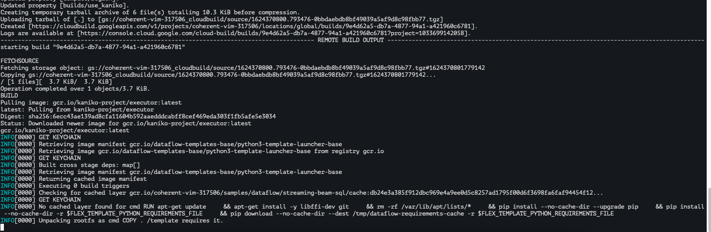
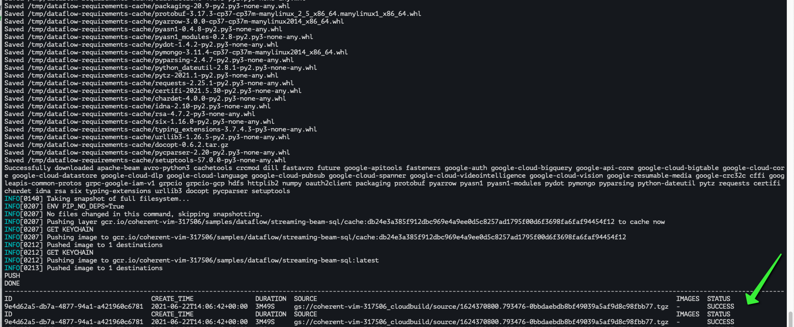

activity
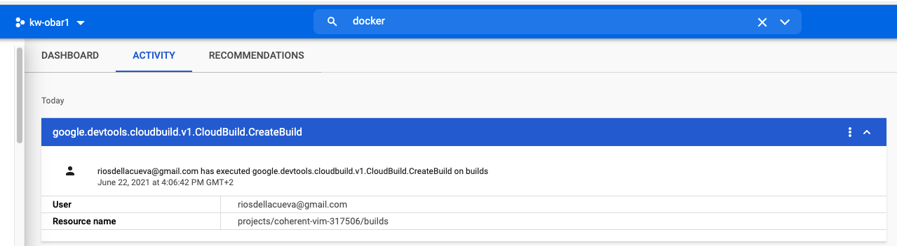
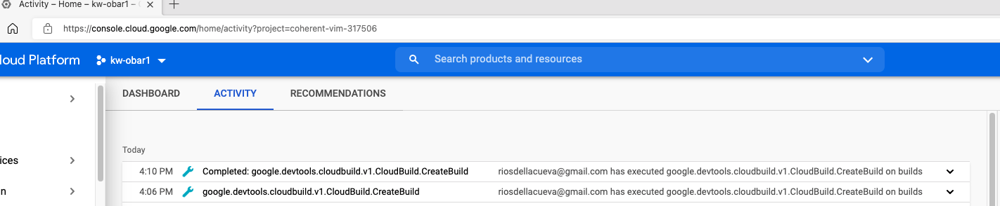
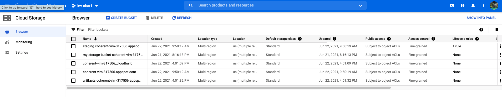

## Creating a Flex Template

To run a template, you need to create a template spec file in a Cloud Storage containing all of the necessary information to run the job

- name
- description
- input parameters

[https://github.com/GoogleCloudPlatform/java-docs-samples/blob/master/dataflow/flex-templates/streaming_beam_sql/metadata.json](/https:§§github.com§GoogleCloudPlatform§java-docs-samples§blob§master§dataflow§flex-templates§streaming_beam_sql§metadata.json/readme.md)

> sample copied [here](./streaming_beam/metadata.json)

- [X] build the template in the bucket

```
export TEMPLATE_PATH="gs://$BUCKET/samples/dataflow/templates/streaming-beam-sql.json"

gcloud dataflow flex-template build $TEMPLATE_PATH \
    --image "$TEMPLATE_IMAGE" \
    --sdk-language "PYTHON" \
    --metadata-file "metadata.json"
```

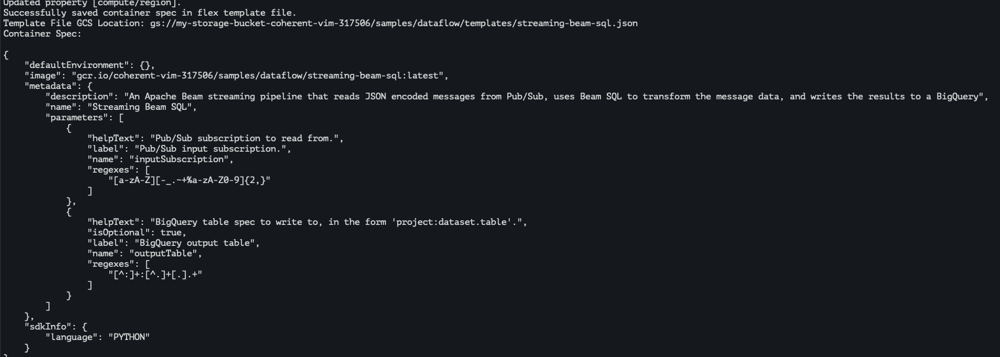

## Running a Flex Template pipeline

- [X] invoke the flex template

a) gcloud
```
  export REGION="us-central1"

  gcloud dataflow flex-template run "streaming-beam-`date +%Y%m%d-%H%M%S`" \
    --template-file-gcs-location "$TEMPLATE_PATH" \
    --parameters input_subscription="$SUBSCRIPTION" \
    --parameters output_table="$PROJECT:$DATASET.$TABLE" \
    --region "$REGION"
```
FIXME: the json sample has inputSubscription and outputTable actually 

b) rest api

```
curl -X POST \
  "https://dataflow.googleapis.com/v1b3/projects/$PROJECT/locations/us-central1/flexTemplates:launch" \
  -H "Content-Type: application/json" \
  -H "Authorization: Bearer $(gcloud auth print-access-token)" \
  -d '{
    "launch_parameter": {
      "jobName": "streaming-beam-sql-'$(date +%Y%m%d-%H%M%S)'",
      "parameters": {
        "inputSubscription": "'$SUBSCRIPTION'",
        "outputTable": "'$PROJECT:$DATASET.$TABLE'"
      },
      "containerSpecGcsPath": "'$TEMPLATE_PATH'"
    }
  }'
```
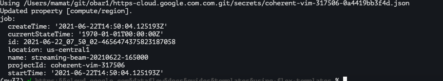
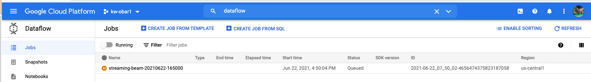

the execution log are
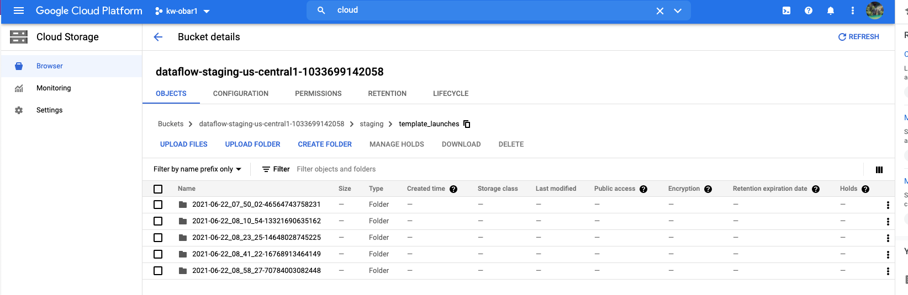
 
 dataflow running 
 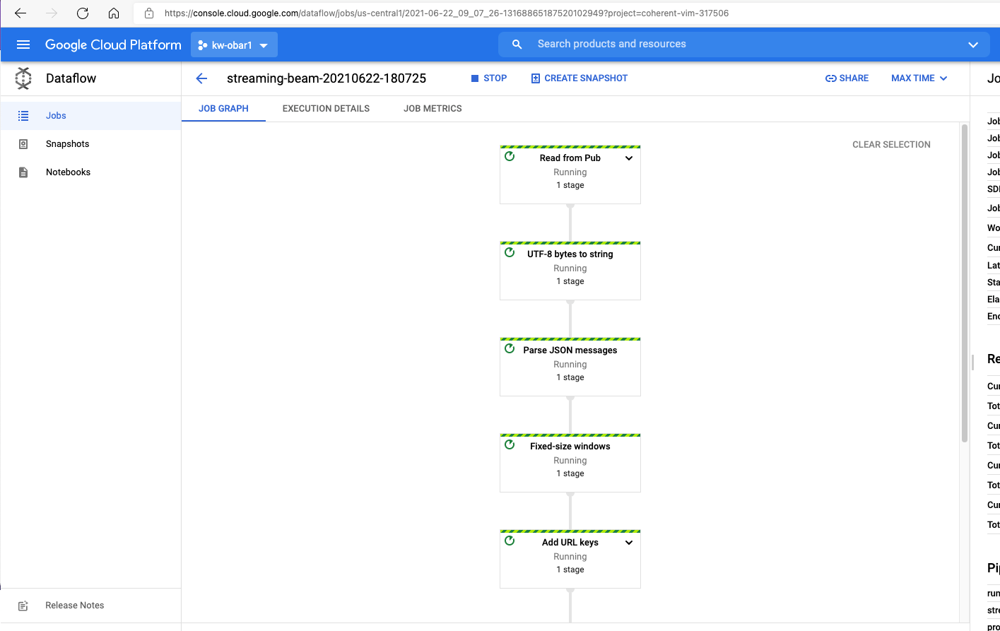

- [X] check data in bq

```
bq query --use_legacy_sql=false 'SELECT * FROM `'"$PROJECT.$DATASET.$TABLE"'`'
```

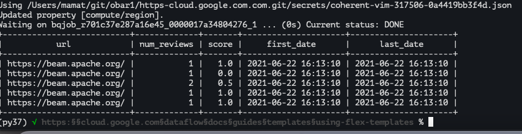

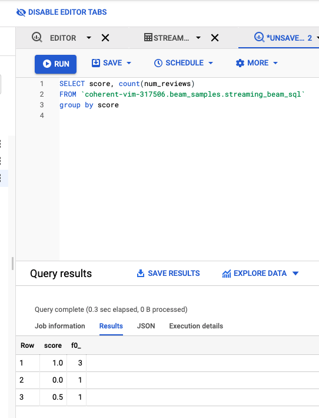

## Cleaning up

TODO: add all the snippets or delete the tmp  project 

