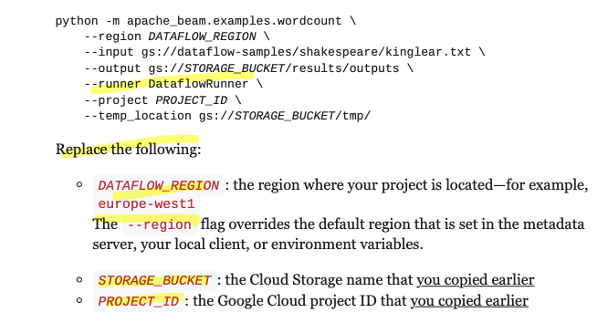

# Quickstart using Python

## Before you begin

enable apis of 
- dataflow
- computer engine
- cloud logging
- cloud storage
- cloud storage json
- bq
- cloud pub/sub 
- cloud datastore
- cloud resource manager

create service account 
- srv account name
- srv account id
- srv account description
- create role // basic owner

create svr account key
- add key // json type
- save 
- set  GOOGLE_APPLICATION_CREDENTIALS // path to  the json file saved

create cloud storage bucket
- name 
- location type 
- storage class // standard
- access control 

## Set up your environment

> pyhton2 not longer supported

create `venv`

## Get the Apache Beam SDK

```
pip install wheel
pip install 'apache-beam[gcp]`

```

## Run the pipeline locally

use sample on gs

gs://dataflow-samples/shakespeare/kinglear.txt

run on the sample

python -m apache_beam.examples.wordcount --output wordcount_outputs

check the output

more wordcount_outputs*

check code [here](wordcount.py)

## Run the pipeline on the Dataflow service

run on data flow using 
`--runner DataflowRunner `

general execution


snippet [here](run_pipeline_dataflow_svr.sh)

## View your results

verify pipeline is running and the results

cloud console
check
https://console.cloud.google.com/dataflow
https://console.cloud.google.com/storage/

local terminal
check

```
gsutil ls -lh "gs://STORAGE_BUCKET_ID/results/outputs*"  
gsutil cat "gs://STORAGE_BUCKET_ID/results/outputs*"

```

## Modify the pipeline code

make case insensitive changing the pipeline

check code [here](wordcount_mod.py)

run with 

python wordcount.py --output wordcount_mod_outputs


## Clean up
delete resources
-  bucket
