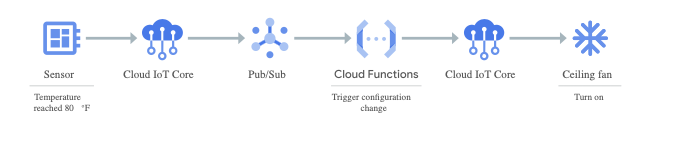
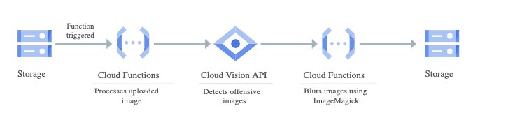
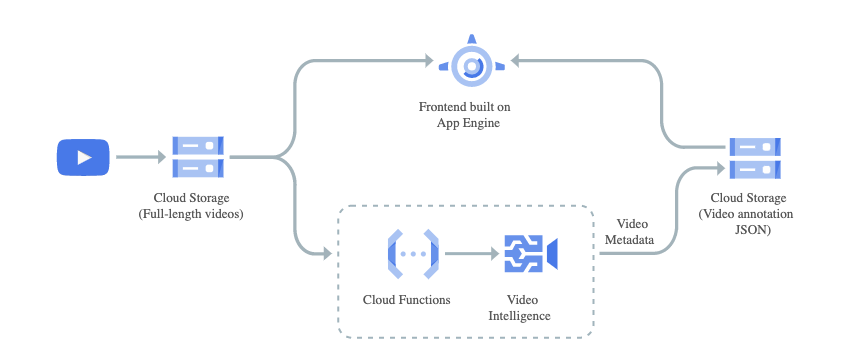

# https:§§cloud.google.com§functions
> https://cloud.google.com/functions

## Cloud Functions
Scalable pay-as-you-go functions as a service (FaaS) to run your code with zero server management.

- No servers to provision, manage, or upgrade - Automatically scale based on the load 
- Integrated monitoring, logging, and debugging capability Built-in security at role and per function level based on

## Key features

- Simplified developer experience and increased developer velocity
- Pay only for what you use 
- Avoid lock-in with open technology 

## Documentation

- Getting started with Cloud Functions 
https://cloud.google.com/functions/docs/quickstarts
[`here`](../https:§§cloud.google.com§functions§docs§quickstart-python/readme.md)
[`here`](../https:§§cloud.google.com§functions§docs§quickstart/readme.md)
[`here`](../https:§§cloud.google.com§functions§docs§first-python/readme.md)

- Trigger a function with Pub/Sub 
https://cloud.google.com/functions/docs/tutorials/pubsub

- Send emails and analyze data using BigQuery 
https://cloud.google.com/functions/docs/tutorials/sendgrid

- Trigger a function that does ML to extract text from images
https://cloud.google.com/functions/docs/tutorials/ocr

Serverless IoT back ends

Real-time file processing

https://console.cloud.google.com/getting-started?tutorial=pubsub_quickstart

Video and image analysis

- Implement Slack Slash command to interact with users
https://cloud.google.com/functions/docs/tutorials/slack

- Developing applications with Google Cloud
https://google.qwiklabs.com/courses/543

## All features

- connect services to build complex apps
- end to end app
- ssas and autoscale
- run code in response to events

## Pricing
https://cloud.google.com/functions/pricing

