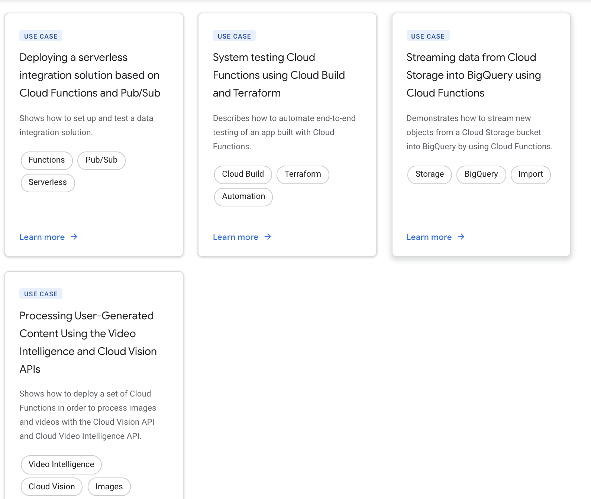

# https:§§cloud.google.com§functions§docs
> https://cloud.google.com/functions/docs

Cloud Functions is a lightweight compute solution for developers to create single-purpose, stand-alone functions that respond to Cloud events without the need to manage a server or runtime environment. Learn more
[https://cloud.google.com/functions/docs/concepts/overview](/https:§§cloud.google.com§functions§docs§concepts§overview/readme.md)

## guides

[`here`](../https:§§cloud.google.com§functions§docs§quickstart-python/readme.md)
[`here`](../https:§§cloud.google.com§functions§docs§first-python/readme.md)
[https://cloud.google.com/functions/docs/writing](/https:§§cloud.google.com§functions§docs§writing/readme.md)
[https://cloud.google.com/functions/docs/calling](/https:§§cloud.google.com§functions§docs§calling/readme.md)
more
[https://cloud.google.com/functions/docs/how-to](/https:§§cloud.google.com§functions§docs§how-to/readme.md)

## reference

[https://cloud.google.com/sdk/gcloud/reference/functions](/https:§§cloud.google.com§sdk§gcloud§reference§functions/readme.md)

## resource

[https://cloud.google.com/functions/pricing](/https:§§cloud.google.com§functions§pricing/readme.md)
[https://cloud.google.com/functions/quotas](/https:§§cloud.google.com§functions§quotas/readme.md)
[https://cloud.google.com/functions/docs/locations](/https:§§cloud.google.com§functions§docs§locations/readme.md)
[https://cloud.google.com/functions/docs/concepts/exec](/https:§§cloud.google.com§functions§docs§concepts§exec/readme.md)
[https://cloud.google.com/functions/docs/bestpractices/tips](/https:§§cloud.google.com§functions§docs§bestpractices§tips/readme.md)
more
[https://cloud.google.com/functions/docs/resources](/https:§§cloud.google.com§functions§docs§resources/readme.md)

## Training and tutorials

SKIP: 

## Use cases

## Code samples

[https://github.com/GoogleCloudPlatform/python-docs-samples/tree/master/functions](/https:§§github.com§GoogleCloudPlatform§python-docs-samples§tree§master§functions/readme.md)

