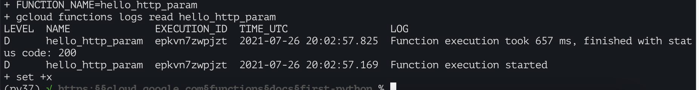
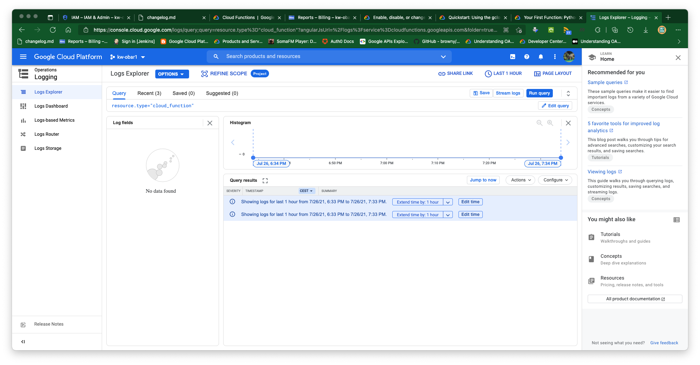

# https:§§cloud.google.com§functions§docs§first-python
> https://cloud.google.com/functions/docs/first-python

2 types
- http functions 
- event drive function

[https://cloud.google.com/functions/docs/writing](/https:§§cloud.google.com§functions§docs§writing/readme.md)

## Guide structure

Creating a GCP project using Cloud SDK
Creating a function
Specifying dependencies
Deploying your function
Testing your function


### Creating a GCP project using Cloud SDK

select prj

enable api
```
[https://console.cloud.google.com/flows/enableapi?apiid=cloudfunctions,cloudbuild.googleapis.com&redirect=https://cloud.google.com/functions/quickstart&_ga=2.228064411.769085834.1626678206-1468234203.1624256121](/https:§§console.cloud.google.com§flows§enableapi?apiid=cloudfunctions,cloudbuild.googleapis.com&redirect=https:§§cloud.google.com§functions§quickstart&_ga=2.228064411.769085834.1626678206-1468234203.1624256121/readme.md)
```

Cloud Functions API, Cloud Build API have been enabled.

[https://cloud.google.com/python/docs/setup](/https:§§cloud.google.com§python§docs§setup/readme.md)

### Creating a function

use `main.py`
and `requirements.txt`

use `--source` to deploy another py name rather than main

### Deploying the function

```
gcloud functions deploy hello_http --runtime python39 --trigger-http --allow-unauthenticated
```

[https://cloud.google.com/functions/docs/securing/managing-access-iam](/https:§§cloud.google.com§functions§docs§securing§managing-access-iam/readme.md)

[https://cloud.google.com/functions/docs/deploying](/https:§§cloud.google.com§functions§docs§deploying/readme.md)

### Testing the function

note `httpsTrigger.url` property of
```
gcloud functions describe hello_http
```

invoke the CF as
```
[https://GCP_REGION-PROJECT_ID.cloudfunctions.net/hello_http?name=NAME](/https:§§GCP_REGION-PROJECT_ID.cloudfunctions.net§hello_http?name=NAME/readme.md)
```

### Viewing logs

from cmd line
```
gcloud functions logs read hello_http
```


from the console
[https://console.cloud.google.com/logs/query;query=resource.type%3D%22cloud_function%22?angularJsUrl=%2Flogs%3Fservice%3Dcloudfunctions.googleapis.com&folder=true&organizationId=true&project=coherent-vim-317506](/https:§§console.cloud.google.com§logs§query;query=resource.type%3D%22cloud_function%22?angularJsUrl=%2Flogs%3Fservice%3Dcloudfunctions.googleapis.com&folder=true&organizationId=true&project=coherent-vim-317506/readme.md)



