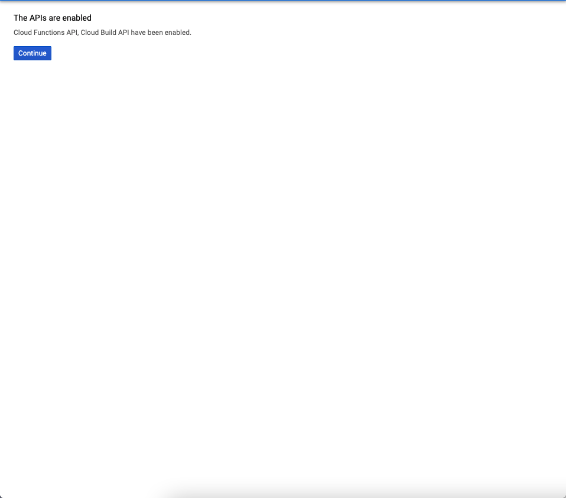
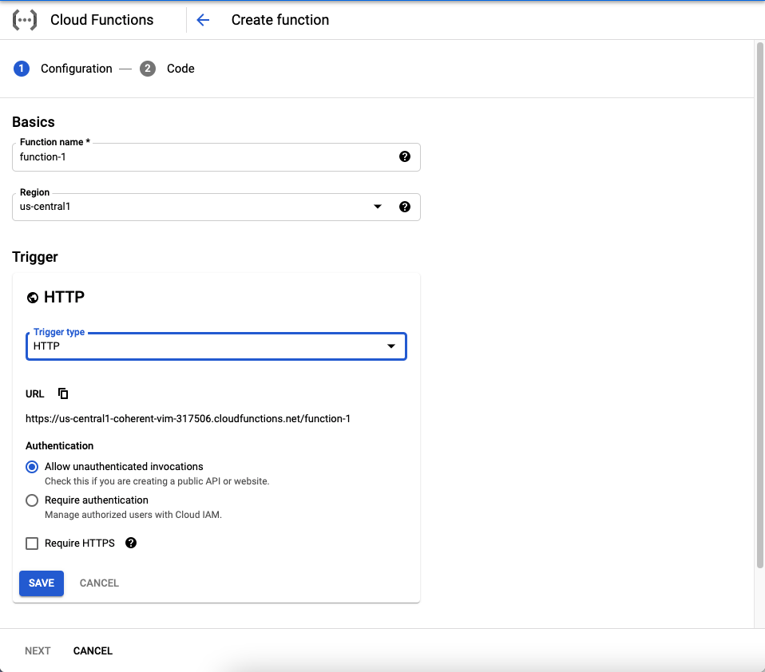
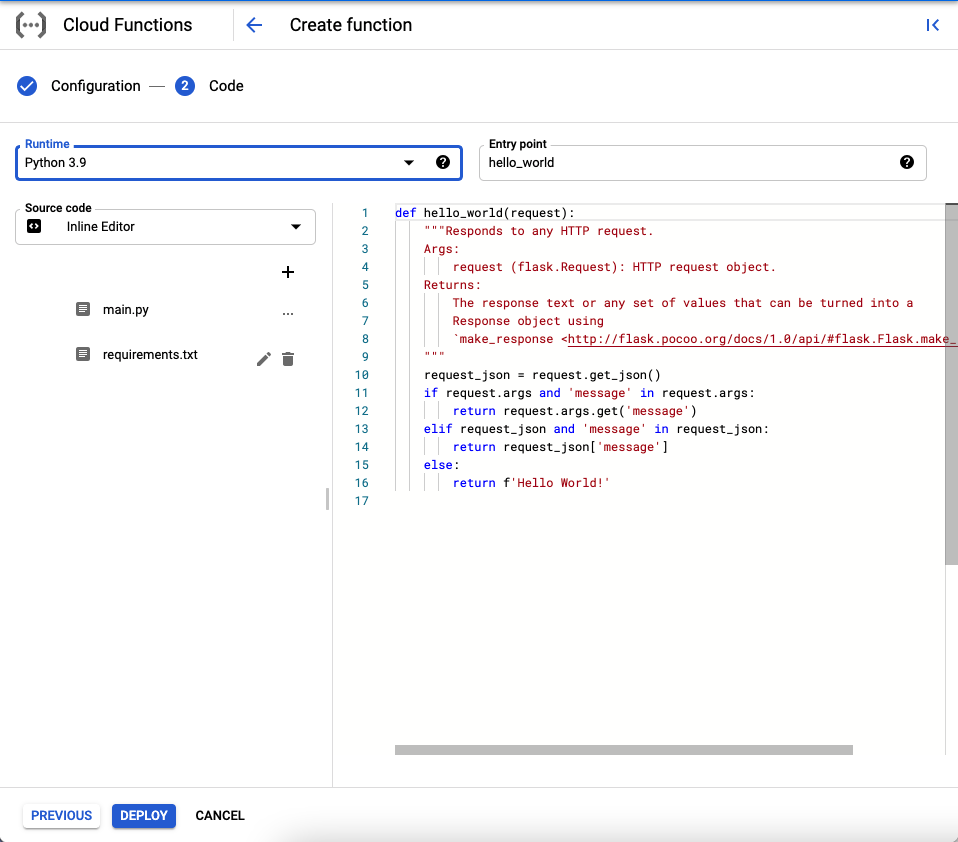
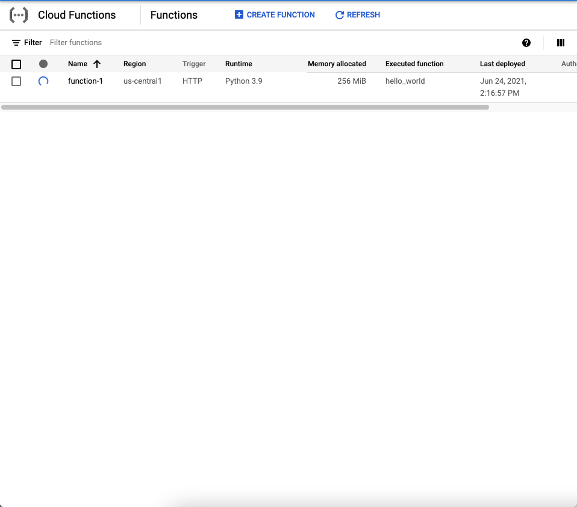
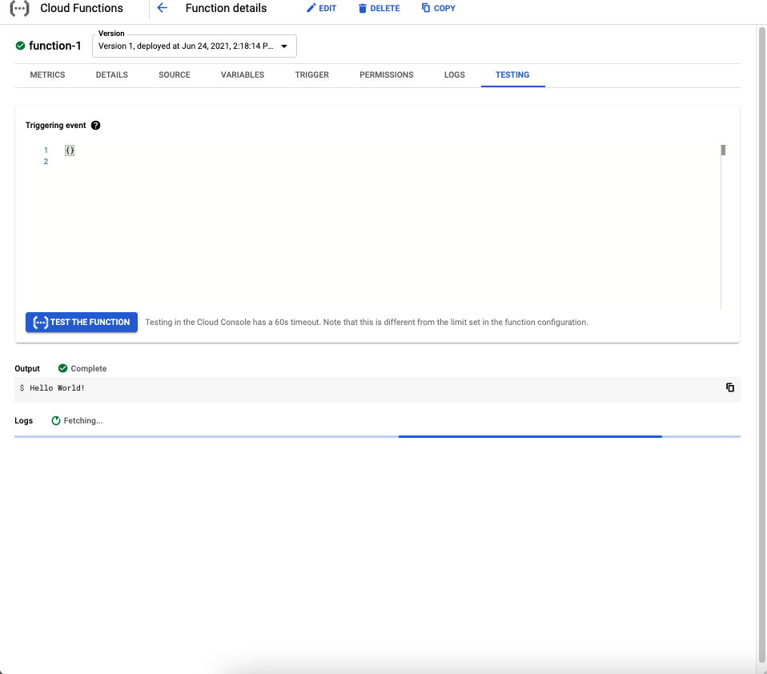
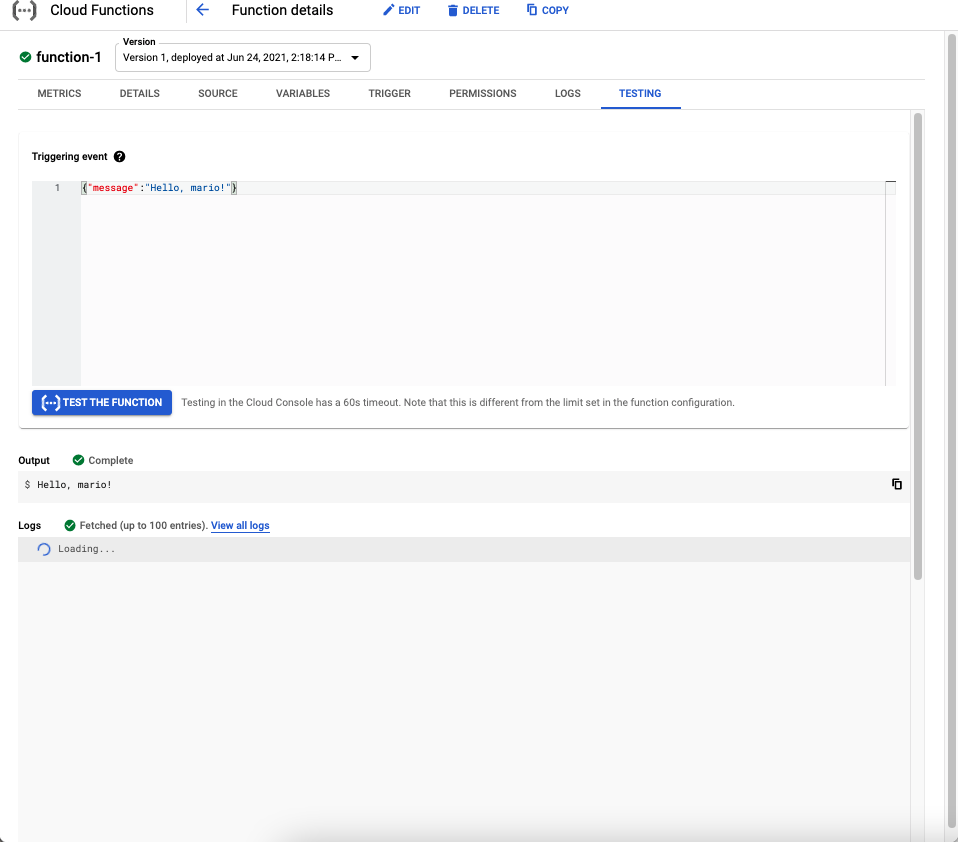

# Python Quickstart
> https://cloud.google.com/functions/docs/quickstart-python

serverless execution env 
single purpose func attached ot emitted event

ex of python code to def the func
```
def hello_world(request):
    """Responds to any HTTP request.
    Args:
        request (flask.Request): HTTP request object.
    Returns:
        The response text or any set of values that can be turned into a
        Response object using
        `make_response <https://flask.palletsprojects.com/en/1.1.x/api/#flask.Flask.make_response>`.
    """
    request_json = request.get_json()
    if request.args and 'message' in request.args:
        return request.args.get('message')
    elif request_json and 'message' in request_json:
        return request_json['message']
    else:
        return f'Hello World!'
```
## Before you begin

enable api
Enable the Cloud Functions and Cloud Build APIs. Enable the APIs
https://console.cloud.google.com/flows/enableapi?apiid=cloudfunctions,cloudbuild.googleapis.com&redirect=https://cloud.google.com/functions/docs/quickstart-python&_ga=2.72723475.1808267204.1624474724-1468234203.1624256121



## Create a function

1. go to  https://console.cloud.google.com/functions/list?_ga=2.40223906.1808267204.1624474724-1468234203.1624256121&project=coherent-vim-317506&folder=&organizationId=

2. Click Create function. 3. Name your function. 4. In the Trigger field, select HTTP. 5. In the Authentication field, select Allow unauthenticated invocations. 
...
creation

python sample

deploy


## Test the function

1. Display the menu for your function, and click Test function.
2. On the testing page, click Test the function. The Output screen displays the text "Hello World!"


trigger url
https://us-central1-coherent-vim-317506.cloudfunctions.net/function-1

change trigger event

```
{"message":"Hello, mario!"}
```
