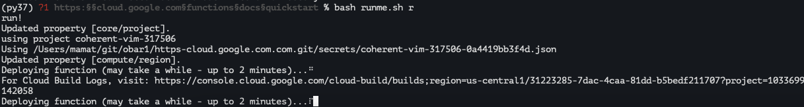
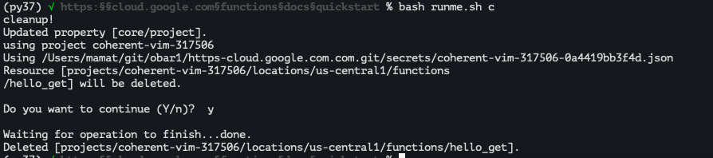

# https:§§cloud.google.com§functions§docs§quickstart
> https://cloud.google.com/functions/docs/quickstart

## Before you begin

enable api
https://console.cloud.google.com/flows/enableapi?apiid=cloudfunctions,cloudbuild.googleapis.com&redirect=https://cloud.google.com/functions/quickstart&_ga=2.195397676.1808267204.1624474724-1468234203.1624256121

update components

```
gcloud components update
```

### Get the sample code

```
git clone https://github.com/GoogleCloudPlatform/python-docs-samples.git

cd python-docs-samples/functions/helloworld/
```

in https:§§cloud.google.com§functions§docs§quickstart/helloworld/main.py

```python
# [START functions_helloworld_get]
def hello_get(request):
    """HTTP Cloud Function.
    Args:
        request (flask.Request): The request object.
        <https://flask.palletsprojects.com/en/1.1.x/api/#incoming-request-data>
    Returns:
        The response text, or any set of values that can be turned into a
        Response object using `make_response`
        <https://flask.palletsprojects.com/en/1.1.x/api/#flask.make_response>.
    Note:
        For more information on how Flask integrates with Cloud
        Functions, see the `Writing HTTP functions` page.
        <https://cloud.google.com/functions/docs/writing/http#http_frameworks>
    """
    return 'Hello World!'
# [END functions_helloworld_get]
```

## Deploy a function

```bash
gcloud functions deploy hello_get \
--runtime python39 --trigger-http --allow-unauthenticated
```


## Test the function
check what to do
```
gcloud functions describe hello_get
```

https://us-central1-coherent-vim-317506.cloudfunctions.net/hello_get


Visit this URL in your browser. You should see a Hello World! message.


## Delete the function

```
gcloud functions delete hello_get 
```



ex
```

Deploying function (may take a while - up to 2 minutes)...⠹
For Cloud Build Logs, visit: https://console.cloud.google.com/cloud-build/builds;region=us-central1/86ca54c3-300a-44d8-aed0-5a77633611ba?project=1033699142058
Deploying function (may take a while - up to 2 minutes)...done.
availableMemoryMb: 256
buildId: 86ca54c3-300a-44d8-aed0-5a77633611ba
entryPoint: hello_get
httpsTrigger:
  securityLevel: SECURE_OPTIONAL
  url: https://us-central1-coherent-vim-317506.cloudfunctions.net/hello_get
ingressSettings: ALLOW_ALL
labels:
  deployment-tool: cli-gcloud
name: projects/coherent-vim-317506/locations/us-central1/functions/hello_get
runtime: python39
serviceAccountEmail: coherent-vim-317506@appspot.gserviceaccount.com
sourceUploadUrl: https://storage.googleapis.com/gcf-upload-us-central1-4f45152c-7f70-42de-8b8f-840c66a6ef62/5ebc4b04-1a50-46e5-be0b-df243e87bbf6.zip?GoogleAccessId=service-1033699142058@gcf-admin-robot.iam.gserviceaccount.com&Expires=1626780979&Signature=PGsCOvC%2B30z8ivXGdQCFLJpwxt7SOCWXxt2vi8faW%2FDWYt3qFmPqhO6ySstNWf7AZvJ%2BKyK4eUT0SKMM%2BXVV53JrFl7ffq1Y%2BYbuDXAtlib3TO5qkp4UEREyhm0BpMCb0McRPoG7wMKbWF4Htoev%2Btt5mUPGTI0BlbndOgh2QKX4ViMTJCgNo%2FH%2Bw3QCLmt892IZw5jKpiZtrVlcHCNWG1z0y6DCBiBklzhpL4MlEIzTzUqd0ru4MnoBoZFbOPaFVAPaEeIiPm7zEeu9x3IEOm6hS2T%2FlUCsWGu1NLOm2%2FlnFlomu5OHKGUal0X1NNPpvep0U6ZL6GJ9D1SuFvwQkw%3D%3D
status: ACTIVE
timeout: 60s
updateTime: '2021-07-20T11:07:52.789Z'
versionId: '1'
availableMemoryMb: 256
buildId: 86ca54c3-300a-44d8-aed0-5a77633611ba
entryPoint: hello_get
httpsTrigger:
  securityLevel: SECURE_OPTIONAL
  url: https://us-central1-coherent-vim-317506.cloudfunctions.net/hello_get
ingressSettings: ALLOW_ALL
labels:
  deployment-tool: cli-gcloud
name: projects/coherent-vim-317506/locations/us-central1/functions/hello_get
runtime: python39
serviceAccountEmail: coherent-vim-317506@appspot.gserviceaccount.com
sourceUploadUrl: https://storage.googleapis.com/gcf-upload-us-central1-4f45152c-7f70-42de-8b8f-840c66a6ef62/5ebc4b04-1a50-46e5-be0b-df243e87bbf6.zip?GoogleAccessId=service-1033699142058@gcf-admin-robot.iam.gserviceaccount.com&Expires=1626780979&Signature=PGsCOvC%2B30z8ivXGdQCFLJpwxt7SOCWXxt2vi8faW%2FDWYt3qFmPqhO6ySstNWf7AZvJ%2BKyK4eUT0SKMM%2BXVV53JrFl7ffq1Y%2BYbuDXAtlib3TO5qkp4UEREyhm0BpMCb0McRPoG7wMKbWF4Htoev%2Btt5mUPGTI0BlbndOgh2QKX4ViMTJCgNo%2FH%2Bw3QCLmt892IZw5jKpiZtrVlcHCNWG1z0y6DCBiBklzhpL4MlEIzTzUqd0ru4MnoBoZFbOPaFVAPaEeIiPm7zEeu9x3IEOm6hS2T%2FlUCsWGu1NLOm2%2FlnFlomu5OHKGUal0X1NNPpvep0U6ZL6GJ9D1SuFvwQkw%3D%3D
status: ACTIVE
timeout: 60s
updateTime: '2021-07-20T11:07:52.789Z'
versionId: '1'
(base) √ https:§§cloud.google.com§functions§docs§quickstart %
```