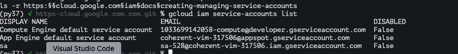

# https:§§cloud.google.com§iam§docs§creating-managing-service-accounts
> https://cloud.google.com/iam/docs/creating-managing-service-accounts

## Creating a service account
sa id // SERVICE_ACCOUNT_ID:
- 6  to 30
- chars and dash

format
```
SERVICE_ACCOUNT_ID@PROJECT_ID.iam.gserviceaccount.com
```

create sa
```
gcloud iam service-accounts create SERVICE_ACCOUNT_ID --description="DESCRIPTION" --display-name="DISPLAY_NAME
```

optional grant `iam role`
```
cloud projects add-iam-policy-binding PROJECT_ID --member="serviceAccount:SERVICE_ACCOUNT_ID@PROJECT_ID.iam.gserviceaccount.com" --role="ROLE_NAME"
```

optional to allow users to impersonate the sa
```
gcloud iam service-accounts add-iam-policy-binding SERVICE_ACCOUNT_ID@PROJECT_ID.iam.gserviceaccount.com --member="user:USER_EMAIL" --role="roles/iam.serviceAccountUser"
```

## Listing service accounts

```
gcloud iam service-accounts list
```


