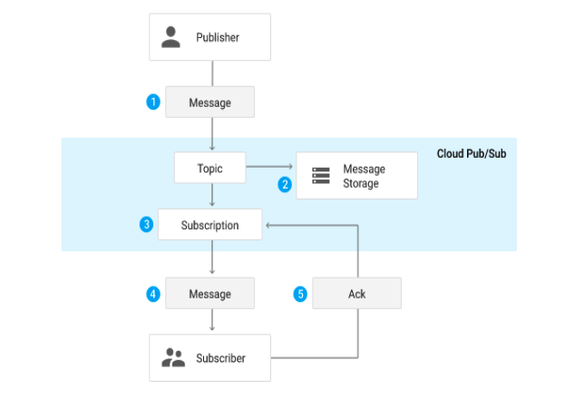

# https:§§cloud.google.com§pubsub§docs§overview
> https://cloud.google.com/pubsub/docs/overview

## What is Pub/Sub?

[https://youtu.be/MjEam95VLiI](/https:§§youtu.be§MjEam95VLiI/readme.md)

Pub/Sub allows services to communicate asynchronously, with latencies on the order of 100 milliseconds. 
Pub/Sub is used for streaming analytics and data integration pipelines to ingest and distribute data. 
Pub/Sub enables you to create systems of event producers and consumers, called publishers and subscribers. 
 
TODO:
[https://cloud.google.com/pubsub/docs/quickstart-console](/https:§§cloud.google.com§pubsub§docs§quickstart-console/readme.md)

TODO:
[https://cloud.google.com/pubsub/docs/building-pubsub-messaging-system](/https:§§cloud.google.com§pubsub§docs§building-pubsub-messaging-system/readme.md)

## Common use cases
 
- ingestion of events
- real time distribution
- replicating data among dbs
- parallel processing of wf
- enterprise server bus
- refreshing distributed cache
- load balancing reliability

## Pub/Sub or Pub/Sub Lite

[https://cloud.google.com/pubsub/lite/docs/quickstart](/https:§§cloud.google.com§pubsub§lite§docs§quickstart/readme.md)

## Comparing Pub/Sub to other messaging technologies

> Another feature Pub/Sub adopts from messaging middleware is per-message parallelism (rather than partition-based). Pub/Sub "leases" individual messages to subscriber clients, then keeps track of whether a given message has been successfullY processed
 
## Service-to-service vs. service-to-client communication

Pub/Sub is intended for service-to-service communication rather than communication with end-user or IoT clients.

## Integrations
Pub/Sub has many integrations with other Google Cloud products to create a fully featured messaging system:
- Stream processing and data integration: Supported by Dataflow, including Dataflow templates and SQL, which allow processing and data integration into BigQuery and data lakes on Cloud Storage. 
- Monitoring, Alerting and Logging: Supported by Monitoring and Logging products. 
- Authentication and IAM: Pub/Sub relies on a standard OAuth authentication used by other Google Cloud products and supports granular IAM, enabling access control for individual resources. 
- APIs: Pub/Sub uses standard gRPC and REST service API technologies along with client libraries for several languages. 
- Triggers, notifications and webhooks: Pub/Sub offers push-based delivery of messages as HTTP POST requests to webhooks. This lets you easily implement workflow automation using Cloud Functions or other serverless products. 
- Orchestration: Pub/Sub can be integrated into multistep serverless workflows Workflows declaratively.  

## Core concepts

- Topic: A named resource to which messages are sent by publishers. 
- Subscription: A named resource representing the stream of messages from a single, specific topic, to be delivered to the subscribing application. 
- Message attribute: A key-value pair that a publisher can define for a message. 
- Publisher: An application that creates and sends messages to a topic(s). 
- Subscriber: An application with a subscription to a topic(s) to receive messages from it. - Acknowledgement (or "ack"): A signal sent by a subscriber to Pub/Sub after it has received a message successfully. 
- `Acked` messages are removed from the subscription's message queue. 
- Push and pull: The two message delivery methods.  

> Publisher-subscriber relationships can be one-to-many (fan-out), many-to-one (fan-in), and many-to-many, as shown in the following diagram:

> Note that for push delivery the ack is implicit in the response to the push request, whilefor pull delivery it requires a separate RPC.Next steps

 ## Next steps

- https://cloud.google.com/pubsub/docs/quickstart-console
TODO:
- https://cloud.google.com/pubsub/architecture
TODO:
- https://cloud.google.com/pubsub/pricing
TODO:
- https://googlecourses.qwiklabs.com/focuses/11548?catalog_rank=%7B%22rank%22%3A6%2C%22num_filters%22%3A0%2C%22has_search%22%3Atrue%7D&parent=catalog&search_id=11865106