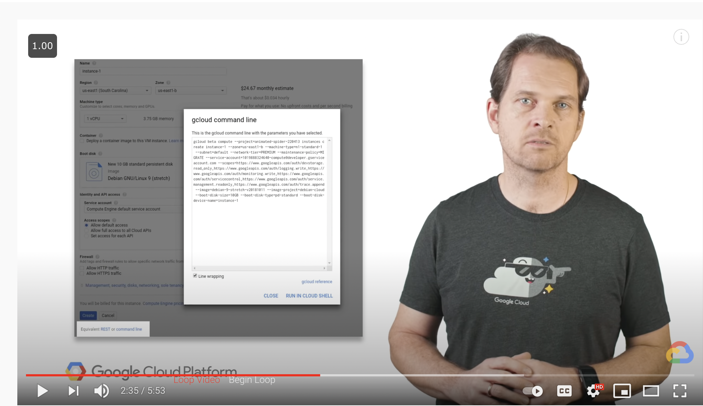

# `https:§§cloud.google.com§sdk`

> <https://cloud.google.com/sdk>

- orch vm from cmd line
- manage computer, vpn, storage
- use you language
- run locally services

## <https://www.youtube.com/watch?v=3v9XWdFyh2E>

gcloud init
gcloud configlist
gcloud components list
you can manage them

check gcloud interative mode

use cloud shell in the gcp browser
boost mode
tmux support
custom docker shell image
save all in your home

## Key features

- gcloud cli
- client lib
- gsutil bq and kubectl

## Documentation

https://cloud.google.com/sdk/docs/install
https://cloud.google.com/sdk/docs/components
https://cloud.google.com/apis/docs/cloud-client-libraries
https://cloud.google.com/sdk/gcloud

run gcloud cmd from a script
https://cloud.google.com/sdk/docs/scripting-gcloud

## Quickstarts

https://cloud.google.com/sdk/docs/quickstarts

## How to

https://cloud.google.com/sdk/docs/how-to

## Tutorial

https://cloud.google.com/sdk/docs/interactive-gcloud

## api ref

https://cloud.google.com/sdk/gcloud/reference

`uc`
scripting gcloud cli commands

`tut`
https://cloud.google.com/sdk/docs/scripting-gcloud

`tut`
https://cloud.google.com/blog/products/it-ops/filtering-and-formatting-fun-with

`tut`
https://cloud.google.com/blog/products/management-tools/scripting-with-gcloud-a-beginners-guide-to-automating-gcp-tasks
