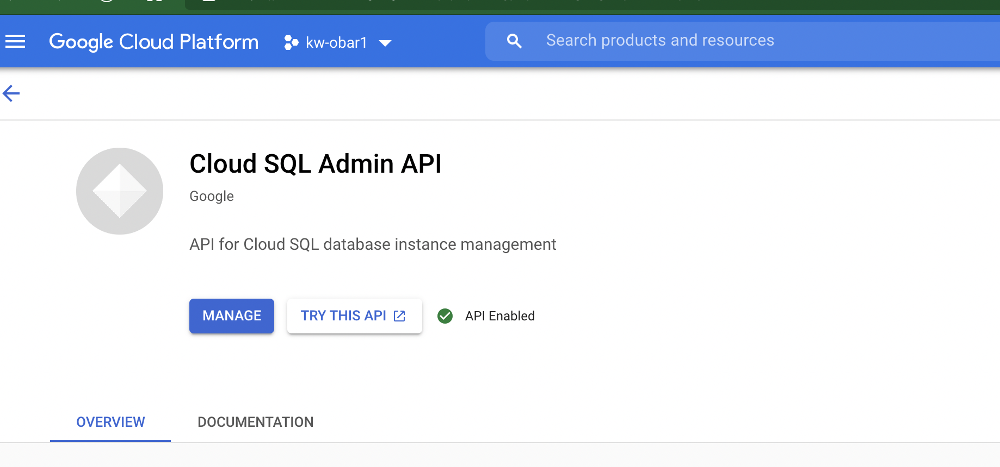
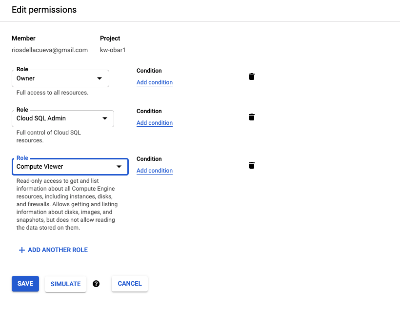
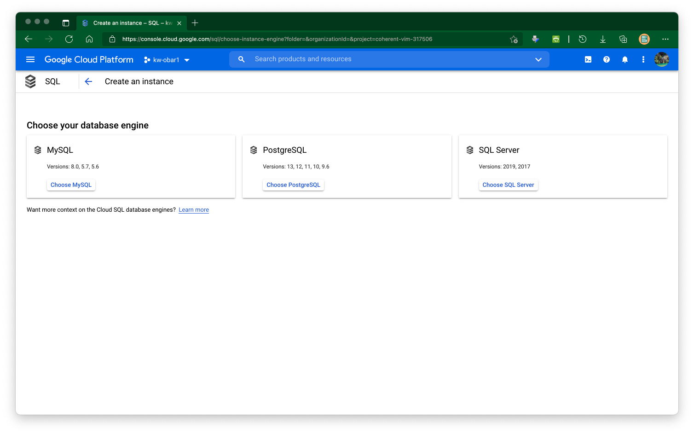
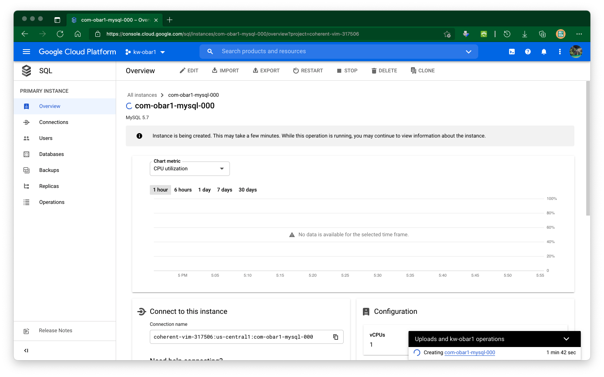
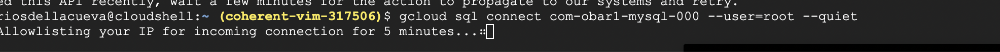
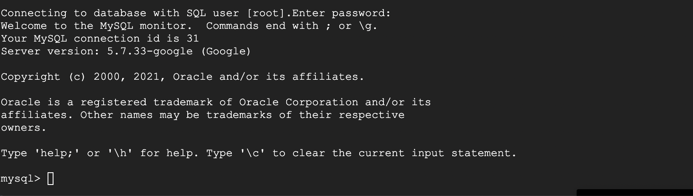
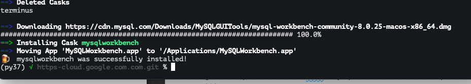
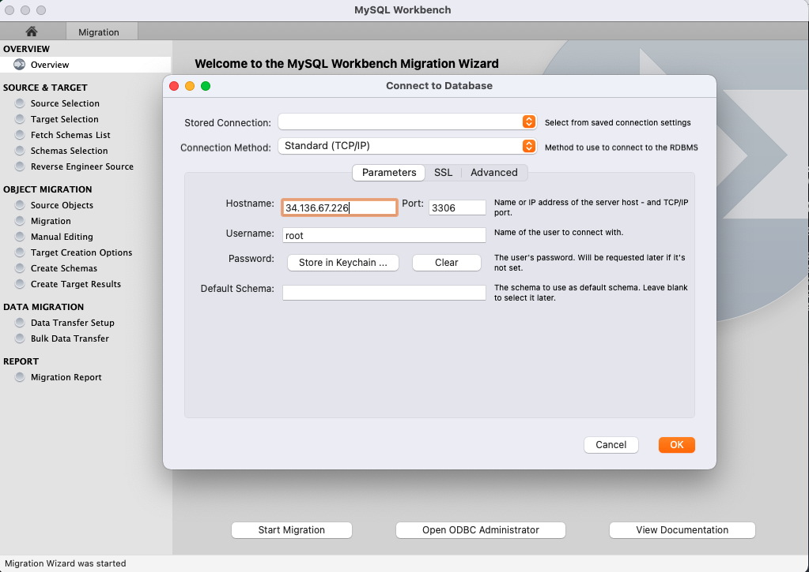

# https:§§cloud.google.com§sql§docs§mysql§create-instance
> https://cloud.google.com/sql/docs/mysql/create-instance

## Before you begin

https://console.cloud.google.com/apis/library/sqladmin.googleapis.com?project=coherent-vim-317506



Make sure you have the Cloud SQL Admin and Compute Viewer roles on your user account.



## Creating a MySQL instance

https://console.cloud.google.com/sql/instances





To connect using gcloud,

```
gcloud sql connect com-obar1-mysql-000 --user=root --quiet
```


add pwd



## Flexible instance configurations

finer granule


## gui

FIXME:  check it 

https://github.com/dbcli/mycli

or 

https://www.mysql.com/products/workbench/
```
brew install --cask mysqlworkbench
```
works




add connection 

coherent-vim-317506:us-central1:com-obar1-mysql-000



note  in gcp 
https://stackoverflow.com/questions/53468831/how-do-i-install-python-3-7-in-google-cloud-shell

```
# install pyenv to install python on persistent home directory
curl https://pyenv.run | bash

# add to path
echo 'export PATH="$HOME/.pyenv/bin:$PATH"' >> ~/.bashrc
echo 'eval "$(pyenv init -)"' >> ~/.bashrc
echo 'eval "$(pyenv virtualenv-init -)"' >> ~/.bashrc

# updating bashrc
source ~/.bashrc

# install python 3.7.4 and make default
pyenv install 3.7.4
pyenv global 3.7.4

# execute
python
```